# Monitoreo y Observabilidad 📊

## La Diferencia entre Monitoreo y Observabilidad

**Monitoreo** = Conocer el estado de sistemas conocidos  
**Observabilidad** = Entender sistemas complejos mediante datos

En DevOps moderno, necesitamos ambos: monitoreo para lo predecible y observabilidad para lo inesperado.

## 🎯 Objetivos del Capítulo

- Implementar stack completo de observabilidad
- Dominar métricas, logs y trazas distribuidas
- Configurar alertas inteligentes
- Crear dashboards efectivos para teams y management

## 📈 Los Tres Pilares de la Observabilidad

```mermaid
graph TB
    A[Aplicación] --> B[Métricas]
    A --> C[Logs]
    A --> D[Trazas]
    
    B --> E[Prometheus]
    C --> F[ElasticSearch]
    D --> G[Jaeger]
    
    E --> H[Grafana]
    F --> H
    G --> H
    
    H --> I[Alertas]
    H --> J[Dashboards]
```



### 1. Métricas: Los Números que Importan

#### Métricas Fundamentales (Golden Signals)
```yaml
golden_signals:
  latency:
    description: "Tiempo de respuesta de requests"
    threshold_warning: "500ms"
    threshold_critical: "1000ms"
    
  traffic:
    description: "Requests por segundo"
    baseline: "1000 RPS"
    alert_on_drop: "50%"
    
  errors:
    description: "Tasa de errores"
    threshold_warning: "1%"
    threshold_critical: "5%"
    
  saturation:
    description: "Utilización de recursos"
    cpu_warning: "70%"
    memory_warning: "80%"
    disk_warning: "85%"
```

#### Implementación con Prometheus

```yaml
# docker-compose.yml - Stack de Monitoreo
version: '3.8'
services:
  prometheus:
    image: prom/prometheus:latest
    ports:
      - "9090:9090"
    volumes:
      - ./prometheus.yml:/etc/prometheus/prometheus.yml
      - prometheus_data:/prometheus
    command:
      - '--config.file=/etc/prometheus/prometheus.yml'
      - '--storage.tsdb.path=/prometheus'
      - '--web.console.libraries=/etc/prometheus/console_libraries'
      - '--web.console.templates=/etc/prometheus/consoles'
      - '--storage.tsdb.retention.time=15d'
      - '--web.enable-lifecycle'

  grafana:
    image: grafana/grafana:latest
    ports:
      - "3000:3000"
    environment:
      - GF_SECURITY_ADMIN_PASSWORD=admin123
    volumes:
      - grafana_data:/var/lib/grafana
      - ./grafana/dashboards:/var/lib/grafana/dashboards
      - ./grafana/provisioning:/etc/grafana/provisioning

  alertmanager:
    image: prom/alertmanager:latest
    ports:
      - "9093:9093"
    volumes:
      - ./alertmanager.yml:/etc/alertmanager/alertmanager.yml

volumes:
  prometheus_data:
  grafana_data:
```

#### Configuración Prometheus
```yaml
# prometheus.yml
global:
  scrape_interval: 15s
  evaluation_interval: 15s

rule_files:
  - "alert_rules.yml"

alerting:
  alertmanagers:
    - static_configs:
        - targets:
          - alertmanager:9093

scrape_configs:
  - job_name: 'prometheus'
    static_configs:
      - targets: ['localhost:9090']

  - job_name: 'node-exporter'
    static_configs:
      - targets: ['node-exporter:9100']

  - job_name: 'application'
    static_configs:
      - targets: ['app:8080']
    metrics_path: '/metrics'
    scrape_interval: 5s
```

#### Métricas Custom en Aplicación (Python)
```python
from prometheus_client import Counter, Histogram, Gauge, start_http_server
import time
import random

# Definir métricas
REQUEST_COUNT = Counter(
    'app_requests_total',
    'Total app requests',
    ['method', 'endpoint', 'status']
)

REQUEST_LATENCY = Histogram(
    'app_request_duration_seconds',
    'Request latency',
    ['endpoint']
)

ACTIVE_USERS = Gauge(
    'app_active_users',
    'Currently active users'
)

DATABASE_CONNECTIONS = Gauge(
    'app_db_connections',
    'Database connections',
    ['pool', 'state']
)

# Instrumentar código
def track_request(func):
    def wrapper(*args, **kwargs):
        start_time = time.time()
        endpoint = func.__name__
        
        try:
            result = func(*args, **kwargs)
            REQUEST_COUNT.labels(
                method='GET', 
                endpoint=endpoint, 
                status='200'
            ).inc()
            return result
            
        except Exception as e:
            REQUEST_COUNT.labels(
                method='GET', 
                endpoint=endpoint, 
                status='500'
            ).inc()
            raise
            
        finally:
            REQUEST_LATENCY.labels(endpoint=endpoint).observe(
                time.time() - start_time
            )
    
    return wrapper

@track_request
def get_user(user_id):
    # Simular latencia
    time.sleep(random.uniform(0.1, 0.5))
    return {"id": user_id, "name": "User"}

# Actualizar métricas de estado
def update_system_metrics():
    # Usuarios activos (ejemplo)
    ACTIVE_USERS.set(random.randint(100, 1000))
    
    # Conexiones DB
    DATABASE_CONNECTIONS.labels(pool='main', state='active').set(15)
    DATABASE_CONNECTIONS.labels(pool='main', state='idle').set(5)

if __name__ == '__main__':
    # Exponer métricas en puerto 8000
    start_http_server(8000)
    
    # Simular aplicación
    while True:
        get_user(random.randint(1, 100))
        update_system_metrics()
        time.sleep(1)
```

### 2. Logs: La Historia Completa

#### Structured Logging (JSON)
```python
import json
import logging
from datetime import datetime
import traceback

class JSONFormatter(logging.Formatter):
    def format(self, record):
        log_entry = {
            'timestamp': datetime.utcnow().isoformat(),
            'level': record.levelname,
            'logger': record.name,
            'message': record.getMessage(),
            'module': record.module,
            'function': record.funcName,
            'line': record.lineno
        }
        
        # Añadir contexto adicional
        if hasattr(record, 'user_id'):
            log_entry['user_id'] = record.user_id
        if hasattr(record, 'request_id'):
            log_entry['request_id'] = record.request_id
        if hasattr(record, 'trace_id'):
            log_entry['trace_id'] = record.trace_id
            
        # Errores con stack trace
        if record.exc_info:
            log_entry['exception'] = {
                'type': record.exc_info[0].__name__,
                'message': str(record.exc_info[1]),
                'traceback': traceback.format_exception(*record.exc_info)
            }
            
        return json.dumps(log_entry)

# Configurar logger
logger = logging.getLogger('app')
handler = logging.StreamHandler()
handler.setFormatter(JSONFormatter())
logger.addHandler(handler)
logger.setLevel(logging.INFO)

# Uso con contexto
def process_order(user_id, order_id):
    # Crear contexto para esta operación
    log_extra = {
        'user_id': user_id,
        'order_id': order_id,
        'request_id': generate_request_id()
    }
    
    logger.info("Processing order started", extra=log_extra)
    
    try:
        # Lógica de negocio
        result = validate_order(order_id)
        logger.info(f"Order validated: {result}", extra=log_extra)
        
        payment = process_payment(user_id, order_id)
        logger.info(f"Payment processed: {payment['id']}", extra=log_extra)
        
        return {"status": "success", "order_id": order_id}
        
    except ValueError as e:
        logger.error(f"Validation error: {e}", extra=log_extra, exc_info=True)
        raise
    except Exception as e:
        logger.error(f"Unexpected error processing order", extra=log_extra, exc_info=True)
        raise
```

#### ELK Stack para Centralización
```yaml
# docker-compose-elk.yml
version: '3.8'
services:
  elasticsearch:
    image: docker.elastic.co/elasticsearch/elasticsearch:8.5.0
    environment:
      - discovery.type=single-node
      - "ES_JAVA_OPTS=-Xms512m -Xmx512m"
      - xpack.security.enabled=false
    ports:
      - "9200:9200"
    volumes:
      - elasticsearch_data:/usr/share/elasticsearch/data

  logstash:
    image: docker.elastic.co/logstash/logstash:8.5.0
    volumes:
      - ./logstash/pipeline:/usr/share/logstash/pipeline
    ports:
      - "5000:5000"
    depends_on:
      - elasticsearch

  kibana:
    image: docker.elastic.co/kibana/kibana:8.5.0
    ports:
      - "5601:5601"
    environment:
      - ELASTICSEARCH_HOSTS=http://elasticsearch:9200
    depends_on:
      - elasticsearch

volumes:
  elasticsearch_data:
```

#### Configuración Logstash
```ruby
# logstash/pipeline/logstash.conf
input {
  beats {
    port => 5044
  }
  
  tcp {
    port => 5000
    codec => json_lines
  }
}

filter {
  # Parse timestamp
  date {
    match => [ "timestamp", "ISO8601" ]
  }
  
  # Enriquecer con geoIP si hay IP
  if [client_ip] {
    geoip {
      source => "client_ip"
      target => "geoip"
    }
  }
  
  # Parsear user agent
  if [user_agent] {
    useragent {
      source => "user_agent"
      target => "ua"
    }
  }
  
  # Clasificar errores
  if [level] == "ERROR" {
    mutate {
      add_tag => [ "error" ]
    }
  }
  
  # Extraer métricas de rendimiento
  if [message] =~ /response_time/ {
    grok {
      match => { "message" => "response_time=%{NUMBER:response_time:float}" }
    }
  }
}

output {
  elasticsearch {
    hosts => ["elasticsearch:9200"]
    index => "app-logs-%{+YYYY.MM.dd}"
  }
  
  # Debug output
  stdout { codec => rubydebug }
}
```

### 3. Trazas Distribuidas: Siguiendo Requests

#### Implementación con OpenTelemetry
```python
from opentelemetry import trace
from opentelemetry.exporter.jaeger.thrift import JaegerExporter
from opentelemetry.sdk.trace import TracerProvider
from opentelemetry.sdk.trace.export import BatchSpanProcessor
from opentelemetry.instrumentation.flask import FlaskInstrumentor
from opentelemetry.instrumentation.requests import RequestsInstrumentor
from opentelemetry.instrumentation.sqlalchemy import SQLAlchemyInstrumentor

# Configurar tracing
trace.set_tracer_provider(TracerProvider())
tracer = trace.get_tracer(__name__)

# Configurar exportador Jaeger
jaeger_exporter = JaegerExporter(
    agent_host_name="jaeger",
    agent_port=6831,
)

span_processor = BatchSpanProcessor(jaeger_exporter)
trace.get_tracer_provider().add_span_processor(span_processor)

# Auto-instrumentar frameworks
FlaskInstrumentor().instrument()
RequestsInstrumentor().instrument()
SQLAlchemyInstrumentor().instrument()

# Tracing manual
def get_user_orders(user_id):
    with tracer.start_as_current_span("get_user_orders") as span:
        span.set_attribute("user.id", user_id)
        
        # Validar usuario
        with tracer.start_as_current_span("validate_user") as child_span:
            user = validate_user(user_id)
            child_span.set_attribute("user.validated", True)
            
        # Obtener órdenes
        with tracer.start_as_current_span("fetch_orders") as child_span:
            orders = fetch_orders_from_db(user_id)
            child_span.set_attribute("orders.count", len(orders))
            
        # Enriquecer con datos adicionales
        with tracer.start_as_current_span("enrich_orders") as child_span:
            enriched_orders = []
            for order in orders:
                with tracer.start_as_current_span("enrich_single_order") as order_span:
                    order_span.set_attribute("order.id", order['id'])
                    
                    # Llamada a servicio externo
                    product_info = get_product_info(order['product_id'])
                    order['product_name'] = product_info['name']
                    enriched_orders.append(order)
                    
        span.set_attribute("operation.success", True)
        return enriched_orders
```

## 🚨 Alertas Inteligentes

### Reglas de Alertas Prometheus
```yaml
# alert_rules.yml
groups:
  - name: application_alerts
    rules:
      # Alta latencia
      - alert: HighLatency
        expr: histogram_quantile(0.95, app_request_duration_seconds_bucket) > 0.5
        for: 2m
        labels:
          severity: warning
          team: backend
        annotations:
          summary: "High latency detected"
          description: "95th percentile latency is {{ $value }}s for 2 minutes"
          
      # Tasa de errores alta
      - alert: HighErrorRate
        expr: rate(app_requests_total{status=~"5.."}[5m]) / rate(app_requests_total[5m]) > 0.05
        for: 1m
        labels:
          severity: critical
          team: backend
        annotations:
          summary: "High error rate detected"
          description: "Error rate is {{ $value | humanizePercentage }}"
          
      # CPU alto
      - alert: HighCPUUsage
        expr: 100 - (avg by(instance) (irate(node_cpu_seconds_total{mode="idle"}[5m])) * 100) > 80
        for: 5m
        labels:
          severity: warning
          team: infrastructure
        annotations:
          summary: "High CPU usage on {{ $labels.instance }}"
          description: "CPU usage is {{ $value }}%"
          
      # Memoria alta
      - alert: HighMemoryUsage
        expr: (1 - (node_memory_MemAvailable_bytes / node_memory_MemTotal_bytes)) * 100 > 90
        for: 3m
        labels:
          severity: critical
          team: infrastructure
        annotations:
          summary: "High memory usage on {{ $labels.instance }}"
          description: "Memory usage is {{ $value }}%"
          
      # Aplicación down
      - alert: ServiceDown
        expr: up{job="application"} == 0
        for: 30s
        labels:
          severity: critical
          team: backend
        annotations:
          summary: "Service {{ $labels.instance }} is down"
          description: "{{ $labels.instance }} has been down for more than 30 seconds"
```

### Configuración AlertManager
```yaml
# alertmanager.yml
global:
  smtp_smarthost: 'smtp.gmail.com:587'
  smtp_from: 'alerts@company.com'
  smtp_auth_username: 'alerts@company.com'
  smtp_auth_password: 'password'

route:
  group_by: ['alertname', 'cluster', 'service']
  group_wait: 10s
  group_interval: 10s
  repeat_interval: 1h
  receiver: 'default'
  routes:
    - match:
        severity: critical
      receiver: 'critical-alerts'
      
    - match:
        team: backend
      receiver: 'backend-team'
      
    - match:
        team: infrastructure
      receiver: 'infra-team'

receivers:
  - name: 'default'
    email_configs:
      - to: 'devops@company.com'
        subject: '[ALERT] {{ .GroupLabels.alertname }}'
        body: |
          {{ range .Alerts }}
          Alert: {{ .Annotations.summary }}
          Description: {{ .Annotations.description }}
          Labels: {{ range .Labels.SortedPairs }}{{ .Name }}={{ .Value }} {{ end }}
          {{ end }}

  - name: 'critical-alerts'
    email_configs:
      - to: 'on-call@company.com'
        subject: '[CRITICAL] {{ .GroupLabels.alertname }}'
    slack_configs:
      - api_url: 'https://hooks.slack.com/services/YOUR/SLACK/WEBHOOK'
        channel: '#critical-alerts'
        title: 'Critical Alert'
        text: '{{ range .Alerts }}{{ .Annotations.summary }}{{ end }}'
        
  - name: 'backend-team'
    slack_configs:
      - api_url: 'https://hooks.slack.com/services/YOUR/SLACK/WEBHOOK'
        channel: '#backend-alerts'
        
  - name: 'infra-team'
    email_configs:
      - to: 'infrastructure@company.com'

inhibit_rules:
  - source_match:
      severity: 'critical'
    target_match:
      severity: 'warning'
    equal: ['alertname', 'instance']
```

## 📊 Dashboards Efectivos

### Dashboard Grafana - Overview de Aplicación
```json
{
  "dashboard": {
    "title": "Application Overview",
    "panels": [
      {
        "title": "Request Rate",
        "type": "stat",
        "targets": [
          {
            "expr": "sum(rate(app_requests_total[5m]))",
            "legendFormat": "RPS"
          }
        ],
        "fieldConfig": {
          "defaults": {
            "color": { "mode": "thresholds" },
            "thresholds": {
              "steps": [
                { "color": "green", "value": null },
                { "color": "yellow", "value": 800 },
                { "color": "red", "value": 1200 }
              ]
            }
          }
        }
      },
      {
        "title": "Response Time (95th percentile)",
        "type": "timeseries",
        "targets": [
          {
            "expr": "histogram_quantile(0.95, rate(app_request_duration_seconds_bucket[5m]))",
            "legendFormat": "95th percentile"
          },
          {
            "expr": "histogram_quantile(0.50, rate(app_request_duration_seconds_bucket[5m]))",
            "legendFormat": "50th percentile"
          }
        ]
      },
      {
        "title": "Error Rate",
        "type": "timeseries",
        "targets": [
          {
            "expr": "sum(rate(app_requests_total{status=~\"5..\"}[5m])) / sum(rate(app_requests_total[5m]))",
            "legendFormat": "Error Rate"
          }
        ],
        "fieldConfig": {
          "defaults": {
            "unit": "percentunit"
          }
        }
      }
    ]
  }
}
```

### Dashboard SRE - SLA Tracking
```json
{
  "dashboard": {
    "title": "SRE - SLA Dashboard",
    "panels": [
      {
        "title": "Availability (30d)",
        "type": "stat",
        "targets": [
          {
            "expr": "avg_over_time(up{job=\"application\"}[30d]) * 100",
            "legendFormat": "Uptime %"
          }
        ],
        "fieldConfig": {
          "defaults": {
            "unit": "percent",
            "min": 99,
            "max": 100,
            "thresholds": {
              "steps": [
                { "color": "red", "value": 99 },
                { "color": "yellow", "value": 99.5 },
                { "color": "green", "value": 99.9 }
              ]
            }
          }
        }
      },
      {
        "title": "Error Budget Remaining",
        "type": "gauge",
        "targets": [
          {
            "expr": "((1 - (sum(rate(app_requests_total{status=~\"5..\"}[30d])) / sum(rate(app_requests_total[30d])))) - 0.999) / 0.001 * 100",
            "legendFormat": "Error Budget"
          }
        ]
      }
    ]
  }
}
```

## 🔍 Observabilidad Avanzada

### Chaos Engineering con Monitoring
```python
import random
import time
from chaos_toolkit import run_experiment

# Experimento de chaos
chaos_experiment = {
    "title": "What happens when we increase latency?",
    "description": "Inject latency and monitor system behavior",
    "steady_state_before": {
        "title": "Application is healthy",
        "probes": [
            {
                "name": "app-is-healthy",
                "type": "probe",
                "provider": {
                    "type": "http",
                    "url": "http://localhost:8080/health"
                },
                "tolerance": {
                    "type": "status",
                    "status": 200
                }
            }
        ]
    },
    "method": [
        {
            "type": "action",
            "name": "inject-latency",
            "provider": {
                "type": "python",
                "module": "latency_injector",
                "func": "add_latency",
                "arguments": {
                    "duration": 300,  # 5 minutes
                    "latency_ms": 500
                }
            }
        }
    ],
    "steady_state_after": {
        "title": "Application recovered",
        "probes": [
            {
                "name": "app-is-healthy-again",
                "type": "probe",
                "provider": {
                    "type": "http",
                    "url": "http://localhost:8080/health"
                },
                "tolerance": {
                    "type": "status",
                    "status": 200
                }
            }
        ]
    }
}

def monitor_during_chaos():
    """Monitorear métricas durante experimento de chaos"""
    metrics_to_watch = [
        "app_request_duration_seconds",
        "app_requests_total",
        "app_active_users",
        "system_cpu_usage"
    ]
    
    while chaos_is_running():
        for metric in metrics_to_watch:
            value = get_current_metric_value(metric)
            log_metric(metric, value, tags=["chaos_experiment"])
        
        time.sleep(5)
```

## 🎯 Ejercicios Prácticos

### Ejercicio 1: Stack Completo de Observabilidad
1. Despliega Prometheus + Grafana + AlertManager
2. Configura métricas custom en una aplicación
3. Crea dashboard básico

### Ejercicio 2: Alertas Inteligentes
1. Define SLIs/SLOs para tu aplicación
2. Configura alertas basadas en SLOs
3. Implementa escalación de alertas

### Ejercicio 3: Distributed Tracing
1. Instrumenta aplicación con OpenTelemetry
2. Configura Jaeger para trazas
3. Analiza performance de requests distribuidos

## ✅ Checklist de Observabilidad

- [ ] Golden signals monitoreados (latency, traffic, errors, saturation)
- [ ] Logs estructurados y centralizados
- [ ] Trazas distribuidas configuradas
- [ ] Alertas basadas en SLOs, no síntomas
- [ ] Dashboards por audiencia (dev, ops, business)
- [ ] Runbooks para todas las alertas críticas
- [ ] Métricas de negocio además de técnicas
- [ ] Chaos engineering con monitoreo

## 🔗 Recursos Adicionales

- [Prometheus Documentation](https://prometheus.io/docs/)
- [Grafana Documentation](https://grafana.com/docs/)
- [OpenTelemetry](https://opentelemetry.io/)
- [Site Reliability Engineering Book](https://sre.google/sre-book/table-of-contents/)
- [Observability Engineering (O'Reilly)](https://www.oreilly.com/library/view/observability-engineering/9781492076438/)

---

> 💡 **Recuerda**: "Si no puedes medirlo, no puedes mejorarlo". La observabilidad es la base para optimizar sistemas complejos.
