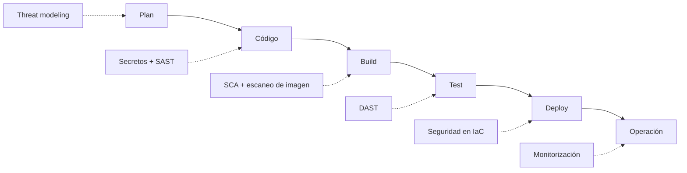

# Seguridad en DevOps

DevOps optimizó la velocidad de entrega. Y al hacerlo dejó al descubierto un problema: el proceso de seguridad tradicional no aguanta ese ritmo.

Si desplegamos una vez al trimestre, podemos permitirnos una auditoría de dos semanas antes de cada release. Si desplegamos quince veces al día, esa auditoría es imposible. La opción que eligen muchos equipos es la peor de todas: dejar de hacerla.

## El coste de llegar tarde

```
Desarrollo (3 meses) → QA → 🔒 Auditoría → 😱 → Producción
```

Tres problemas con este modelo:

- **Arreglar es carísimo.** Un fallo detectado en diseño se corrige cambiando un párrafo. El mismo fallo en producción implica rehacer código, migrar datos y gestionar un incidente.
- **La seguridad se convierte en "el que dice que no".** Un obstáculo burocrático que los equipos aprenden a esquivar.
- **No escala.** Tres personas de seguridad no pueden revisar a mano lo que producen cien desarrolladores.

## Shift-left

**DevSecOps** es la respuesta: integrar la seguridad en cada etapa en lugar de dejarla al final. Y **shift-left** es su idea central — si dibujamos el ciclo de vida de izquierda a derecha, se trata de mover la seguridad hacia la izquierda, lo más cerca posible de donde se escribe el código.


```mermaid
graph LR
    A[Plan] --> B[Código]
    B --> C[Build]
    C --> D[Test]
    D --> E[Deploy]
    E --> F[Operación]

    A1[Threat modeling] -.-> A
    B1[Secretos + SAST] -.-> B
    C1[SCA + escaneo de imagen] -.-> C
    D1[DAST] -.-> D
    E1[Seguridad en IaC] -.-> E
    F1[Monitorización] -.-> F
```

No es una frase motivacional, es aritmética: cuanto antes encontramos un fallo, más barato es arreglarlo.

## Qué cambia respecto a DevOps

| | DevOps | DevSecOps |
|---|---|---|
| **Objetivo** | Entregar rápido y de forma fiable | Lo mismo, sin regalar fallos |
| **Responsabilidad** | Dev y Ops comparten la entrega | Todos comparten también la seguridad |
| **Cuándo se revisa** | Antes de la release | En cada commit |
| **Qué rompe el pipeline** | Un test que falla | Un test **o un CVE crítico** |
| **Métricas** | Lead time, MTTR | Las anteriores + tiempo hasta parchear |

Fijémonos en que no es un stack distinto ni un equipo aparte. Es el mismo pipeline con controles añadidos.

## Las herramientas, por etapa

| Familia | Qué hace | Cuándo actúa | Ejemplo |
|---|---|---|---|
| **Secret scanning** | Busca credenciales en el código | Antes del commit | gitleaks |
| **SAST** | Analiza el código sin ejecutarlo | En cada push | Semgrep, SonarQube |
| **SCA** | Revisa nuestras dependencias | En cada push | Trivy, Dependabot |
| **Escaneo de imágenes** | Busca CVEs en el contenedor | Al construir | Trivy, Grype |
| **SBOM y firma** | Inventaría y firma el artefacto | En cada release | Syft, Cosign |
| **IaC scanning** | Audita nuestro Terraform | Antes de desplegar | Checkov, tfsec |
| **DAST** | Ataca la aplicación en marcha | Sobre un entorno desplegado | OWASP ZAP |

Ninguna encuentra todo. Cada una mira desde un ángulo distinto, y por eso se combinan.

## Los dos principios que evitan el fracaso

Si nos llevamos solo dos ideas de este capítulo, que sean estas.

**1. Informar de todo, bloquear por poco.** Un pipeline que falla por doscientas vulnerabilidades de severidad baja se ignora en una semana, y entonces no protegemos nada. Reportemos absolutamente todo, pero bloqueemos únicamente lo crítico que tenga parche disponible.

**2. La seguridad es responsabilidad de todos.** Si el desarrollador piensa que "ya lo mirará el equipo de seguridad", el modelo no funciona. Y cuando un control frene a alguien, ayudémosle a arreglarlo: esa primera vez decide si el equipo lo percibe como ayuda o como obstáculo.

## Continúa en el curso de DevSecOps

Este capítulo es solo el mapa. Cada una de estas etapas tiene su capítulo con laboratorio propio en el **[curso de DevSecOps](../devsecops/README.md)**:

1. [Qué es DevSecOps](../devsecops/101.Introduccion.md) — cultura y pipeline seguro
2. [Secretos en el código](../devsecops/102.Secretos_en_codigo.md) — gitleaks, pre-commit e historial
3. [Dependencias y SCA](../devsecops/103.Dependencias_sca.md) — Trivy, Dependabot y Renovate
4. [SAST](../devsecops/104.Sast.md) — análisis estático con Semgrep
5. [Imágenes de contenedor](../devsecops/105.Seguridad_imagenes.md) — escaneo con Trivy y gates
6. [SBOM y firma](../devsecops/106.Sbom_firma.md) — Syft y Cosign
7. [Seguridad en IaC](../devsecops/107.Seguridad_iac.md) — Checkov y Policy as Code
8. [Secretos en producción](../devsecops/108.Gestion_secretos.md) — Vault y External Secrets
9. [DAST](../devsecops/109.Dast.md) — OWASP ZAP
10. [Pipeline completo](../devsecops/110.Pipeline_completo.md) — juntarlo todo en GitHub Actions

Para la seguridad específica de Kubernetes (RBAC, NetworkPolicies, Falco, OPA), el sitio es el [curso de Kubernetes](../kubernetes/119.Seguridad.md).

## Resumen

- El proceso de seguridad tradicional no aguanta el ritmo de DevOps
- **Shift-left**: cuanto antes detectas un fallo, más barato es arreglarlo
- DevSecOps no es otro stack: es el mismo pipeline con controles en cada etapa
- Cada familia de herramientas cubre un ángulo distinto y ninguna lo ve todo
- Informemos de todo, bloqueemos por poco, y ayudemos a quien bloqueemos

---

> 💡 **Recuerda**: la seguridad no es un checkpoint, es algo que ocurre en cada commit.

**Continúa en el [curso de DevSecOps](../devsecops/README.md), donde cada etapa tiene su laboratorio.**
