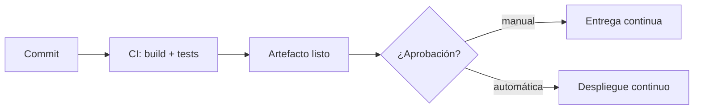

# Qué es CI/CD

CI/CD son tres prácticas distintas que casi siempre se nombran juntas y que conviene separar, porque implican compromisos muy diferentes.

## Las tres, separadas

**Integración continua (CI).** Todo el mundo integra su trabajo en la rama principal a menudo — al menos una vez al día — y cada integración se valida automáticamente compilando y ejecutando los tests.

**Entrega continua (CD).** Cada cambio que pasa la validación queda **listo para desplegar** en cualquier momento. El despliegue lo lanza una persona, pero es un botón, no un procedimiento.

**Despliegue continuo (CD, también).** Lo mismo, pero sin el botón: si pasa todas las validaciones, va a producción solo.



La diferencia entre las dos últimas es **una decisión de negocio, no técnica**. Muchos equipos con capacidad de despliegue continuo eligen mantener la aprobación manual por regulación o por gestión del riesgo, y es perfectamente legítimo.

## Lo que la CI es en realidad

Aquí hay un malentendido muy extendido: mucha gente cree que tener un pipeline que ejecuta tests ya es integración continua. No lo es.

**La integración continua trata de integrar a menudo.** Si tienes ramas que viven tres semanas antes de fusionarse, no estás haciendo CI aunque tengas cien jobs en verde. Estás haciendo integración esporádica con validación automática, que está bien, pero no te da lo que promete la CI.

El beneficio real viene de que los conflictos y las incompatibilidades aparezcan a las pocas horas, cuando son pequeños, en lugar de a las tres semanas, cuando son una tarde perdida.

De ahí sale una consecuencia incómoda: para integrar a diario hay que saber meter en la rama principal código de funcionalidades a medias. Se resuelve con **feature flags** o construyendo por partes que no rompan lo existente.

## Las etapas de un pipeline

```
Commit → Build → Tests → Análisis → Artefacto → Deploy staging → Deploy producción
```

En cada una:

| Etapa | Qué pasa | Cuánto debería tardar |
|---|---|---|
| **Build** | Compilar, empaquetar | 1-3 min |
| **Tests** | Unitarios e integración | 3-5 min |
| **Análisis** | Lint, seguridad, calidad | 1-2 min |
| **Artefacto** | Publicar la imagen o el paquete | 1-2 min |
| **Deploy** | Desplegar y verificar | 2-5 min |

Dos principios que sostienen todo lo demás:

**El artefacto se construye una sola vez.** Se construye en CI y ese mismo artefacto atraviesa staging y producción. Si reconstruyes para producción, lo que despliegas no es lo que probaste.

**Fallar rápido.** Lo barato primero. Si el lint falla en veinte segundos, no gastes cinco minutos de tests.

## Elegir plataforma

| | GitHub Actions | GitLab CI | Jenkins |
|---|---|---|---|
| **Instalación** | Nada, va integrado | Nada si usas GitLab | Un servidor que mantener |
| **Configuración** | YAML | YAML | Groovy o interfaz web |
| **Ecosistema** | Enorme (marketplace) | Bueno | Enorme, pero desigual |
| **Coste** | Gratis en repos públicos | Minutos incluidos | Solo tu infraestructura |
| **Fuerte en** | Integración con GitHub | Todo en una herramienta | Flexibilidad extrema |

La recomendación honesta: **usa el CI de donde ya está tu código**. La integración lo vale, y el tiempo que ahorras en mantenimiento es real.

Jenkins sigue teniendo sentido en dos casos: necesitas algo muy específico que las plataformas gestionadas no permiten, o tienes requisitos de aislamiento que obligan a alojarlo tú. Fuera de eso, mantener un Jenkins es un trabajo a tiempo parcial que nadie quiere.

## Un pipeline mínimo que funciona

```yaml
name: CI/CD
on:
  push:
    branches: [main]
  pull_request:

jobs:
  test:
    runs-on: ubuntu-latest
    steps:
      - uses: actions/checkout@v4
      - uses: actions/setup-node@v4
        with:
          node-version: 20
          cache: 'npm'
      - run: npm ci
      - run: npm run lint
      - run: npm test

  build:
    needs: test
    if: github.ref == 'refs/heads/main'
    runs-on: ubuntu-latest
    steps:
      - uses: actions/checkout@v4
      - run: docker build -t ghcr.io/org/app:${{ github.sha }} .
      - run: docker push ghcr.io/org/app:${{ github.sha }}

  deploy:
    needs: build
    runs-on: ubuntu-latest
    environment: produccion      # aquí se configura la aprobación manual
    steps:
      - run: ./deploy.sh ghcr.io/org/app:${{ github.sha }}
```

Tres detalles que importan más de lo que parece:

- **`needs`** encadena los jobs: no se construye si los tests fallan.
- **`environment: produccion`** es donde GitHub aplica la aprobación manual y guarda los secretos de ese entorno. Es la línea que convierte esto en entrega continua en vez de despliegue continuo.
- **La etiqueta es el SHA del commit**, y se pasa al script de despliegue. Trazabilidad directa desde producción hasta la línea de código.

## Qué hace falta antes

El despliegue continuo no es una herramienta que enchufas, es una consecuencia. Requiere:

- ✅ Tests en los que el equipo confíe de verdad
- ✅ Despliegue automatizado, sin pasos manuales escondidos
- ✅ Monitorización que te avise antes que los usuarios
- ✅ Rollback rápido y probado
- ✅ Feature flags para desacoplar desplegar de activar

Si te falta el rollback o la monitorización, el despliegue continuo no te hace ir más rápido: te hace romper cosas más rápido.

## Secretos en el pipeline

Nunca en el código, siempre en el gestor de secretos de la plataforma:

```yaml
env:
  API_TOKEN: ${{ secrets.API_TOKEN }}
```

Y dos cosas que sorprenden a mucha gente: los secretos aparecen enmascarados en los logs, **pero un `echo` bien construido puede sacarlos igualmente**; y los pull requests desde forks no tienen acceso a los secretos, lo cual es una medida de seguridad, no un fallo.

La gestión seria de secretos —rotación, credenciales dinámicas, identidad de plataforma— está en el [capítulo 8 del curso de DevSecOps](../devsecops/108.Gestion_secretos.md).

## Errores habituales

- **Pipelines lentos.** Más de diez minutos y la gente deja de esperar. Lo tratamos en el [capítulo siguiente](302.Pipelines.md).
- **Tests inestables.** Enseñan al equipo a reintentar sin mirar.
- **Reconstruir por entorno.** Rompe la garantía de que despliegas lo que probaste.
- **Rama principal rota durante horas.** Si nadie puede integrar, la CI ha dejado de funcionar. Arreglarla es la máxima prioridad, por delante de cualquier funcionalidad.

## Resumen

- CI es **integrar a menudo**, no solo tener tests automáticos
- Entrega continua deja el artefacto listo; despliegue continuo lo lanza solo
- La diferencia entre ambas es una decisión de negocio
- **Construye el artefacto una vez** y promociónalo entre entornos
- Usa el CI de donde ya vive tu código
- Sin rollback ni monitorización, el despliegue continuo solo acelera los errores
- Una rama principal rota es la prioridad número uno

## Recursos adicionales

- [Documentación de GitHub Actions](https://docs.github.com/actions)
- [Pipelines avanzados](302.Pipelines.md) — cuando esto se queda corto
- [Estrategias de despliegue](304.Deployment_strategies.md)
- [Pipeline DevSecOps completo](../devsecops/110.Pipeline_completo.md)

---

> 💡 **Recuerda**: el objetivo de CI/CD no es desplegar mucho, es que desplegar deje de dar miedo.

**En el próximo capítulo vemos qué hacer cuando ese pipeline empieza a tardar demasiado.**
