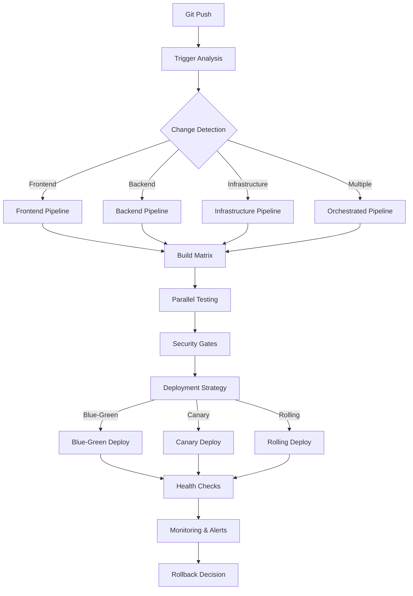

# Pipelines CI/CD Avanzados 🚀

## Más Allá del Pipeline Básico

Un pipeline CI/CD básico ejecuta tests y despliega. Un pipeline avanzado optimiza para velocidad, calidad, seguridad y experiencia del desarrollador, mientras maneja complejidad empresarial.

## 🎯 Objetivos del Capítulo

- Diseñar pipelines de nivel enterprise
- Implementar paralelización inteligente
- Optimizar tiempos de build y deploy
- Manejar dependencias complejas entre servicios
- Crear experiencias developer-friendly

## 🏗️ Arquitectura de Pipeline Avanzado



### Pipeline Configuration as Code

#### GitHub Actions - Enterprise Pipeline
```yaml
# .github/workflows/advanced-pipeline.yml
name: Advanced CI/CD Pipeline

on:
  push:
    branches: [main, develop, 'release/*']
  pull_request:
    branches: [main, develop]

env:
  REGISTRY: ghcr.io
  IMAGE_NAME: ${{ github.repository }}

jobs:
  # Job para detectar cambios y optimizar pipeline
  detect_changes:
    runs-on: ubuntu-latest
    outputs:
      frontend: ${{ steps.changes.outputs.frontend }}
      backend: ${{ steps.changes.outputs.backend }}
      infrastructure: ${{ steps.changes.outputs.infrastructure }}
      tests: ${{ steps.changes.outputs.tests }}
    steps:
      - uses: actions/checkout@v3
        with:
          fetch-depth: 0
          
      - uses: dorny/paths-filter@v2
        id: changes
        with:
          filters: |
            frontend:
              - 'frontend/**'
              - 'package.json'
              - 'package-lock.json'
            backend:
              - 'backend/**'
              - 'api/**'
              - 'requirements.txt'
              - 'Dockerfile'
            infrastructure:
              - 'terraform/**'
              - 'k8s/**'
              - '.github/workflows/**'
            tests:
              - 'tests/**'
              - '**/*.test.js'
              - '**/*.spec.py'

  # Build matrix para múltiples versiones/plataformas
  build_matrix:
    needs: detect_changes
    if: needs.detect_changes.outputs.backend == 'true'
    runs-on: ubuntu-latest
    strategy:
      matrix:
        python-version: ['3.9', '3.10', '3.11']
        node-version: ['16', '18', '20']
        include:
          - python-version: '3.11'
            node-version: '20'
            is_primary: true
    steps:
      - uses: actions/checkout@v3
      
      - name: Setup Python ${{ matrix.python-version }}
        uses: actions/setup-python@v4
        with:
          python-version: ${{ matrix.python-version }}
          
      - name: Setup Node ${{ matrix.node-version }}
        uses: actions/setup-node@v3
        with:
          node-version: ${{ matrix.node-version }}
          cache: 'npm'
          
      - name: Cache dependencies
        uses: actions/cache@v3
        with:
          path: |
            ~/.cache/pip
            ~/.npm
            node_modules
          key: ${{ runner.os }}-deps-${{ matrix.python-version }}-${{ matrix.node-version }}-${{ hashFiles('**/requirements.txt', '**/package-lock.json') }}
          
      - name: Install dependencies
        run: |
          pip install -r requirements.txt
          npm ci
          
      - name: Build application
        run: |
          npm run build
          python setup.py build
          
      - name: Upload build artifacts
        if: matrix.is_primary
        uses: actions/upload-artifact@v3
        with:
          name: build-artifacts
          path: |
            dist/
            build/

  # Testing paralelo e inteligente
  test_suite:
    needs: [detect_changes, build_matrix]
    runs-on: ubuntu-latest
    strategy:
      matrix:
        test_group: [unit, integration, e2e, performance]
        shard: [1, 2, 3, 4]
    steps:
      - uses: actions/checkout@v3
      
      - name: Download build artifacts
        uses: actions/download-artifact@v3
        with:
          name: build-artifacts
          
      - name: Setup test environment
        run: |
          docker-compose -f docker-compose.test.yml up -d
          
      - name: Run ${{ matrix.test_group }} tests (Shard ${{ matrix.shard }})
        run: |
          case "${{ matrix.test_group }}" in
            "unit")
              pytest tests/unit/ --shard-id=${{ matrix.shard }} --num-shards=4
              ;;
            "integration")
              pytest tests/integration/ --shard-id=${{ matrix.shard }} --num-shards=4
              ;;
            "e2e")
              npm run test:e2e -- --shard=${{ matrix.shard }}/4
              ;;
            "performance")
              k6 run tests/performance/load-test.js --shard=${{ matrix.shard }}
              ;;
          esac
          
      - name: Upload test results
        uses: actions/upload-artifact@v3
        if: always()
        with:
          name: test-results-${{ matrix.test_group }}-${{ matrix.shard }}
          path: |
            test-results/
            coverage/

  # Security scanning paralelo
  security_scan:
    needs: detect_changes
    runs-on: ubuntu-latest
    strategy:
      matrix:
        scan_type: [sast, sca, secrets, container]
    steps:
      - uses: actions/checkout@v3
      
      - name: SAST Scan
        if: matrix.scan_type == 'sast'
        uses: github/codeql-action/analyze@v2
        with:
          languages: python, javascript
          
      - name: SCA Scan  
        if: matrix.scan_type == 'sca'
        uses: snyk/actions/node@master
        env:
          SNYK_TOKEN: ${{ secrets.SNYK_TOKEN }}
          
      - name: Secrets Scan
        if: matrix.scan_type == 'secrets'
        uses: trufflesecurity/trufflehog@main
        with:
          path: ./
          
      - name: Container Scan
        if: matrix.scan_type == 'container'
        uses: aquasecurity/trivy-action@master
        with:
          image-ref: ${{ env.REGISTRY }}/${{ env.IMAGE_NAME }}:${{ github.sha }}

  # Build y push de imágenes optimizado
  build_and_push:
    needs: [test_suite, security_scan]
    if: github.ref == 'refs/heads/main'
    runs-on: ubuntu-latest
    steps:
      - uses: actions/checkout@v3
      
      - name: Setup Buildx
        uses: docker/setup-buildx-action@v2
        
      - name: Login to Container Registry
        uses: docker/login-action@v2
        with:
          registry: ${{ env.REGISTRY }}
          username: ${{ github.actor }}
          password: ${{ secrets.GITHUB_TOKEN }}
          
      - name: Extract metadata
        id: meta
        uses: docker/metadata-action@v4
        with:
          images: ${{ env.REGISTRY }}/${{ env.IMAGE_NAME }}
          tags: |
            type=ref,event=branch
            type=ref,event=pr
            type=sha,prefix={{branch}}-
            type=raw,value=latest,enable={{is_default_branch}}
            
      - name: Build and push
        uses: docker/build-push-action@v4
        with:
          context: .
          platforms: linux/amd64,linux/arm64
          push: true
          tags: ${{ steps.meta.outputs.tags }}
          labels: ${{ steps.meta.outputs.labels }}
          cache-from: type=gha
          cache-to: type=gha,mode=max
          build-args: |
            VERSION=${{ github.sha }}
            BUILD_DATE=${{ steps.meta.outputs.created }}

  # Deployment con diferentes estrategias
  deploy:
    needs: build_and_push
    runs-on: ubuntu-latest
    environment: 
      name: production
      url: https://myapp.com
    strategy:
      matrix:
        environment: [staging, production]
    steps:
      - uses: actions/checkout@v3
      
      - name: Deploy to ${{ matrix.environment }}
        run: |
          # Estrategia basada en el ambiente
          if [ "${{ matrix.environment }}" = "staging" ]; then
            echo "Rolling deployment to staging"
            kubectl apply -f k8s/staging/
          else
            echo "Blue-green deployment to production"
            ./scripts/blue-green-deploy.sh
          fi
          
      - name: Health check
        run: |
          timeout 300 bash -c 'while [[ "$(curl -s -o /dev/null -w ''%{http_code}'' https://${{ matrix.environment }}.myapp.com/health)" != "200" ]]; do sleep 5; done'
          
      - name: Smoke tests
        run: |
          npm run test:smoke -- --env=${{ matrix.environment }}
```

### Jenkins Pipeline Avanzado

```groovy
// Jenkinsfile
pipeline {
    agent none
    
    parameters {
        choice(
            name: 'DEPLOYMENT_STRATEGY',
            choices: ['rolling', 'blue-green', 'canary'],
            description: 'Deployment strategy'
        )
        booleanParam(
            name: 'SKIP_TESTS',
            defaultValue: false,
            description: 'Skip test execution'
        )
        string(
            name: 'TARGET_ENVIRONMENT',
            defaultValue: 'staging',
            description: 'Target environment'
        )
    }
    
    environment {
        DOCKER_REGISTRY = 'harbor.company.com'
        IMAGE_NAME = 'myapp'
        KUBECONFIG = credentials('kubeconfig-prod')
        SONAR_TOKEN = credentials('sonar-token')
    }
    
    stages {
        stage('Preparation') {
            agent { label 'docker' }
            steps {
                script {
                    // Detectar cambios
                    def changedFiles = sh(
                        script: "git diff --name-only HEAD~1",
                        returnStdout: true
                    ).trim().split('\n')
                    
                    env.BUILD_FRONTEND = changedFiles.any { it.startsWith('frontend/') }
                    env.BUILD_BACKEND = changedFiles.any { it.startsWith('backend/') }
                    env.BUILD_INFRASTRUCTURE = changedFiles.any { it.startsWith('infrastructure/') }
                    
                    // Generar build matrix
                    def buildMatrix = [:]
                    if (env.BUILD_FRONTEND == 'true') {
                        buildMatrix['frontend'] = ['node:16', 'node:18', 'node:20']
                    }
                    if (env.BUILD_BACKEND == 'true') {
                        buildMatrix['backend'] = ['python:3.9', 'python:3.10', 'python:3.11']
                    }
                    
                    env.BUILD_MATRIX = writeJSON returnText: true, json: buildMatrix
                }
            }
        }
        
        stage('Parallel Build & Test') {
            parallel {
                stage('Backend Pipeline') {
                    when { environment name: 'BUILD_BACKEND', value: 'true' }
                    agent { 
                        docker { 
                            image 'python:3.11'
                            args '-v /var/run/docker.sock:/var/run/docker.sock'
                        }
                    }
                    stages {
                        stage('Backend Setup') {
                            steps {
                                sh '''
                                    pip install -r requirements.txt
                                    pip install pytest pytest-cov
                                '''
                            }
                        }
                        
                        stage('Backend Tests') {
                            parallel {
                                stage('Unit Tests') {
                                    steps {
                                        sh 'pytest tests/unit/ --junitxml=results/unit-tests.xml --cov=src --cov-report=xml'
                                    }
                                    post {
                                        always {
                                            junit 'results/unit-tests.xml'
                                            publishCoverage adapters: [coberturaAdapter('coverage.xml')], sourceFileResolver: sourceFiles('STORE_LAST_BUILD')
                                        }
                                    }
                                }
                                
                                stage('Integration Tests') {
                                    steps {
                                        sh '''
                                            docker-compose -f docker-compose.test.yml up -d
                                            sleep 30
                                            pytest tests/integration/ --junitxml=results/integration-tests.xml
                                        '''
                                    }
                                    post {
                                        always {
                                            sh 'docker-compose -f docker-compose.test.yml down'
                                            junit 'results/integration-tests.xml'
                                        }
                                    }
                                }
                            }
                        }
                        
                        stage('Quality Gates') {
                            parallel {
                                stage('SonarQube Analysis') {
                                    steps {
                                        withSonarQubeEnv('SonarQube') {
                                            sh '''
                                                sonar-scanner \
                                                  -Dsonar.projectKey=myapp-backend \
                                                  -Dsonar.sources=src/ \
                                                  -Dsonar.tests=tests/ \
                                                  -Dsonar.python.coverage.reportPaths=coverage.xml \
                                                  -Dsonar.python.xunit.reportPath=results/unit-tests.xml
                                            '''
                                        }
                                        
                                        timeout(time: 10, unit: 'MINUTES') {
                                            waitForQualityGate abortPipeline: true
                                        }
                                    }
                                }
                                
                                stage('Security Scan') {
                                    steps {
                                        sh '''
                                            # Dependency check
                                            safety check --json --output results/safety-report.json
                                            
                                            # SAST with bandit
                                            bandit -r src/ -f json -o results/bandit-report.json
                                            
                                            # Secrets scan
                                            trufflehog --json --entropy=False . > results/secrets-scan.json
                                        '''
                                    }
                                    post {
                                        always {
                                            archiveArtifacts artifacts: 'results/*-report.json', allowEmptyArchive: true
                                        }
                                    }
                                }
                            }
                        }
                    }
                }
                
                stage('Frontend Pipeline') {
                    when { environment name: 'BUILD_FRONTEND', value: 'true' }
                    agent { 
                        docker { 
                            image 'node:18'
                            args '-v /var/run/docker.sock:/var/run/docker.sock'
                        }
                    }
                    stages {
                        stage('Frontend Setup') {
                            steps {
                                sh '''
                                    npm ci
                                    npm run build
                                '''
                            }
                        }
                        
                        stage('Frontend Tests') {
                            parallel {
                                stage('Unit Tests') {
                                    steps {
                                        sh 'npm run test:unit -- --reporter=xunit --outputFile=results/frontend-unit-tests.xml'
                                    }
                                }
                                
                                stage('E2E Tests') {
                                    steps {
                                        sh '''
                                            npm run start:test &
                                            sleep 60
                                            npm run test:e2e -- --reporter=xunit --outputFile=results/frontend-e2e-tests.xml
                                        '''
                                    }
                                }
                                
                                stage('Performance Tests') {
                                    steps {
                                        sh '''
                                            npm run build:prod
                                            npm run lighthouse:ci
                                        '''
                                    }
                                }
                            }
                            post {
                                always {
                                    junit 'results/frontend-*.xml'
                                }
                            }
                        }
                    }
                }
            }
        }
        
        stage('Build & Push Images') {
            when { 
                anyOf {
                    branch 'main'
                    branch 'develop'
                    branch 'release/*'
                }
            }
            agent { label 'docker' }
            steps {
                script {
                    def imageTag = "${env.BUILD_NUMBER}-${env.GIT_COMMIT.take(8)}"
                    def latestTag = env.BRANCH_NAME == 'main' ? 'latest' : env.BRANCH_NAME
                    
                    // Build con BuildKit para optimización
                    sh """
                        export DOCKER_BUILDKIT=1
                        docker build \
                            --build-arg VERSION=${imageTag} \
                            --build-arg BUILD_DATE=\$(date -u +"%Y-%m-%dT%H:%M:%SZ") \
                            --tag ${DOCKER_REGISTRY}/${IMAGE_NAME}:${imageTag} \
                            --tag ${DOCKER_REGISTRY}/${IMAGE_NAME}:${latestTag} \
                            --cache-from=${DOCKER_REGISTRY}/${IMAGE_NAME}:latest \
                            .
                    """
                    
                    // Push to registry
                    docker.withRegistry("https://${DOCKER_REGISTRY}", 'harbor-credentials') {
                        sh """
                            docker push ${DOCKER_REGISTRY}/${IMAGE_NAME}:${imageTag}
                            docker push ${DOCKER_REGISTRY}/${IMAGE_NAME}:${latestTag}
                        """
                    }
                    
                    env.IMAGE_TAG = imageTag
                }
            }
        }
        
        stage('Deploy') {
            when { 
                anyOf {
                    branch 'main'
                    branch 'develop'
                }
            }
            agent { label 'kubectl' }
            steps {
                script {
                    def deploymentStrategy = params.DEPLOYMENT_STRATEGY
                    def targetEnv = params.TARGET_ENVIRONMENT
                    
                    switch(deploymentStrategy) {
                        case 'rolling':
                            sh """
                                helm upgrade --install myapp ./charts/myapp \
                                    --namespace ${targetEnv} \
                                    --set image.tag=${env.IMAGE_TAG} \
                                    --set environment=${targetEnv} \
                                    --wait --timeout=600s
                            """
                            break
                            
                        case 'blue-green':
                            sh "./scripts/blue-green-deploy.sh ${env.IMAGE_TAG} ${targetEnv}"
                            break
                            
                        case 'canary':
                            sh """
                                # Deploy canary with 10% traffic
                                helm upgrade --install myapp-canary ./charts/myapp \
                                    --namespace ${targetEnv} \
                                    --set image.tag=${env.IMAGE_TAG} \
                                    --set canary.enabled=true \
                                    --set canary.weight=10 \
                                    --wait --timeout=600s
                                
                                # Monitor metrics for 10 minutes
                                sleep 600
                                
                                # Check error rate and promote if good
                                ERROR_RATE=\$(kubectl get --raw "/api/v1/namespaces/${targetEnv}/services/prometheus:9090/proxy/api/v1/query?query=rate(http_requests_total{status=~'5..'}[5m])/rate(http_requests_total[5m])" | jq -r '.data.result[0].value[1]')
                                
                                if (( \$(echo "\$ERROR_RATE < 0.01" | bc -l) )); then
                                    echo "Promoting canary to full deployment"
                                    helm upgrade myapp ./charts/myapp \
                                        --namespace ${targetEnv} \
                                        --set image.tag=${env.IMAGE_TAG} \
                                        --set canary.enabled=false
                                else
                                    echo "Rolling back canary due to high error rate"
                                    helm rollback myapp-canary
                                    exit 1
                                fi
                            """
                            break
                    }
                }
            }
        }
        
        stage('Post-Deploy Validation') {
            agent { label 'kubectl' }
            parallel {
                stage('Health Checks') {
                    steps {
                        sh '''
                            # Wait for deployment to be ready
                            kubectl rollout status deployment/myapp -n ${TARGET_ENVIRONMENT} --timeout=300s
                            
                            # Health check endpoint
                            for i in {1..30}; do
                                if curl -f "https://${TARGET_ENVIRONMENT}.myapp.com/health"; then
                                    echo "Health check passed"
                                    break
                                fi
                                sleep 10
                            done
                        '''
                    }
                }
                
                stage('Smoke Tests') {
                    steps {
                        sh '''
                            # Run critical path tests
                            npm run test:smoke -- --env=${TARGET_ENVIRONMENT}
                        '''
                    }
                }
                
                stage('Performance Baseline') {
                    steps {
                        sh '''
                            # Run load test to establish baseline
                            k6 run tests/performance/baseline.js \
                                --env ENVIRONMENT=${TARGET_ENVIRONMENT} \
                                --out json=results/performance-baseline.json
                        '''
                    }
                    post {
                        always {
                            archiveArtifacts artifacts: 'results/performance-baseline.json', allowEmptyArchive: true
                        }
                    }
                }
            }
        }
    }
    
    post {
        always {
            // Cleanup
            sh 'docker system prune -f'
        }
        
        success {
            // Notify success
            slackSend(
                channel: '#deployments',
                color: 'good',
                message: """
                ✅ Deployment successful!
                Environment: ${params.TARGET_ENVIRONMENT}
                Strategy: ${params.DEPLOYMENT_STRATEGY}
                Image: ${env.IMAGE_TAG}
                Duration: ${currentBuild.durationString}
                """
            )
        }
        
        failure {
            // Notify failure and trigger rollback
            slackSend(
                channel: '#deployments',
                color: 'danger',
                message: """
                ❌ Deployment failed!
                Environment: ${params.TARGET_ENVIRONMENT}
                Stage: ${env.STAGE_NAME}
                Build: ${env.BUILD_URL}
                """
            )
            
            // Auto-rollback on production failure
            script {
                if (params.TARGET_ENVIRONMENT == 'production') {
                    sh 'helm rollback myapp -n production'
                }
            }
        }
    }
}
```

## 🚀 Optimización de Pipeline Performance

### 1. Caché Inteligente

```yaml
# Cache strategy example
- name: Cache Node modules
  uses: actions/cache@v3
  with:
    path: ~/.npm
    key: ${{ runner.os }}-node-${{ hashFiles('**/package-lock.json') }}
    restore-keys: |
      ${{ runner.os }}-node-

- name: Cache Python dependencies
  uses: actions/cache@v3
  with:
    path: ~/.cache/pip
    key: ${{ runner.os }}-pip-${{ hashFiles('**/requirements.txt') }}
    restore-keys: |
      ${{ runner.os }}-pip-

# Cache Docker layers
- name: Setup Docker Buildx
  uses: docker/setup-buildx-action@v2
  
- name: Build with cache
  uses: docker/build-push-action@v4
  with:
    cache-from: type=gha
    cache-to: type=gha,mode=max
```

### 2. Test Sharding Inteligente

```python
# pytest-smart-shard.py
import json
import sys
from collections import defaultdict

def analyze_test_history():
    """Analizar historial de tests para sharding óptimo"""
    with open('test-times.json', 'r') as f:
        test_times = json.load(f)
    
    # Agrupar tests por tiempo de ejecución
    slow_tests = []
    medium_tests = []
    fast_tests = []
    
    for test, time in test_times.items():
        if time > 60:  # > 1 minuto
            slow_tests.append(test)
        elif time > 10:  # > 10 segundos
            medium_tests.append(test)
        else:
            fast_tests.append(test)
    
    return slow_tests, medium_tests, fast_tests

def create_optimal_shards(num_shards=4):
    """Crear shards balanceados por tiempo de ejecución"""
    slow, medium, fast = analyze_test_history()
    
    shards = [[] for _ in range(num_shards)]
    shard_times = [0] * num_shards
    
    # Distribuir tests lentos primero
    for test in slow:
        min_shard = shard_times.index(min(shard_times))
        shards[min_shard].append(test)
        shard_times[min_shard] += test_times[test]
    
    # Luego tests medianos
    for test in medium:
        min_shard = shard_times.index(min(shard_times))
        shards[min_shard].append(test)
        shard_times[min_shard] += test_times[test]
    
    # Finalmente tests rápidos
    for test in fast:
        min_shard = shard_times.index(min(shard_times))
        shards[min_shard].append(test)
        shard_times[min_shard] += test_times[test]
    
    return shards

if __name__ == "__main__":
    shard_id = int(sys.argv[1])
    num_shards = int(sys.argv[2])
    
    shards = create_optimal_shards(num_shards)
    tests_for_shard = shards[shard_id - 1]
    
    print(" ".join(tests_for_shard))
```

### 3. Build Parallelization

```dockerfile
# Multi-stage optimized Dockerfile
FROM node:18-alpine AS frontend-deps
WORKDIR /app
COPY frontend/package*.json ./
RUN npm ci --only=production

FROM python:3.11-slim AS backend-deps
WORKDIR /app
COPY backend/requirements.txt ./
RUN pip install --no-cache-dir -r requirements.txt

FROM node:18-alpine AS frontend-build
WORKDIR /app
COPY --from=frontend-deps /app/node_modules ./node_modules
COPY frontend/ ./
RUN npm run build

FROM python:3.11-slim AS backend-build
WORKDIR /app
COPY --from=backend-deps /app /app
COPY backend/ ./
RUN python setup.py build

# Final image
FROM python:3.11-slim AS production
WORKDIR /app

# Copy backend
COPY --from=backend-build /app /app

# Copy frontend static files
COPY --from=frontend-build /app/dist ./static

# Install runtime dependencies only
RUN apt-get update && apt-get install -y \
    nginx \
    && rm -rf /var/lib/apt/lists/*

EXPOSE 8000
CMD ["gunicorn", "--bind", "0.0.0.0:8000", "app:app"]
```

## 🔄 Deployment Strategies Avanzadas

### 1. Blue-Green con Health Checks

```bash
#!/bin/bash
# blue-green-deploy.sh

NEW_VERSION=$1
ENVIRONMENT=$2
CURRENT_COLOR=$(kubectl get service myapp-active -o jsonpath='{.spec.selector.color}')

if [ "$CURRENT_COLOR" = "blue" ]; then
    DEPLOY_COLOR="green"
else
    DEPLOY_COLOR="blue"
fi

echo "Deploying version $NEW_VERSION to $DEPLOY_COLOR environment"

# Deploy to inactive color
kubectl set image deployment/myapp-$DEPLOY_COLOR app=myapp:$NEW_VERSION

# Wait for rollout
kubectl rollout status deployment/myapp-$DEPLOY_COLOR --timeout=600s

# Health checks
echo "Running health checks..."
for i in {1..30}; do
    if kubectl exec deployment/myapp-$DEPLOY_COLOR -- curl -f http://localhost:8000/health; then
        echo "Health check passed"
        break
    fi
    sleep 10
    if [ $i -eq 30 ]; then
        echo "Health checks failed"
        exit 1
    fi
done

# Smoke tests
echo "Running smoke tests..."
kubectl run smoke-tests --image=myapp-tests:$NEW_VERSION \
    --env="TARGET_URL=http://myapp-$DEPLOY_COLOR:8000" \
    --restart=Never \
    --rm -i

# Switch traffic
echo "Switching traffic to $DEPLOY_COLOR"
kubectl patch service myapp-active -p '{"spec":{"selector":{"color":"'$DEPLOY_COLOR'"}}}'

# Monitor for 5 minutes
echo "Monitoring new deployment..."
sleep 300

# Check error rates
ERROR_RATE=$(kubectl exec deployment/prometheus -- \
    curl -s "http://localhost:9090/api/v1/query?query=rate(http_requests_total{status=~'5..'}[5m])/rate(http_requests_total[5m])" | \
    jq -r '.data.result[0].value[1]')

if (( $(echo "$ERROR_RATE > 0.01" | bc -l) )); then
    echo "High error rate detected, rolling back"
    kubectl patch service myapp-active -p '{"spec":{"selector":{"color":"'$CURRENT_COLOR'"}}}'
    exit 1
fi

echo "Deployment successful"
```

### 2. Canary con Istio

```yaml
# canary-deployment.yml
apiVersion: argoproj.io/v1alpha1
kind: Rollout
metadata:
  name: myapp-rollout
spec:
  replicas: 10
  strategy:
    canary:
      canaryService: myapp-canary
      stableService: myapp-stable
      trafficRouting:
        istio:
          virtualService:
            name: myapp-vs
            routes:
            - primary
      steps:
      - setWeight: 10
      - pause: {duration: 2m}
      - analysis:
          templates:
          - templateName: success-rate
          args:
          - name: service-name
            value: myapp-canary
      - setWeight: 25
      - pause: {duration: 2m}
      - analysis:
          templates:
          - templateName: success-rate
          - templateName: latency
          args:
          - name: service-name
            value: myapp-canary
      - setWeight: 50
      - pause: {duration: 5m}
      - setWeight: 75
      - pause: {duration: 5m}
  selector:
    matchLabels:
      app: myapp
  template:
    metadata:
      labels:
        app: myapp
    spec:
      containers:
      - name: myapp
        image: myapp:stable
        ports:
        - containerPort: 8080

---
apiVersion: argoproj.io/v1alpha1
kind: AnalysisTemplate
metadata:
  name: success-rate
spec:
  args:
  - name: service-name
  metrics:
  - name: success-rate
    interval: 30s
    count: 4
    successCondition: result[0] >= 0.95
    failureLimit: 3
    provider:
      prometheus:
        address: http://prometheus:9090
        query: |
          sum(rate(http_requests_total{service="{{args.service-name}}",status!~"5.."}[2m])) /
          sum(rate(http_requests_total{service="{{args.service-name}}"}[2m]))

---
apiVersion: argoproj.io/v1alpha1
kind: AnalysisTemplate
metadata:
  name: latency
spec:
  args:
  - name: service-name
  metrics:
  - name: latency
    interval: 30s
    count: 4
    successCondition: result[0] <= 0.5
    failureLimit: 3
    provider:
      prometheus:
        address: http://prometheus:9090
        query: |
          histogram_quantile(0.95,
            sum(rate(http_request_duration_seconds_bucket{service="{{args.service-name}}"}[2m])) by (le)
          )
```

## 🎯 Ejercicios Prácticos

### Ejercicio 1: Pipeline Optimization
1. Analiza un pipeline existente
2. Identifica bottlenecks
3. Implementa paralelización inteligente
4. Mide mejoras en tiempo de ejecución

### Ejercicio 2: Advanced Deployment
1. Implementa blue-green deployment
2. Añade health checks automatizados
3. Configura rollback automático
4. Documenta el proceso de decisión

### Ejercicio 3: Multi-Service Pipeline
1. Crea pipeline para aplicación con microservicios
2. Implementa dependency detection
3. Optimiza builds para servicios no cambiados
4. Configura deployment orchestration

## ✅ Pipeline Excellence Checklist

- [ ] Change detection para optimizar builds
- [ ] Test sharding balanceado por tiempo
- [ ] Paralelización inteligente de jobs
- [ ] Caché optimizado para dependencias
- [ ] Security gates integrados
- [ ] Deployment strategies configurables
- [ ] Health checks y smoke tests automatizados
- [ ] Rollback automático en caso de fallas
- [ ] Métricas y monitoring de pipeline
- [ ] Notificaciones contextuales

## 🔗 Recursos Adicionales

- [GitHub Actions Advanced Features](https://docs.github.com/en/actions/using-workflows/advanced-workflow-features)
- [Jenkins Pipeline Best Practices](https://www.jenkins.io/doc/book/pipeline/pipeline-best-practices/)
- [Argo Rollouts](https://argoproj.github.io/argo-rollouts/)
- [Tekton Pipelines](https://tekton.dev/)


---

> 💡 **Recuerda**: Un pipeline avanzado no es solo más complejo, es más inteligente. Optimiza para la experiencia del desarrollador y la confiabilidad del sistema.
