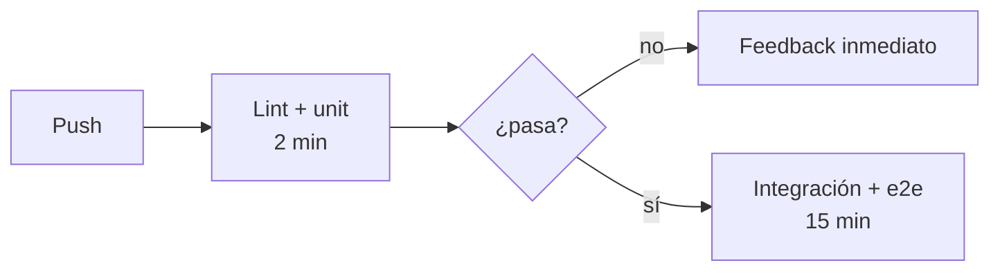

# Pipelines avanzados

Un pipeline básico ejecuta los tests y despliega. Funciona perfectamente hasta que el proyecto crece y un día alguien dice la frase: *"voy a hacer el cambio de una línea y espero veinte minutos a que pase el CI"*.

A partir de ahí empiezan a pasar cosas malas. La gente agrupa cambios en commits grandes para no esperar, se saltan el CI con `--no-verify`, o directamente dejan de mirar si pasó.

**Un pipeline lento no es una molestia, es un incentivo perverso.** Este capítulo va de que eso no ocurra.

## El objetivo: menos de diez minutos

No es un número mágico, es el umbral aproximado en el que la gente deja de esperar y cambia de tarea. Y cuando cambia de tarea, el contexto se pierde y arreglar el fallo cuesta el triple.

Cuatro palancas, de mayor a menor impacto:

1. **No ejecutar lo que no hace falta** (detección de cambios)
2. **No repetir trabajo ya hecho** (cache)
3. **Hacer cosas a la vez** (paralelización)
4. **No duplicar configuración** (workflows reutilizables)

## 1. Detección de cambios

En un monorepo, cambiar el README no debería lanzar los tests del backend.

```yaml
jobs:
  cambios:
    runs-on: ubuntu-latest
    outputs:
      frontend: ${{ steps.filtro.outputs.frontend }}
      backend: ${{ steps.filtro.outputs.backend }}
    steps:
      - uses: actions/checkout@v4
      - uses: dorny/paths-filter@v3
        id: filtro
        with:
          filters: |
            frontend:
              - 'frontend/**'
            backend:
              - 'backend/**'
              - 'requirements.txt'

  test-backend:
    needs: cambios
    if: needs.cambios.outputs.backend == 'true'
    runs-on: ubuntu-latest
    steps:
      - run: pytest
```

:::warning Cuidado con lo que declaramos como "no afecta"

Si el filtro se queda corto, tendremos cambios que se despliegan sin haber pasado por los tests que los cubrían. Ante la duda, incluyamos el fichero en el filtro: ejecutar de más cuesta minutos, ejecutar de menos cuesta incidentes.

:::

## 2. Cache

Descargar dependencias es, casi siempre, la parte más lenta de un build. Y casi nunca cambia.

```yaml
- uses: actions/setup-node@v4
  with:
    node-version: 20
    cache: 'npm'      # gestiona la cache por ti
```

Para casos que la acción no cubre, la cache manual:

```yaml
- uses: actions/cache@v4
  with:
    path: ~/.cache/pip
    key: ${{ runner.os }}-pip-${{ hashFiles('**/requirements.txt') }}
    restore-keys: |
      ${{ runner.os }}-pip-
```

La clave está en las dos últimas líneas. El `key` incluye un hash del fichero de dependencias: si cambia, la cache se invalida. Y `restore-keys` permite reutilizar una cache parcial anterior en lugar de empezar de cero — que es la diferencia entre instalar dos paquetes nuevos o los doscientos.

Para imágenes de contenedor:

```yaml
- uses: docker/build-push-action@v6
  with:
    cache-from: type=gha
    cache-to: type=gha,mode=max
```

## 3. Paralelización

### Matrices

Ejecutar lo mismo sobre varias versiones o plataformas, a la vez:

```yaml
jobs:
  test:
    runs-on: ${{ matrix.os }}
    strategy:
      fail-fast: false
      matrix:
        os: [ubuntu-latest, macos-latest]
        node: [20, 22]
```

Cuatro combinaciones en paralelo. El `fail-fast: false` es importante: por defecto, si una combinación falla se cancelan las demás, y entonces no sabemos si el fallo es de esa versión concreta o de todas.

### Repartir los tests

Cuando la suite es larga, se parte en trozos que corren a la vez:

```yaml
    strategy:
      matrix:
        shard: [1, 2, 3, 4]
    steps:
      - run: npx playwright test --shard=${{ matrix.shard }}/4
```

Una suite de veinte minutos pasa a cinco. Con un matiz: repartir por número de fichero suele dejar un trozo mucho más lento que los otros, y el job total tarda lo que tarde el más lento. Las herramientas que reparten por **tiempo histórico** de cada test equilibran mucho mejor.

### Separar rápido de lento


```mermaid
graph LR
    A[Push] --> B[Lint + unit<br/>2 min]
    B --> C{¿pasa?}
    C -->|no| D[Feedback inmediato]
    C -->|sí| E[Integración + e2e<br/>15 min]
```

Lo barato primero. No tiene sentido gastar quince minutos de e2e para descubrir al final que faltaba un punto y coma.

## 4. Workflows reutilizables

Cuando tenemos ocho repositorios con el mismo pipeline copiado, cualquier mejora implica ocho pull requests. Y en la práctica, se queda sin hacer.

```yaml
# .github/workflows/test-node.yml (en un repo central)
on:
  workflow_call:
    inputs:
      node-version:
        type: string
        default: '20'

jobs:
  test:
    runs-on: ubuntu-latest
    steps:
      - uses: actions/checkout@v4
      - uses: actions/setup-node@v4
        with:
          node-version: ${{ inputs.node-version }}
          cache: 'npm'
      - run: npm ci && npm test
```

Y en cada proyecto:

```yaml
jobs:
  test:
    uses: mi-org/.github/.github/workflows/test-node.yml@v1
    with:
      node-version: '22'
```

Fijémonos en el `@v1` del final. **Referenciemos siempre una versión o un tag**, nunca `@main`: si no, un cambio en el workflow central puede romper los ocho repositorios a la vez sin que nadie haya tocado nada.

## Tests inestables

El enemigo silencioso. Un test que falla una de cada veinte ejecuciones enseña al equipo a reintentar el pipeline sin mirar, y a partir de ahí los fallos reales también se ignoran.

Lo que funciona:

1. **Medir** cuáles fallan de forma intermitente
2. **Sacarlos** de la ruta crítica, a un job aparte que no bloquee
3. **Arreglarlos o borrarlos** con fecha límite
4. **No** poner reintentos automáticos como solución permanente — es esconder el problema

Un test que nadie se fía de él tiene valor negativo: consume tiempo y no aporta confianza.

## Qué medir del pipeline

| Métrica | Objetivo razonable |
|---|---|
| Duración del CI | Menos de 10 min |
| Tasa de éxito | Más del 95% |
| Tiempo en cola | Menos de 1 min |
| Tests inestables | Cero en la ruta crítica |

Si la tasa de éxito baja del 90%, el problema rara vez es el código: suele ser infraestructura o tests inestables. Y un pipeline en el que el rojo es normal deja de ser una señal.

## Seguridad en el pipeline

Los escaneos de seguridad —secretos, SAST, dependencias, imágenes— encajan de forma natural en un pipeline avanzado, en paralelo con los tests.

Lo tenemos con laboratorios completos en el [curso de DevSecOps](../devsecops/README.md), y el pipeline entero montado en su [capítulo final](../devsecops/110.Pipeline_completo.md).

## Resumen

- Un pipeline lento no molesta: cambia el comportamiento del equipo, y a peor
- **No ejecutemos lo que no hace falta**, pero seamos conservadores con los filtros
- La cache con `restore-keys` evita empezar de cero en cada cambio
- Matrices y sharding paralelizan; `fail-fast: false` para saber qué falla de verdad
- Lo barato primero: lint y unit antes que e2e
- Workflows reutilizables versionados con tag, nunca `@main`
- Los tests inestables tienen valor negativo

## Recursos adicionales

- [Documentación de GitHub Actions](https://docs.github.com/actions)
- [Workflows reutilizables](https://docs.github.com/actions/using-workflows/reusing-workflows)
- [Pipeline DevSecOps completo](../devsecops/110.Pipeline_completo.md)

---

> 💡 **Recordemos**: el mejor pipeline no es el que hace más cosas, es aquel en el que el equipo confía lo suficiente como para no saltárselo.

**En el próximo capítulo hablamos de lo que ese pipeline debería estar ejecutando: los tests.**
