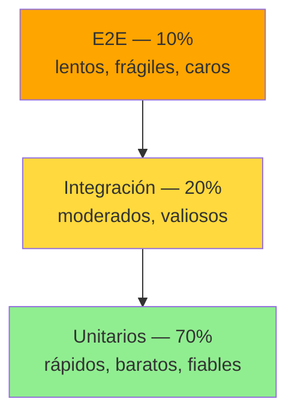

# Testing automatizado

Los tests son lo que te permite desplegar quince veces al día sin que te tiemble el pulso. Sin ellos, la entrega continua es simplemente desplegar rápido, que no es lo mismo.

La pregunta que responde este capítulo no es "¿cómo escribo un test?", sino **"¿qué tengo que automatizar, en qué proporción, y qué debe romper el pipeline?"**.

## La pirámide de testing


```mermaid
graph TB
    A["E2E — 10%<br/>lentos, frágiles, caros"] --> B["Integración — 20%<br/>moderados, valiosos"]
    B --> C["Unitarios — 70%<br/>rápidos, baratos, fiables"]

    style C fill:#90EE90
    style B fill:#FFD93D
    style A fill:#FFA500
```

Los porcentajes no son sagrados, pero la **forma** sí importa. Los tests de abajo son rápidos y precisos: cuando fallan, sabes exactamente qué se rompió. Los de arriba son lentos y ambiguos: cuando falla un e2e, puede ser el código, la red, un dato de prueba o el navegador.

El antipatrón habitual es el **cono de helado**: pocos unitarios y muchos e2e. Suele pasar cuando los tests los escribe un equipo de QA aparte, sin acceso al código. El resultado es una suite que tarda cuarenta minutos y en la que nadie confía.

### Qué probar en cada nivel

| Nivel | Prueba | Dependencias | Duración |
|---|---|---|---|
| **Unitario** | Una función o clase | Todo simulado | ms |
| **Integración** | Varias piezas juntas | Base de datos real, servicios simulados | segundos |
| **E2E** | El flujo completo del usuario | Todo real | minutos |

Y una regla práctica: **los e2e solo para los caminos críticos**. Registro, login, compra. No hagas un e2e para comprobar que un formulario valida un email; eso es un unitario.

## La cobertura engaña

La cobertura mide qué líneas se ejecutaron durante los tests. No mide si comprobaste algo útil.

```javascript
// 100% de cobertura, cero valor
test('crea usuario', () => {
  crearUsuario({ email: 'a@b.com' });
  // sin un solo assert
});
```

Ese test pasa siempre, incluso si `crearUsuario` no hace nada. Y suma cobertura.

Cómo usarla bien:

- Como **señal**, no como objetivo. Un 30% te dice algo; un 95% no te dice casi nada.
- Mirando **qué** no está cubierto, no solo el porcentaje. Descubrir que el módulo de pagos está al 20% es información útil.
- Vigilando que **no baje** en los pull requests, en vez de perseguir un número absoluto.

Cuando la cobertura pasa a ser un objetivo, la gente escribe tests para subirla. Y entonces deja de medir nada.

## Los tests inestables

Un test que falla una de cada veinte ejecuciones sin que haya cambiado nada.

Son el problema más corrosivo de una suite, porque enseñan al equipo a **reintentar sin mirar**. Y en cuanto reintentar es el reflejo, los fallos reales también se ignoran.

Causas más frecuentes, por orden:

1. **Esperas por tiempo.** Un `sleep(2)` que funciona en tu portátil y falla en un runner cargado. La solución es esperar a una condición, no a un reloj.
2. **Tests que dependen entre sí.** El test B funciona solo si A se ejecutó antes. Se destapa al paralelizar.
3. **Estado compartido.** Registros que quedan en la base de datos de un test anterior.
4. **Dependencias externas reales.** Una API de terceros que a veces tarda.

Qué hacer con ellos:

```
Detectar → sacar de la ruta crítica → arreglar con fecha límite → borrar si no se arregla
```

Lo que **no** funciona es poner reintentos automáticos y seguir. Eso no arregla el test, solo esconde que no te fías de él.

## Datos de prueba

El origen de la mitad de las inestabilidades. Tres reglas:

- **Cada test crea lo que necesita.** Nada de una base de datos precargada compartida que se va degradando.
- **Datos aislados.** Emails y nombres únicos por ejecución, para poder correr en paralelo.
- **Limpieza garantizada**, en un bloque que se ejecute también si el test falla.

Las librerías de *factories* ayudan mucho: defines una vez cómo es un usuario válido y en cada test solo especificas lo que te importa de ese caso concreto.

## Tests en el pipeline

Lo barato primero, y no todo en cada push:

| Cuándo | Qué |
|---|---|
| Pre-commit | Lint, formato |
| Cada push | Unitarios, integración |
| Pull request | Lo anterior + e2e de caminos críticos |
| Tras desplegar en staging | Smoke tests, rendimiento |
| Programado | Suite e2e completa, pruebas de carga |

Los **smoke tests** merecen mención aparte: cinco comprobaciones que confirman que lo que acabas de desplegar responde. Se ejecutan en segundos, después de cada despliegue, y son la diferencia entre enterarte tú o que te lo cuente un usuario.

```bash
curl -f https://mi-app.com/health || exit 1
```

## Pruebas de carga

Responden a una pregunta distinta: no *"¿funciona?"* sino *"¿aguanta?"*.

```javascript
// k6 — carga progresiva con umbrales
export const options = {
  stages: [
    { duration: '2m', target: 50 },
    { duration: '5m', target: 50 },
    { duration: '2m', target: 0 },
  ],
  thresholds: {
    http_req_duration: ['p(95)<500'],
    http_req_failed: ['rate<0.01'],
  },
};
```

Lo importante son los `thresholds`: convierten la prueba en algo que pasa o falla, en lugar de un gráfico bonito que nadie interpreta.

Tres avisos:

- **No las lances contra producción** sin avisar y sin un plan.
- **Un entorno más pequeño da números que no valen.** Sirven para comparar contra ti mismo, no para predecir el límite real.
- **Mide siempre percentiles, no medias.** Una media de 200 ms puede esconder que el 5% de tus usuarios espera cuatro segundos.

## Tests de seguridad

Además de comprobar que la aplicación hace lo que debe, conviene comprobar que no hace lo que no debe: análisis estático, dependencias vulnerables y ataques automatizados contra el entorno desplegado.

Todo eso, con laboratorios, en el [curso de DevSecOps](../devsecops/README.md) — en particular [SAST](../devsecops/104.Sast.md) y [DAST con OWASP ZAP](../devsecops/109.Dast.md).

## Resumen

- La forma de la pirámide importa más que los porcentajes exactos
- E2E solo para caminos críticos: son lentos y ambiguos
- La cobertura es una señal, no un objetivo
- Los tests inestables enseñan al equipo a ignorar los fallos: sácalos de la ruta crítica
- Cada test crea y limpia sus propios datos
- Los smoke tests tras cada despliegue cuestan segundos y avisan antes que los usuarios
- En pruebas de carga, define umbrales y mide percentiles

## Recursos adicionales

- [La pirámide de tests, de Martin Fowler](https://martinfowler.com/articles/practical-test-pyramid.html)
- [Playwright](https://playwright.dev/)
- [k6](https://k6.io/docs/)
- [Curso de DevSecOps](../devsecops/README.md)

---

> 💡 **Recuerda**: el valor de una suite de tests no está en cuántos tiene, sino en si el equipo se atreve a desplegar cuando está en verde.

**En el próximo capítulo vemos cómo llevar ese código probado a producción sin cortar el servicio.**
