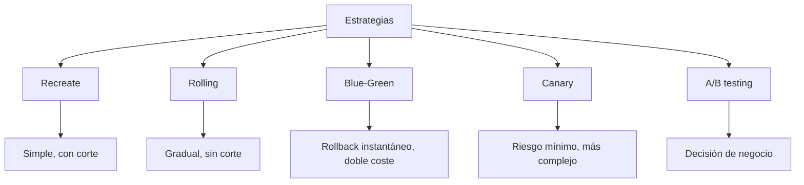

# Estrategias de despliegue

Desplegar no es "subir el código". Es sustituir algo que está funcionando y que la gente está usando ahora mismo, sin que se note.

La estrategia que elijas determina cuánto riesgo asumes en cada release, cuánto tardas en volver atrás si algo va mal y cuánta infraestructura necesitas.

## Las cinco estrategias


```mermaid
graph TB
    A[Estrategias] --> B[Recreate]
    A --> C[Rolling]
    A --> D[Blue-Green]
    A --> E[Canary]
    A --> F[A/B testing]

    B --> B1[Simple, con corte]
    C --> C1[Gradual, sin corte]
    D --> D1[Rollback instantáneo, doble coste]
    E --> E1[Riesgo mínimo, más complejo]
    F --> F1[Decisión de negocio]
```

### Recreate

Paras la versión antigua, arrancas la nueva. Hay corte de servicio.

Parece primitivo, pero es la opción correcta en más casos de los que la gente admite: aplicaciones internas, procesos por lotes, o cuando dos versiones no pueden convivir contra la misma base de datos. Si puedes permitirte dos minutos de corte a las tres de la mañana, es la estrategia más simple y la que menos cosas puede romper.

### Rolling update

Sustituyes las instancias poco a poco. En ningún momento se para el servicio.

Es la opción por defecto en Kubernetes y la que cubre la mayoría de los casos. Dos parámetros la definen:

- **`maxUnavailable`** — cuántas instancias puedes tener caídas a la vez
- **`maxSurge`** — cuántas de más puedes levantar durante la transición

La consecuencia importante: durante la transición **conviven las dos versiones**. Tu aplicación tiene que aguantarlo, y tu API tiene que ser compatible en ambos sentidos.

### Blue-green

Mantienes dos entornos completos. Despliegas en el inactivo, lo verificas con calma y luego cambias el tráfico de golpe.

Su gran virtud es el rollback: volver atrás es cambiar el enrutado otra vez, y tarda segundos. Su gran defecto es el coste: necesitas el doble de infraestructura, aunque sea solo durante el despliegue.

### Canary

Envías la versión nueva a un porcentaje pequeño de usuarios, miras las métricas, y vas subiendo si todo va bien.

```
5% → observar → 25% → observar → 50% → observar → 100%
```

Es la estrategia que menos riesgo asume, porque un fallo afecta al 5% de los usuarios y no al 100%. A cambio necesitas dos cosas que no todo el mundo tiene: **enrutado por porcentaje** y, sobre todo, **métricas fiables** para decidir si promocionar o abortar.

Sin métricas automáticas, un canary es un rolling update más lento y con más pasos manuales.

### A/B testing

Técnicamente se parece al canary, pero la pregunta es distinta. El canary pregunta *"¿esto funciona?"*; el A/B testing pregunta *"¿esto vende más?"*.

El reparto no es aleatorio sino por segmento de usuario, y quien decide no es el equipo de operaciones sino el de producto. La decisión se basa en significancia estadística, no en tasa de error.

## Cuál elegir

| Estrategia | Corte | Coste extra | Rollback | Complejidad |
|---|---|---|---|---|
| Recreate | Sí | Ninguno | Redesplegar | Muy baja |
| Rolling | No | Bajo | Lento | Baja |
| Blue-green | No | **Doble** | **Instantáneo** | Media |
| Canary | No | Bajo | Rápido | Alta |
| A/B testing | No | Bajo | Rápido | Alta |

Una guía honesta:

- **Empieza por rolling.** Cubre la mayoría de los casos y viene de serie.
- **Blue-green** si necesitas rollback inmediato y puedes pagar el doble de infraestructura un rato.
- **Canary** solo si ya tienes buena observabilidad. Sin métricas fiables, no aporta.
- **Recreate** si el corte es asumible. No te compliques por gusto.

## Los health checks son la clave

Ninguna estrategia funciona si el sistema no sabe cuándo una instancia está lista de verdad. Tres sondas distintas, y confundirlas es el fallo más común:

- **Liveness** — ¿sigue viva? Si no, reiníciala.
- **Readiness** — ¿puede recibir tráfico ya? Si no, sácala del balanceador pero **no la reinicies**.
- **Startup** — ¿ha terminado de arrancar? Protege a las aplicaciones lentas de que liveness las mate durante el arranque.

El error clásico es usar el mismo endpoint para liveness y readiness. Si ese endpoint comprueba la base de datos, una caída de la base de datos hace que liveness falle y el orquestador reinicie todas tus instancias en bucle — convirtiendo una degradación en una caída total.

## La parte difícil: la base de datos

Aquí es donde se rompen los despliegues bonitos. Puedes revertir el código en segundos; una migración que borró una columna, no.

La regla: **durante un despliegue conviven dos versiones del código contra una sola base de datos**. Así que todo cambio de esquema tiene que ser compatible con la versión anterior.

| Seguro | Peligroso |
|---|---|
| Añadir columnas con valor por defecto | Borrar columnas |
| Añadir tablas | Renombrar columnas |
| Añadir índices sin bloquear | Cambiar tipos de datos |
| | Añadir `NOT NULL` a lo existente |

Renombrar una columna no es una operación, son cuatro despliegues:

1. Añadir la columna nueva
2. Escribir en las dos, leer de la vieja
3. Copiar los datos y leer de la nueva
4. Borrar la vieja, cuando ya nadie la usa

Es tedioso, y es la diferencia entre poder hacer rollback y no poder.

## Rollback

Antes de desplegar, ten respondidas tres preguntas:

1. **¿Cómo vuelvo atrás?** El comando exacto, escrito.
2. **¿Cuánto tarda?**
3. **¿Qué pasa con los datos** que se escribieron con la versión nueva?

En Kubernetes el rollback del código es directo:

```bash
kubectl rollout undo deployment/mi-app
kubectl rollout status deployment/mi-app
```

Lo automático es mejor: si las métricas se degradan por encima de un umbral durante los primeros minutos, revierte solo. Es exactamente lo que hacen herramientas como Argo Rollouts o Flagger, que analizan las métricas entre paso y paso del canary.

## Feature flags

Una alternativa que cambia el problema de sitio: despliega el código con la funcionalidad apagada y enciéndela después.

```
Despliegue  ≠  Activación
```

Separar ambas cosas tiene dos ventajas grandes: puedes desplegar a media mañana sin miedo, y "revertir" es apagar un interruptor en lugar de volver a desplegar.

El precio es que el código acumula ramas condicionales. Un flag que lleva un año encendido ya no es un flag, es deuda técnica — ponles fecha de caducidad.

## En Kubernetes

La implementación concreta de canary y blue-green en Kubernetes, con enrutado de tráfico y análisis de métricas, la tienes en el curso de Kubernetes:

- [Canary y blue-green en Kubernetes](../kubernetes/303.Canary_bluegreen.md)
- [Service mesh](../kubernetes/305.Service_mesh.md) — enrutado por porcentaje con Istio

## Resumen

- Rolling cubre la mayoría de los casos y viene de serie: empieza ahí
- Blue-green compra rollback instantáneo a cambio del doble de infraestructura
- Canary solo aporta si ya tienes métricas fiables
- Recreate sigue siendo válido si el corte es asumible
- **No uses el mismo endpoint para liveness y readiness**
- Las migraciones de base de datos tienen que ser compatibles hacia atrás
- Ten el comando de rollback escrito **antes** de desplegar

## Recursos adicionales

- [Canary y blue-green en Kubernetes](../kubernetes/303.Canary_bluegreen.md)
- [Argo Rollouts](https://argoproj.github.io/argo-rollouts/)
- [Evolutionary Database Design, de Martin Fowler](https://martinfowler.com/articles/evodb.html)

---

> 💡 **Recuerda**: la estrategia de despliegue debe ajustarse a tu tolerancia al riesgo, no a lo que esté de moda.

**En el próximo capítulo vemos qué aportan los contenedores a todo este flujo.**
