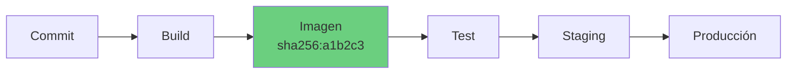

# Contenedores en el flujo DevOps

Este capítulo no va de aprender Docker. Para eso está el [curso de Docker](../docker/README.md), que empieza desde cero.

Va de entender **qué cambia en nuestra forma de entregar software** cuando el artefacto que desplegamos es una imagen de contenedor. Que es mucho más de lo que parece.

## El problema que resuelven de verdad

"Funciona en mi máquina" no era un chiste sobre programadores descuidados. Era el síntoma de un problema real: el software depende de su entorno, y los entornos divergían.

Antes de los contenedores, desplegar significaba llevar el código a un servidor que alguien había configurado, con una versión de Java concreta, unas librerías del sistema concretas y unas variables de entorno documentadas únicamente en la cabeza de alguien.

Un contenedor empaqueta la aplicación **y su entorno de ejecución** en una sola unidad. Lo que pruebas es literalmente lo que despliegas.

## La idea clave: el artefacto inmutable

De todo lo que aportan los contenedores, esto es lo que más cambia nuestro pipeline.



Fijémonos en que solo hay **una** caja de build. La misma imagen, con el mismo digest, atraviesa todos los entornos. No se reconstruye para producción.

Esto se llama **build once, deploy anywhere**, y tiene una consecuencia que conviene entender bien: si la imagen funcionó en staging y falla en producción, el problema **no está en el artefacto**. Está en la configuración, en los datos o en la infraestructura. Acabamos de eliminar una categoría entera de causas posibles.

Comparémoslo con el modelo anterior, en el que cada entorno compilaba lo suyo y una diferencia en la versión del compilador podía arruinarnos el viernes.

### La configuración va fuera de la imagen

Para que esto funcione, la imagen no puede llevar dentro nada específico de un entorno:

```
❌ Una imagen por entorno         ✅ Una imagen, configuración inyectada
   mi-app:1.0-staging                mi-app:1.0 + variables de entorno
   mi-app:1.0-produccion             mi-app:1.0 + variables de entorno
```

Si tenemos imágenes con el nombre del entorno en la etiqueta, hemos perdido la inmutabilidad: son artefactos distintos y ya no estamos desplegando lo que probamos.

La configuración se inyecta al arrancar: variables de entorno, ficheros montados o un gestor de secretos ([capítulo 8 del curso de DevSecOps](../devsecops/108.Gestion_secretos.md)).

## El registry es nuestro repositorio de artefactos

El registry deja de ser "donde están las imágenes" y pasa a ser una pieza central del pipeline: el punto donde el build entrega y el despliegue recoge.

Tres decisiones que importan:

**Etiquetado.** `latest` no vale en producción: es una etiqueta móvil y mañana puede apuntar a otra cosa. Usamos algo que identifique el origen exacto:

```bash
mi-app:1.4.2                # versión semántica, para humanos
mi-app:a1b2c3d              # hash del commit, trazable al código
mi-app@sha256:9f8e7d...     # digest, inmutable de verdad
```

En producción, referenciamos por **digest**. Es la única forma de garantizar que desplegamos exactamente lo que aprobamos.

**Retención.** Un pipeline activo genera cientos de imágenes al mes. Sin política de limpieza, el registry crece hasta que alguien recibe la factura.

**Promoción.** Muchos equipos usan registries separados por entorno y "promocionan" copiando la imagen sin reconstruirla. Es una forma sencilla de hacer explícito qué ha superado qué controles.

## El contenedor en el pipeline

```yaml
# Construir una vez, etiquetar con el commit
- name: Build
  run: docker build -t ghcr.io/org/mi-app:${{ github.sha }} .

- name: Push
  run: docker push ghcr.io/org/mi-app:${{ github.sha }}

# Desplegar SIEMPRE esa misma referencia
- name: Deploy a staging
  run: ./deploy.sh staging ghcr.io/org/mi-app:${{ github.sha }}
```

El detalle que marca la diferencia: `deploy.sh` recibe la referencia de la imagen como parámetro. Nunca la reconstruye y nunca usa `latest`.

Entre el build y el despliegue es donde encajan los controles de seguridad del artefacto: escaneo de vulnerabilidades, SBOM y firma. Los tenemos en los capítulos [5](../devsecops/105.Seguridad_imagenes.md) y [6](../devsecops/106.Sbom_firma.md) del curso de DevSecOps.

## ¿Necesitas un orquestador?

Aquí es donde muchos equipos se complican la vida por adelantado.

Un orquestador resuelve problemas que **no todo el mundo tiene**: programar contenedores en muchas máquinas, reiniciar los que fallan, escalar según la carga, descubrimiento de servicios y despliegues progresivos.

Si tenemos tres servicios en dos máquinas, Kubernetes nos añade más complejidad de la que nos quita.

| Situación | Opción razonable |
|---|---|
| Una máquina, pocos servicios | Docker Compose y systemd |
| Varias máquinas, sin escalado dinámico | Docker Swarm o Nomad |
| Escalado, alta disponibilidad, muchos equipos | Kubernetes |
| No queremos gestionar servidores | Cloud Run, ECS Fargate, App Runner |

La pregunta útil no es "¿es Kubernetes lo mejor?", sino **"¿tenemos el problema que Kubernetes resuelve, y alguien que lo mantenga?"**. Un cluster mal operado es peor que tres máquinas con Compose.

Si la respuesta es que sí lo necesitamos, el [curso de Kubernetes](../kubernetes/README.md) lo cubre desde cero.

## Lo que cambia en nuestra forma de trabajar

Adoptar contenedores toca más cosas de las que parece:

- **El entorno de desarrollo se versiona.** El `docker-compose.yml` del proyecto sustituye al documento de "cómo montar nuestra máquina", y deja de quedarse obsoleto.
- **Los despliegues se vuelven aburridos.** Que es exactamente lo que queremos.
- **El rollback es cambiar una referencia.** La versión anterior sigue existiendo en el registry.
- **Aparecen problemas nuevos.** Gestión de imágenes, tamaño, vulnerabilidades heredadas de la imagen base y la tentación de meter Kubernetes donde no hace falta.

## Resumen

- Un contenedor empaqueta la aplicación **y su entorno**: lo que pruebas es lo que despliegas
- **Build once, deploy anywhere**: una sola imagen atraviesa todos los entornos
- Si tenemos imágenes con el entorno en la etiqueta, hemos perdido la inmutabilidad
- En producción, referenciamos por **digest**, nunca por `latest`
- El registry es nuestro repositorio de artefactos: etiquetado, retención y promoción
- Un orquestador resuelve problemas que no todo el mundo tiene

## Recursos adicionales

- [Curso de Docker](../docker/README.md) — contenedores desde cero
- [Curso de Kubernetes](../kubernetes/README.md) — orquestación desde cero
- [Seguridad de imágenes](../devsecops/105.Seguridad_imagenes.md) — escaneo y gates en CI
- [SBOM y firma](../devsecops/106.Sbom_firma.md) — inventario e integridad del artefacto

---

> 💡 **Recuerda**: el valor del contenedor no es que arranque rápido, es que el artefacto que aprobamos y el que desplegamos son el mismo objeto.

**En el próximo capítulo vemos qué pasa cuando decidimos partir la aplicación en muchos servicios.**
