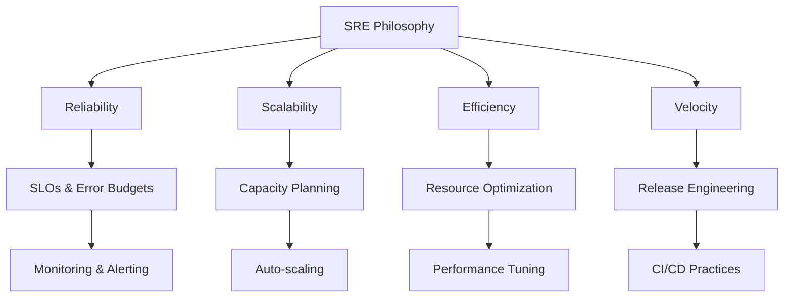

# 403. Site Reliability Engineering (SRE)

## Índice
- [Introducción a SRE](#introducción)
- [Principios Fundamentales](#principios-fundamentales)
- [Service Level Objectives (SLOs)](#slos)
- [Error Budgets](#error-budgets)
- [Monitoring y Alerting](#monitoring-alerting)
- [Incident Management](#incident-management)
- [Postmortems](#postmortems)
- [Capacity Planning](#capacity-planning)
- [Release Engineering](#release-engineering)
- [Automation](#automation)
- [Herramientas SRE](#herramientas)
- [Ejercicios Prácticos](#ejercicios)

## Introducción

Site Reliability Engineering (SRE) es una disciplina que incorpora aspectos de ingeniería de software a las operaciones de infraestructura y aplicaciones.

### Filosofía SRE



### SRE vs DevOps vs Traditional Ops

| Aspecto | Traditional Ops | DevOps | SRE |
|---------|----------------|--------|-----|
| **Objetivo** | Estabilidad | Velocidad + Estabilidad | Confiabilidad medible |
| **Métricas** | Uptime | Lead time, MTTR | SLOs, Error budgets |
| **Enfoque** | Manual | Colaborativo | Ingenieril |
| **Cambios** | Evitar | Frecuentes | Controlados por budget |

## Principios Fundamentales

### 1. Embracing Risk

```python
# Cálculo de disponibilidad y riesgo aceptable
class AvailabilityCalculator:
    def __init__(self):
        self.slo_target = 99.9  # 99.9% SLO
    
    def calculate_error_budget(self, period_days: int) -> float:
        """Calcular error budget para un período"""
        total_minutes = period_days * 24 * 60
        allowed_downtime = total_minutes * (100 - self.slo_target) / 100
        return allowed_downtime
    
    def calculate_current_availability(self, uptime_minutes: int, total_minutes: int) -> float:
        """Calcular disponibilidad actual"""
        return (uptime_minutes / total_minutes) * 100
    
    def error_budget_remaining(self, current_availability: float, period_days: int) -> float:
        """Calcular error budget restante"""
        allowed_downtime = self.calculate_error_budget(period_days)
        actual_downtime = (100 - current_availability) * period_days * 24 * 60 / 100
        return allowed_downtime - actual_downtime

# Ejemplo de uso
calculator = AvailabilityCalculator()
monthly_budget = calculator.calculate_error_budget(30)  # 43.2 minutos
print(f"Error budget mensual: {monthly_budget:.1f} minutos")
```

### 2. Service Level Objectives (SLOs)

```yaml
# Ejemplo de definición de SLOs
service_level_objectives:
  web_frontend:
    availability:
      target: 99.9%
      measurement_window: 30d
      sli: "sum(rate(http_requests_total{job='frontend',code!~'5..'}[5m])) / sum(rate(http_requests_total{job='frontend'}[5m]))"
    
    latency:
      target: 95%  # 95% de requests < 200ms
      threshold: 200ms
      measurement_window: 30d
      sli: "histogram_quantile(0.95, rate(http_request_duration_seconds_bucket{job='frontend'}[5m]))"
    
    throughput:
      target: 1000  # RPS mínimo
      measurement_window: 5m
      sli: "sum(rate(http_requests_total{job='frontend'}[5m]))"

  api_service:
    availability:
      target: 99.95%
      measurement_window: 30d
    
    latency:
      target: 99%  # 99% de requests < 100ms
      threshold: 100ms
      measurement_window: 30d
    
    error_rate:
      target: 0.1%  # < 0.1% error rate
      measurement_window: 30d
```

### 3. Error Budgets

```python
import datetime
from dataclasses import dataclass
from typing import List

@dataclass
class SLOViolation:
    timestamp: datetime.datetime
    duration_minutes: float
    impact: str

class ErrorBudgetManager:
    def __init__(self, slo_target: float, window_days: int = 30):
        self.slo_target = slo_target
        self.window_days = window_days
        self.violations: List[SLOViolation] = []
    
    def add_violation(self, violation: SLOViolation):
        """Registrar una violación de SLO"""
        self.violations.append(violation)
        self._cleanup_old_violations()
    
    def get_error_budget_burn_rate(self) -> float:
        """Calcular tasa de consumo del error budget"""
        total_budget = self._calculate_total_budget()
        consumed_budget = sum(v.duration_minutes for v in self.violations)
        
        if total_budget == 0:
            return 0
        
        return consumed_budget / total_budget
    
    def get_remaining_budget(self) -> float:
        """Obtener error budget restante en minutos"""
        total_budget = self._calculate_total_budget()
        consumed_budget = sum(v.duration_minutes for v in self.violations)
        return max(0, total_budget - consumed_budget)
    
    def should_halt_releases(self) -> bool:
        """Determinar si se deben detener los releases"""
        burn_rate = self.get_error_budget_burn_rate()
        return burn_rate > 0.9  # Detener si se consumió > 90%
    
    def _calculate_total_budget(self) -> float:
        """Calcular total error budget en minutos"""
        total_minutes = self.window_days * 24 * 60
        return total_minutes * (100 - self.slo_target) / 100
    
    def _cleanup_old_violations(self):
        """Limpiar violaciones fuera de la ventana"""
        cutoff = datetime.datetime.now() - datetime.timedelta(days=self.window_days)
        self.violations = [v for v in self.violations if v.timestamp > cutoff]

# Ejemplo de uso
budget_manager = ErrorBudgetManager(slo_target=99.9, window_days=30)

# Simular violación
violation = SLOViolation(
    timestamp=datetime.datetime.now(),
    duration_minutes=15.0,
    impact="API latency exceeded threshold"
)
budget_manager.add_violation(violation)

print(f"Error budget restante: {budget_manager.get_remaining_budget():.1f} minutos")
print(f"¿Detener releases?: {budget_manager.should_halt_releases()}")
```

## Monitoring y Alerting

### Alerting Philosophy

```yaml
# Ejemplo de reglas de alerting en Prometheus
groups:
  - name: sre_alerts
    rules:
      # Page-worthy alerts (requieren intervención inmediata)
      - alert: ServiceDown
        expr: up{job=~"web|api"} == 0
        for: 1m
        labels:
          severity: page
        annotations:
          summary: "Service {{ $labels.job }} is down"
          description: "Service {{ $labels.job }} has been down for more than 1 minute"
      
      - alert: HighErrorRate
        expr: |
          (
            sum(rate(http_requests_total{code=~"5.."}[5m])) by (job)
            /
            sum(rate(http_requests_total[5m])) by (job)
          ) > 0.05
        for: 5m
        labels:
          severity: page
        annotations:
          summary: "High error rate on {{ $labels.job }}"
          description: "Error rate is {{ $value | humanizePercentage }}"
      
      # Ticket-worthy alerts (no requieren intervención inmediata)
      - alert: HighLatency
        expr: |
          histogram_quantile(0.95,
            sum(rate(http_request_duration_seconds_bucket[5m])) by (le, job)
          ) > 0.5
        for: 15m
        labels:
          severity: ticket
        annotations:
          summary: "High latency on {{ $labels.job }}"
          description: "95th percentile latency is {{ $value }}s"
      
      - alert: ErrorBudgetBurn
        expr: |
          (
            1 - (
              sum(rate(http_requests_total{code!~"5.."}[1h])) by (job)
              /
              sum(rate(http_requests_total[1h])) by (job)
            )
          ) > 14.4 * (1 - 0.999)  # 14.4x burn rate for 99.9% SLO
        for: 2m
        labels:
          severity: page
        annotations:
          summary: "Fast error budget burn on {{ $labels.job }}"
          description: "Error budget will be exhausted in less than 2 days"
```

### Four Golden Signals

```python
from prometheus_client import Counter, Histogram, Gauge, CollectorRegistry
import time

class GoldenSignalsCollector:
    def __init__(self, service_name: str):
        self.registry = CollectorRegistry()
        self.service_name = service_name
        
        # 1. Latency
        self.request_duration = Histogram(
            f'{service_name}_request_duration_seconds',
            'Request duration in seconds',
            ['method', 'endpoint'],
            registry=self.registry
        )
        
        # 2. Traffic
        self.request_count = Counter(
            f'{service_name}_requests_total',
            'Total requests',
            ['method', 'endpoint', 'status_code'],
            registry=self.registry
        )
        
        # 3. Errors
        self.error_count = Counter(
            f'{service_name}_errors_total',
            'Total errors',
            ['method', 'endpoint', 'error_type'],
            registry=self.registry
        )
        
        # 4. Saturation
        self.cpu_usage = Gauge(
            f'{service_name}_cpu_usage_percent',
            'CPU usage percentage',
            registry=self.registry
        )
        
        self.memory_usage = Gauge(
            f'{service_name}_memory_usage_percent',
            'Memory usage percentage',
            registry=self.registry
        )
        
        self.active_connections = Gauge(
            f'{service_name}_active_connections',
            'Active connections',
            registry=self.registry
        )
    
    def record_request(self, method: str, endpoint: str, status_code: int, duration: float):
        """Registrar una request completa"""
        # Latency
        self.request_duration.labels(method=method, endpoint=endpoint).observe(duration)
        
        # Traffic
        self.request_count.labels(
            method=method, 
            endpoint=endpoint, 
            status_code=status_code
        ).inc()
        
        # Errors (si es error)
        if status_code >= 400:
            error_type = "client_error" if 400 <= status_code < 500 else "server_error"
            self.error_count.labels(
                method=method, 
                endpoint=endpoint, 
                error_type=error_type
            ).inc()
    
    def update_saturation_metrics(self, cpu_percent: float, memory_percent: float, connections: int):
        """Actualizar métricas de saturación"""
        self.cpu_usage.set(cpu_percent)
        self.memory_usage.set(memory_percent)
        self.active_connections.set(connections)

# Middleware para FastAPI
class SREMiddleware:
    def __init__(self, app, collector: GoldenSignalsCollector):
        self.app = app
        self.collector = collector
    
    async def __call__(self, scope, receive, send):
        if scope["type"] == "http":
            start_time = time.time()
            
            async def send_wrapper(message):
                if message["type"] == "http.response.start":
                    duration = time.time() - start_time
                    
                    self.collector.record_request(
                        method=scope["method"],
                        endpoint=scope["path"],
                        status_code=message["status"],
                        duration=duration
                    )
                
                await send(message)
            
            await self.app(scope, receive, send_wrapper)
        else:
            await self.app(scope, receive, send)
```

## Incident Management

### Incident Response Process

```python
from enum import Enum
from dataclasses import dataclass
from typing import List, Optional
import datetime

class IncidentSeverity(Enum):
    SEV1 = "sev1"  # Service down, major functionality unavailable
    SEV2 = "sev2"  # Significant feature unavailable
    SEV3 = "sev3"  # Minor feature unavailable
    SEV4 = "sev4"  # Cosmetic issues

class IncidentStatus(Enum):
    INVESTIGATING = "investigating"
    IDENTIFIED = "identified"
    MONITORING = "monitoring"
    RESOLVED = "resolved"

@dataclass
class IncidentUpdate:
    timestamp: datetime.datetime
    author: str
    message: str
    status: IncidentStatus

@dataclass
class Incident:
    id: str
    title: str
    severity: IncidentSeverity
    status: IncidentStatus
    created_at: datetime.datetime
    resolved_at: Optional[datetime.datetime]
    incident_commander: str
    affected_services: List[str]
    updates: List[IncidentUpdate]
    root_cause: Optional[str] = None
    
    def add_update(self, author: str, message: str, status: IncidentStatus):
        """Añadir actualización al incidente"""
        update = IncidentUpdate(
            timestamp=datetime.datetime.now(),
            author=author,
            message=message,
            status=status
        )
        self.updates.append(update)
        self.status = status
        
        if status == IncidentStatus.RESOLVED:
            self.resolved_at = datetime.datetime.now()
    
    def get_duration(self) -> Optional[datetime.timedelta]:
        """Obtener duración del incidente"""
        if self.resolved_at:
            return self.resolved_at - self.created_at
        return datetime.datetime.now() - self.created_at
    
    def is_slo_affecting(self) -> bool:
        """Determinar si el incidente afecta SLOs"""
        return self.severity in [IncidentSeverity.SEV1, IncidentSeverity.SEV2]

class IncidentManager:
    def __init__(self):
        self.incidents: List[Incident] = []
        self.incident_counter = 0
    
    def create_incident(self, title: str, severity: IncidentSeverity, 
                       commander: str, affected_services: List[str]) -> Incident:
        """Crear nuevo incidente"""
        self.incident_counter += 1
        incident = Incident(
            id=f"INC-{self.incident_counter:04d}",
            title=title,
            severity=severity,
            status=IncidentStatus.INVESTIGATING,
            created_at=datetime.datetime.now(),
            resolved_at=None,
            incident_commander=commander,
            affected_services=affected_services,
            updates=[]
        )
        
        incident.add_update(
            author=commander,
            message="Incident created and investigation started",
            status=IncidentStatus.INVESTIGATING
        )
        
        self.incidents.append(incident)
        return incident
    
    def get_mttr(self, days: int = 30) -> float:
        """Calcular Mean Time To Resolution"""
        cutoff = datetime.datetime.now() - datetime.timedelta(days=days)
        resolved_incidents = [
            i for i in self.incidents 
            if i.resolved_at and i.created_at > cutoff
        ]
        
        if not resolved_incidents:
            return 0
        
        total_duration = sum(
            (i.resolved_at - i.created_at).total_seconds() 
            for i in resolved_incidents
        )
        
        return total_duration / len(resolved_incidents) / 60  # en minutos

# Ejemplo de automatización de respuesta
class AutomatedResponse:
    def __init__(self, incident_manager: IncidentManager):
        self.incident_manager = incident_manager
    
    async def handle_alert(self, alert_data: dict):
        """Manejar alerta automáticamente"""
        if alert_data["severity"] == "critical":
            # Crear incidente automáticamente
            incident = self.incident_manager.create_incident(
                title=f"Automated: {alert_data['alertname']}",
                severity=IncidentSeverity.SEV2,
                commander="sre-oncall",
                affected_services=alert_data.get("services", [])
            )
            
            # Ejecutar runbooks automáticos
            await self._execute_runbook(incident, alert_data)
    
    async def _execute_runbook(self, incident: Incident, alert_data: dict):
        """Ejecutar runbook automático"""
        if "HighMemoryUsage" in alert_data["alertname"]:
            # Restart pods with high memory usage
            await self._restart_high_memory_pods()
            incident.add_update(
                author="automation",
                message="Automated restart of high memory pods initiated",
                status=IncidentStatus.MONITORING
            )
```

### Runbooks

```yaml
# Ejemplo de runbook estructurado
runbook:
  title: "High API Latency Response"
  severity: SEV2
  estimated_time: 15min
  
  triggers:
    - alert: HighAPILatency
      threshold: "p95 > 500ms for 5min"
  
  steps:
    1_immediate_response:
      title: "Immediate Assessment"
      time_limit: 2min
      actions:
        - Check if issue is widespread or localized
        - Verify monitoring dashboards
        - Check recent deployments
      
      escalation:
        condition: "No obvious cause found"
        action: "Escalate to senior SRE"
    
    2_investigation:
      title: "Detailed Investigation"
      time_limit: 10min
      actions:
        - Check database performance metrics
        - Review error logs for patterns
        - Analyze traffic patterns
        - Check dependency health
      
      potential_causes:
        - Database slow queries
        - High traffic spike
        - Dependency failure
        - Memory pressure
    
    3_mitigation:
      title: "Apply Mitigation"
      time_limit: 5min
      actions:
        database_issues:
          - Kill long-running queries
          - Scale read replicas
        
        traffic_spike:
          - Enable rate limiting
          - Scale application instances
        
        dependency_failure:
          - Enable circuit breaker
          - Use cached responses
        
        memory_pressure:
          - Restart application pods
          - Scale up instances
    
    4_monitoring:
      title: "Monitor Recovery"
      actions:
        - Watch latency metrics return to normal
        - Ensure error rate is stable
        - Monitor for cascading failures
  
  rollback_procedures:
    - Revert recent deployment if applicable
    - Disable feature flags if necessary
    - Scale down if over-provisioned
  
  communication:
    internal:
      - Update incident channel every 15min
      - Notify stakeholders if customer-facing
    
    external:
      - Update status page if SEV1/SEV2
      - Prepare customer communication if needed
```

## Postmortems

### Postmortem Template

```markdown
# Postmortem: [Incident Title]

**Date:** 2024-01-15  
**Authors:** SRE Team  
**Status:** Complete  
**Summary:** Brief description of what happened

## Impact
- **Duration:** 2h 34m (14:30 - 17:04 UTC)
- **Users Affected:** ~15,000 users (approximately 30% of active users)
- **Revenue Impact:** ~$50,000 in lost transactions
- **Services Affected:** 
  - Payment API (complete outage)
  - User Dashboard (degraded performance)

## Root Cause
The root cause was a database connection pool exhaustion caused by a memory leak in the payment service introduced in version 2.3.4 deployed at 14:15 UTC.

## Detection
- **First Alert:** 14:32 UTC - High database connection count
- **User Reports:** 14:35 UTC - First customer support ticket
- **Escalation:** 14:45 UTC - Incident declared SEV1

## Timeline
| Time (UTC) | Event |
|------------|--------|
| 14:15 | Payment service v2.3.4 deployed |
| 14:30 | Connection pool utilization starts climbing |
| 14:32 | Alert: High database connections |
| 14:35 | First customer support ticket |
| 14:45 | Incident declared SEV1 |
| 15:10 | Root cause identified |
| 15:20 | Rollback initiated |
| 15:35 | Service restored |
| 17:04 | All systems fully recovered |

## What Went Well
- Alert fired within acceptable time (2 minutes)
- Team quickly identified the correlation with deployment
- Rollback process worked smoothly
- Communication was clear and frequent

## What Went Wrong
- Memory leak not caught in testing
- Monitoring didn't catch gradual memory increase
- Connection pool monitoring threshold too high
- No automated rollback on deployment issues

## Action Items
| Action | Owner | Due Date | Priority |
|--------|-------|----------|----------|
| Add memory leak detection to CI/CD | Dev Team | 2024-01-22 | P0 |
| Lower connection pool alert threshold | SRE Team | 2024-01-17 | P0 |
| Implement gradual memory monitoring | SRE Team | 2024-01-20 | P1 |
| Add automated rollback on health check failure | DevOps Team | 2024-01-25 | P1 |
| Improve load testing to catch memory leaks | QA Team | 2024-01-30 | P2 |

## Lessons Learned
1. Gradual resource exhaustion can be as dangerous as sudden failures
2. Connection pool monitoring needs more sensitive thresholds
3. Memory leak detection should be part of automated testing
4. Deployment health checks should include resource utilization trends

## Appendix
- [Incident Timeline Dashboard]
- [Error Logs]
- [Monitoring Screenshots]
```

### Automated Postmortem Generation

```python
import jinja2
from dataclasses import dataclass
from typing import List, Dict, Any

@dataclass
class PostmortemData:
    incident_id: str
    title: str
    start_time: datetime.datetime
    end_time: datetime.datetime
    severity: IncidentSeverity
    affected_services: List[str]
    root_cause: str
    impact_description: str
    timeline_events: List[Dict[str, Any]]
    action_items: List[Dict[str, Any]]

class PostmortemGenerator:
    def __init__(self):
        self.template = jinja2.Template("""
# Postmortem: {{ title }}

**Incident ID:** {{ incident_id }}  
**Date:** {{ start_time.strftime('%Y-%m-%d') }}  
**Duration:** {{ duration }}  
**Severity:** {{ severity.value.upper() }}

## Summary
{{ impact_description }}

## Root Cause
{{ root_cause }}

## Timeline

| {{ event.timestamp.strftime('%H:%M UTC') }} | {{ event.description }} |


## Action Items

- [ ] **{{ item.title }}** ({{ item.owner }}, due: {{ item.due_date }}) - Priority: {{ item.priority }}


## Monitoring Queries
```promql
# Error rate during incident
sum(rate(http_requests_total{code=~"5.."}[5m])) by (service)

# Latency during incident  
histogram_quantile(0.95, 
  sum(rate(http_request_duration_seconds_bucket[5m])) by (le, service)
)
```

## Prevention Measures

## Capacity Planning

### Predictive Scaling

```python
import numpy as np
from sklearn.linear_model import LinearRegression
from datetime import datetime, timedelta

class CapacityPlanner:
    def __init__(self):
        self.models = {}
    
    def analyze_growth_trends(self, service_name: str, metrics_data: List[Dict]):
        """Analizar tendencias de crecimiento de un servicio"""
        # Preparar datos
        timestamps = [m['timestamp'] for m in metrics_data]
        cpu_usage = [m['cpu_usage'] for m in metrics_data]
        memory_usage = [m['memory_usage'] for m in metrics_data]
        request_rate = [m['request_rate'] for m in metrics_data]
        
        # Convertir timestamps a números
        start_time = min(timestamps)
        time_deltas = [(t - start_time).total_seconds() / 3600 for t in timestamps]  # horas
        
        # Entrenar modelos
        X = np.array(time_deltas).reshape(-1, 1)
        
        models = {}
        for metric_name, values in [
            ('cpu', cpu_usage),
            ('memory', memory_usage),
            ('requests', request_rate)
        ]:
            model = LinearRegression()
            model.fit(X, values)
            models[metric_name] = model
        
        self.models[service_name] = {
            'models': models,
            'start_time': start_time,
            'last_update': datetime.now()
        }
    
    def predict_capacity_needs(self, service_name: str, days_ahead: int = 30) -> Dict[str, float]:
        """Predecir necesidades de capacidad"""
        if service_name not in self.models:
            raise ValueError(f"No model trained for service {service_name}")
        
        service_data = self.models[service_name]
        models = service_data['models']
        start_time = service_data['start_time']
        
        # Calcular tiempo futuro en horas
        future_hours = (datetime.now() - start_time).total_seconds() / 3600 + (days_ahead * 24)
        X_future = np.array([[future_hours]])
        
        predictions = {}
        for metric_name, model in models.items():
            predicted_value = model.predict(X_future)[0]
            predictions[metric_name] = max(0, predicted_value)  # No valores negativos
        
        return predictions
    
    def generate_scaling_recommendations(self, service_name: str) -> List[str]:
        """Generar recomendaciones de escalado"""
        predictions = self.predict_capacity_needs(service_name, days_ahead=30)
        recommendations = []
        
        if predictions['cpu'] > 80:
            recommendations.append(
                f"Consider increasing CPU limits/requests. Predicted: {predictions['cpu']:.1f}%"
            )
        
        if predictions['memory'] > 80:
            recommendations.append(
                f"Consider increasing memory limits/requests. Predicted: {predictions['memory']:.1f}%"
            )
        
        if predictions['requests'] > 1000:  # Threshold depends on service
            recommendations.append(
                f"Consider horizontal scaling. Predicted RPS: {predictions['requests']:.1f}"
            )
        
        return recommendations

# Uso del capacity planner
planner = CapacityPlanner()

# Simular datos históricos
historical_data = [
    {
        'timestamp': datetime.now() - timedelta(days=30-i),
        'cpu_usage': 30 + i * 1.5 + np.random.normal(0, 5),
        'memory_usage': 40 + i * 1.2 + np.random.normal(0, 3),
        'request_rate': 100 + i * 10 + np.random.normal(0, 20)
    }
    for i in range(30)
]

planner.analyze_growth_trends('web-service', historical_data)
predictions = planner.predict_capacity_needs('web-service', days_ahead=30)
recommendations = planner.generate_scaling_recommendations('web-service')

print("Predicciones para 30 días:")
for metric, value in predictions.items():
    print(f"  {metric}: {value:.1f}")

print("\nRecomendaciones:")
for rec in recommendations:
    print(f"  - {rec}")
```

## Automation

### Chaos Engineering

```python
import random
import asyncio
from typing import List, Dict
import kubernetes

class ChaosExperiment:
    def __init__(self, name: str, description: str):
        self.name = name
        self.description = description
        self.is_running = False
    
    async def run(self):
        """Ejecutar experimento de chaos"""
        raise NotImplementedError

class PodKillerExperiment(ChaosExperiment):
    def __init__(self, namespace: str, label_selector: str, kill_percentage: float = 0.1):
        super().__init__(
            name="pod-killer",
            description=f"Kill {kill_percentage*100}% of pods matching {label_selector}"
        )
        self.namespace = namespace
        self.label_selector = label_selector
        self.kill_percentage = kill_percentage
        self.k8s_client = kubernetes.client.CoreV1Api()
    
    async def run(self):
        """Matar pods aleatoriamente"""
        self.is_running = True
        
        try:
            # Obtener pods
            pods = self.k8s_client.list_namespaced_pod(
                namespace=self.namespace,
                label_selector=self.label_selector
            )
            
            # Seleccionar pods a eliminar
            pod_names = [pod.metadata.name for pod in pods.items]
            num_to_kill = max(1, int(len(pod_names) * self.kill_percentage))
            pods_to_kill = random.sample(pod_names, num_to_kill)
            
            print(f"🔥 Killing {len(pods_to_kill)} pods: {pods_to_kill}")
            
            # Eliminar pods
            for pod_name in pods_to_kill:
                self.k8s_client.delete_namespaced_pod(
                    name=pod_name,
                    namespace=self.namespace
                )
                await asyncio.sleep(2)  # Esperar entre eliminaciones
        
        finally:
            self.is_running = False

class NetworkLatencyExperiment(ChaosExperiment):
    def __init__(self, target_service: str, latency_ms: int, duration_seconds: int):
        super().__init__(
            name="network-latency",
            description=f"Add {latency_ms}ms latency to {target_service} for {duration_seconds}s"
        )
        self.target_service = target_service
        self.latency_ms = latency_ms
        self.duration_seconds = duration_seconds
    
    async def run(self):
        """Añadir latencia de red"""
        self.is_running = True
        
        try:
            print(f"🐌 Adding {self.latency_ms}ms latency to {self.target_service}")
            
            # Simular aplicación de latencia (en real usarías toxiproxy, tc, etc.)
            await asyncio.sleep(self.duration_seconds)
            
            print(f"✅ Latency experiment completed for {self.target_service}")
        
        finally:
            self.is_running = False

class ChaosScheduler:
    def __init__(self):
        self.experiments: List[ChaosExperiment] = []
        self.is_running = False
    
    def add_experiment(self, experiment: ChaosExperiment):
        """Añadir experimento al scheduler"""
        self.experiments.append(experiment)
    
    async def run_scheduled_chaos(self, interval_minutes: int = 60):
        """Ejecutar experimentos de chaos de forma programada"""
        self.is_running = True
        
        while self.is_running:
            if self.experiments:
                # Seleccionar experimento aleatorio
                experiment = random.choice(self.experiments)
                
                if not experiment.is_running:
                    print(f"🎯 Starting chaos experiment: {experiment.name}")
                    print(f"   Description: {experiment.description}")
                    
                    try:
                        await experiment.run()
                    except Exception as e:
                        print(f"❌ Experiment failed: {e}")
            
            # Esperar antes del siguiente experimento
            await asyncio.sleep(interval_minutes * 60)
    
    def stop(self):
        """Detener el scheduler"""
        self.is_running = False

# Configuración de chaos engineering
async def setup_chaos_experiments():
    scheduler = ChaosScheduler()
    
    # Experimentos de pods
    scheduler.add_experiment(PodKillerExperiment(
        namespace="production",
        label_selector="app=web-frontend",
        kill_percentage=0.1
    ))
    
    # Experimentos de latencia
    scheduler.add_experiment(NetworkLatencyExperiment(
        target_service="api-service",
        latency_ms=500,
        duration_seconds=300
    ))
    
    # Ejecutar chaos de forma programada
    await scheduler.run_scheduled_chaos(interval_minutes=30)
```

## Ejercicios Prácticos

### Ejercicio 1: Implementar SLO Dashboard

```python
# Tarea: Crear un dashboard de SLOs
class SLODashboard:
    def __init__(self, prometheus_client):
        self.prometheus = prometheus_client
    
    async def get_slo_status(self, service_name: str, window_days: int = 30) -> Dict:
        """
        TODO: Implementar cálculo de estado de SLOs
        
        Debe retornar:
        - availability_slo: porcentaje actual
        - latency_slo: percentil 95 actual  
        - error_budget_remaining: minutos restantes
        - burn_rate: tasa actual de consumo
        - status: "healthy", "warning", "critical"
        """
        pass
    
    def generate_html_dashboard(self, services: List[str]) -> str:
        """
        TODO: Generar HTML dashboard con estado de todos los servicios
        Incluir gráficos, métricas actuales y tendencias
        """
        pass

# Test del dashboard
dashboard = SLODashboard(prometheus_client)
status = await dashboard.get_slo_status("web-service", 30)
html = dashboard.generate_html_dashboard(["web-service", "api-service"])
```

### Ejercicio 2: Automated Runbook Execution

```python
# Tarea: Implementar ejecución automática de runbooks
class RunbookExecutor:
    def __init__(self):
        self.runbooks = {}
    
    def register_runbook(self, alert_name: str, runbook_steps: List[Dict]):
        """
        TODO: Registrar runbook para una alerta específica
        
        Ejemplo de runbook_steps:
        [
            {
                "name": "check_pods",
                "command": "kubectl get pods -l app=web",
                "timeout": 30,
                "continue_on_failure": True
            },
            {
                "name": "restart_deployment", 
                "command": "kubectl rollout restart deployment/web",
                "timeout": 60,
                "continue_on_failure": False
            }
        ]
        """
        pass
    
    async def execute_runbook(self, alert_name: str, context: Dict) -> Dict:
        """
        TODO: Ejecutar runbook automáticamente
        
        Debe:
        - Ejecutar pasos en orden
        - Manejar timeouts y fallos
        - Registrar output de cada paso
        - Retornar resumen de ejecución
        """
        pass

# Configurar runbooks automáticos
executor = RunbookExecutor()
executor.register_runbook("HighPodMemory", [
    {"name": "get_memory_usage", "command": "kubectl top pods", "timeout": 30},
    {"name": "restart_high_memory_pods", "command": "kubectl delete pod -l memory=high", "timeout": 60}
])
```

### Ejercicio 3: Error Budget Policy Engine

```python
# Tarea: Implementar motor de políticas para error budgets
class ErrorBudgetPolicy:
    def __init__(self, name: str):
        self.name = name
    
    def should_halt_releases(self, burn_rate: float, remaining_budget: float) -> bool:
        """Determinar si se deben detener releases"""
        raise NotImplementedError
    
    def get_action_recommendations(self, burn_rate: float, remaining_budget: float) -> List[str]:
        """Obtener recomendaciones de acciones"""
        raise NotImplementedError

class ConservativePolicy(ErrorBudgetPolicy):
    """
    TODO: Implementar política conservadora
    - Detener releases si burn rate > 0.8
    - Alertar si remaining budget < 20%
    - Recomendar acciones específicas
    """
    pass

class AggressivePolicy(ErrorBudgetPolicy):
    """
    TODO: Implementar política agresiva  
    - Detener releases solo si burn rate > 0.95
    - Permitir más riesgo para velocidad
    - Acciones más permisivas
    """
    pass

class PolicyEngine:
    def __init__(self):
        self.policies = {}
    
    def apply_policy(self, service_name: str, burn_rate: float, remaining_budget: float):
        """
        TODO: Aplicar política específica del servicio
        - Evaluar si detener releases
        - Generar alertas si es necesario
        - Ejecutar acciones automáticas
        """
        pass

# Configurar políticas por servicio
engine = PolicyEngine()
engine.register_service("critical-service", ConservativePolicy("conservative"))
engine.register_service("experimental-service", AggressivePolicy("aggressive"))
```

## Herramientas SRE

### Stack Básico
- **Monitoring**: Prometheus + Grafana
- **Alerting**: Alertmanager + PagerDuty
- **Logging**: ELK Stack / Loki
- **Tracing**: Jaeger / Zipkin
- **Incident Management**: Opsgenie / PagerDuty

### Automation
- **Chaos Engineering**: Chaos Monkey, Litmus
- **Runbooks**: Ansible, Rundeck
- **Deployment**: Argo CD, Flux
- **Testing**: k6, Artillery

## Recursos Adicionales

- [SRE Book - Google](https://sre.google/sre-book/table-of-contents/)
- [SRE Workbook - Google](https://sre.google/workbook/table-of-contents/)
- [The Site Reliability Workbook](https://landing.google.com/sre/workbook/)
- [SREcon Conferences](https://www.usenix.org/conferences/byname/925)
- [SRE Weekly Newsletter](https://sreweekly.com/)

## SRE Maturity Model

| Nivel | Características |
|-------|----------------|
| **Level 0** | Manual operations, reactive |
| **Level 1** | Basic monitoring, some automation |
| **Level 2** | SLOs defined, incident management |
| **Level 3** | Error budgets, chaos engineering |
| **Level 4** | Predictive scaling, full automation |
