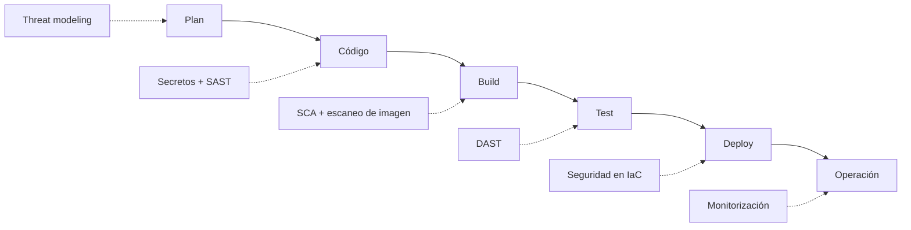

# Qué es DevSecOps

DevSecOps es la práctica de integrar la seguridad en **todas** las etapas del ciclo de desarrollo, en lugar de dejarla como una revisión al final que casi siempre llega tarde y siempre llega mal.

Si DevOps rompió el muro entre Desarrollo y Operaciones, DevSecOps rompe el que queda: el que separa a ambos del equipo de Seguridad.

## El problema que resuelve

Imagina el modelo clásico. El equipo desarrolla durante tres meses, se prepara la release y, dos días antes de salir a producción, llega la auditoría de seguridad con un informe de 40 páginas.

```
Desarrollo (3 meses) → QA → 🔒 Auditoría → 😱 → Producción
```

Los problemas son evidentes:

- **Arreglar sale carísimo.** Un fallo detectado en diseño se corrige cambiando un párrafo. El mismo fallo en producción implica rehacer código, migrar datos y, con suerte, no salir en las noticias.
- **La seguridad es "el que dice que no".** Se convierte en un obstáculo burocrático, así que los equipos aprenden a esquivarla.
- **No escala.** Tres personas de seguridad no pueden revisar a mano lo que producen cien desarrolladores.

## Shift-left, o mover la seguridad a la izquierda

Si dibujas el ciclo de vida de izquierda a derecha, la seguridad tradicional vive en el extremo derecho. **Shift-left** significa exactamente lo que parece: desplazarla hacia la izquierda, lo más cerca posible del momento en que se escribe el código.

La idea de fondo: **cuanto antes encuentras un fallo, más barato es arreglarlo.** No es una frase motivacional, es aritmética. Un secreto detectado por un hook antes del commit se arregla borrando una línea. Ese mismo secreto publicado en GitHub obliga a rotar la credencial, revisar los accesos y asumir que alguien ya la tiene.



Cada etapa tiene su familia de herramientas. Este curso las recorre en ese orden.

## DevOps vs DevSecOps

No son cosas distintas: DevSecOps es DevOps con seguridad integrada. Pero el cambio de énfasis es real.

| | DevOps | DevSecOps |
|---|---|---|
| **Objetivo** | Entregar rápido y de forma fiable | Entregar rápido, fiable **y sin regalar fallos** |
| **Quién es responsable** | Dev y Ops comparten la entrega | Todo el mundo comparte también la seguridad |
| **Cuándo se revisa la seguridad** | Antes de la release | En cada commit |
| **Qué rompe el pipeline** | Un test que falla | Un test **o un CVE crítico** |
| **Métrica típica** | Lead time, MTTR | Las anteriores + tiempo hasta parchear |

Si vienes de cero en DevOps, el [curso de DevOps](../devops/README.md) cubre la base. Y en el capítulo de [seguridad de ese curso](../devops/204.Seguridad.md) tienes el resumen de cómo enlazan ambos mundos.

## Las familias de herramientas

Hay un zoo enorme de siglas. Estas son las que importan, y todas tienen su capítulo:

| Sigla | Qué hace | Cuándo actúa |
|---|---|---|
| **Secret scanning** | Busca credenciales escritas en el código | Antes del commit |
| **SAST** (Static Application Security Testing) | Analiza el código sin ejecutarlo | En cada push |
| **SCA** (Software Composition Analysis) | Revisa tus dependencias de terceros | En cada push |
| **Escaneo de imágenes** | Busca CVEs en la imagen de contenedor | Al construir |
| **IaC scanning** | Audita tu Terraform antes de aplicarlo | Antes de desplegar |
| **DAST** (Dynamic Application Security Testing) | Ataca la aplicación ya en marcha | Sobre un entorno desplegado |

Un detalle importante: **ninguna encuentra todo**. Cada una mira desde un ángulo distinto, y por eso se combinan.

## La parte cultural

La tecnología es la parte fácil. Lo difícil es esto:

- **La seguridad es responsabilidad de todos.** Si el desarrollador piensa que "ya lo mirará el equipo de seguridad", el modelo no funciona.
- **Las herramientas informan, no bloquean por capricho.** Un pipeline que falla por 200 vulnerabilidades de severidad baja se ignora en una semana. Empieza bloqueando solo lo crítico.
- **Sin culpables.** Cuando aparece un fallo, la pregunta es qué control faltaba, no quién lo escribió.

## Laboratorio: el repositorio del curso

Vamos a conocer al paciente. Es una aplicación pequeña con cinco fallos plantados a propósito:

```bash
git clone https://github.com/pabpereza/devsecops-demo
cd devsecops-demo
tree
```

Échale un vistazo antes de seguir e intenta encontrarlos a ojo:

1. Unas **credenciales escritas en el código**, en `src/config.js`
2. **Dependencias con CVE conocido**, fijadas en `package-lock.json`
3. Un **`eval()` y una consulta SQL concatenada** en `src/routes.js`
4. Un **`Dockerfile`** con imagen base obsoleta que corre como root
5. Un **bucket S3 público** y un SSH abierto a internet en `infra/main.tf`

Lo interesante viene después: en cada capítulo, una herramienta distinta encontrará el suyo en segundos. Y esa es exactamente la diferencia entre revisar código a ojo y automatizarlo.

Un aperitivo de lo que viene. Este comando tarda cuatro segundos y no requiere instalar nada:

```bash
docker run --rm -v "$PWD:/repo" zricethezav/gitleaks:latest detect -s /repo -v
```

Te dirá qué secreto has filtrado, en qué fichero, en qué línea y **en qué commit entró**. Eso último es lo que convierte un despiste en un incidente: aunque borres la línea, el secreto sigue en el historial.

:::warning Las credenciales del repositorio son falsas

Son cadenas aleatorias con el formato correcto. No dan acceso a nada. Están ahí porque las herramientas las detectan igual que detectarían unas de verdad.

:::

## Resumen

- DevSecOps es DevOps con la seguridad integrada en cada etapa, no al final
- **Shift-left**: cuanto antes detectas un fallo, más barato es arreglarlo
- Cada etapa del pipeline tiene su familia de herramientas, y se complementan
- Lo que más cuesta no es instalar las herramientas, es que el equipo las asuma

## Recursos adicionales

- [Ruta DevSecOps, recomendaciones para empezar](/blog/ruta_devsecops_recomendaciones_2025) — el roadmap completo en un diagrama
- [Mi ruta hasta DevSecOps](/blog/mi_ruta_devsecops_reflexiones_recomendaciones_2025) — cómo llegué yo, por si te sirve de referencia
- [OWASP DevSecOps Guideline](https://owasp.org/www-project-devsecops-guideline/)

---

> 💡 **Recuerda**: la seguridad perfecta no existe. El objetivo es que explotar tu aplicación cueste más de lo que vale.

**En el próximo capítulo empezamos por lo más urgente y lo más común: los secretos filtrados en el código.**
