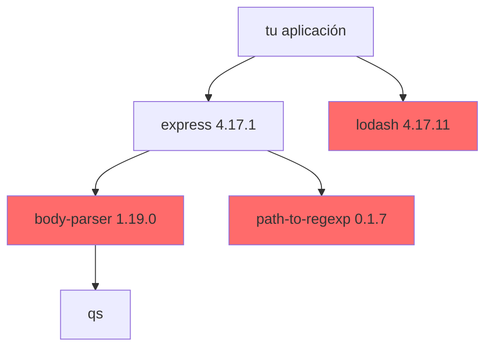

# Dependencias y SCA

En un proyecto moderno, la mayor parte del código que despliegas no lo has escrito tú. Un `npm install` de una aplicación pequeña arrastra cientos de paquetes, y cada uno viene con su propio historial de vulnerabilidades.

**SCA** (*Software Composition Analysis*, análisis de composición de software) es la práctica de inventariar esas dependencias y cruzarlas con las bases de datos públicas de vulnerabilidades. En la práctica: saber si estás usando una versión con un CVE conocido.

> Un **CVE** (*Common Vulnerabilities and Exposures*) es el identificador público de una vulnerabilidad concreta. `CVE-2019-10744` es siempre el mismo fallo, en cualquier herramienta que lo mencione.

## Lo difícil son las transitivas

Tú instalas Express. Express instala `body-parser`, que instala `qs`, que instala... Ese árbol es donde vive la mayoría de los problemas, porque no lo has elegido tú y ni siquiera sabes que está ahí.



En rojo, los paquetes con vulnerabilidades conocidas del laboratorio. Fíjate en que **dos de los tres no los instalaste tú**.

## Laboratorio: encontrar las dependencias vulnerables

Usamos [Trivy](https://trivy.dev/), que además de imágenes escanea sistemas de ficheros:

```bash
cd devsecops-demo

docker run --rm -v "$PWD:/src" aquasec/trivy:latest fs --scanners vuln /src
```

Tarda unos nueve segundos. Salida real:

```
package-lock.json (npm)
Total: 20 (UNKNOWN: 0, LOW: 6, MEDIUM: 5, HIGH: 8, CRITICAL: 1)
```

Filtrando por lo que de verdad importa:

```bash
docker run --rm -v "$PWD:/src" aquasec/trivy:latest fs \
  --scanners vuln --severity HIGH,CRITICAL /src
```

| Librería | Vulnerabilidad | Severidad | Instalada | Corregida en |
|---|---|---|---|---|
| `lodash` | CVE-2019-10744 | **CRITICAL** | 4.17.11 | 4.17.12 |
| `lodash` | CVE-2020-8203 | HIGH | 4.17.11 | 4.17.19 |
| `lodash` | CVE-2021-23337 | HIGH | 4.17.11 | 4.17.21 |
| `body-parser` | CVE-2024-45590 | HIGH | 1.19.0 | 1.20.3 |
| `path-to-regexp` | CVE-2024-45296 | HIGH | 0.1.7 | 0.1.10 |

La crítica, `CVE-2019-10744`, es *prototype pollution* en `defaultsDeep`. Y no es teórica: el laboratorio tiene una ruta `/preferencias` que hace exactamente `_.merge({}, req.body)` con lo que le mande el usuario.

:::danger Trivy necesita el fichero de bloqueo

Si el proyecto solo tiene `package.json` y no `package-lock.json`, **Trivy no reporta nada**. No es un fallo suyo: sin fichero de bloqueo no sabe qué versión exacta hay instalada, y sin versión exacta no puede decidir si es vulnerable.

Si tu escaneo sale limpio sospechosamente rápido, comprueba que el lockfile está versionado.

:::

## La columna que de verdad importa

De las cinco columnas, la útil es **"Corregida en"**.

Una vulnerabilidad sin versión corregida disponible es un problema que no puedes resolver actualizando: toca mitigar de otra forma o cambiar de librería. Pero si dice `4.17.21` y tú tienes `4.17.11`, el arreglo es un comando.

Por eso el 80% del trabajo de SCA no es analizar: es **mantenerse al día**. Y eso se automatiza.

## Automatizar las actualizaciones

### Dependabot

Si estás en GitHub, es lo más rápido de activar. Un fichero y ya:

```yaml
# .github/dependabot.yml
version: 2
updates:
  - package-ecosystem: "npm"
    directory: "/"
    schedule:
      interval: "weekly"
    open-pull-requests-limit: 5
```

A partir de ahí abre pull requests solo con las actualizaciones, cada una con su changelog. Además, las **alertas de seguridad** de Dependabot están activadas por defecto en repositorios públicos: verás los CVEs de arriba en la pestaña *Security* sin configurar nada.

### Renovate

Hace lo mismo, pero funciona fuera de GitHub y es mucho más configurable. Su gracia es que puede **agrupar** actualizaciones para no ahogarte en pull requests:

```json
{
  "extends": ["config:recommended"],
  "packageRules": [
    {
      "matchUpdateTypes": ["minor", "patch"],
      "groupName": "actualizaciones menores",
      "automerge": true
    }
  ]
}
```

Ese `automerge` de parches es el que marca la diferencia a medio plazo: las actualizaciones pequeñas entran solas y tú solo revisas las que rompen cosas.

| | Dependabot | Renovate |
|---|---|---|
| **Plataformas** | Solo GitHub | GitHub, GitLab, Bitbucket, Azure... |
| **Configuración** | Sencilla, limitada | Muy detallada |
| **Agrupar PRs** | Básico | Excelente |
| **Automerge** | No nativo | Sí |
| **Coste** | Gratis en GitHub | Gratis (app o self-hosted) |

Empieza por Dependabot si estás en GitHub. Cámbiate a Renovate cuando el volumen de PRs te moleste.

## En el pipeline

```yaml
# .github/workflows/dependencias.yml
name: Dependencias
on: [push, pull_request]

jobs:
  sca:
    runs-on: ubuntu-latest
    steps:
      - uses: actions/checkout@v4
      - uses: aquasecurity/trivy-action@master
        with:
          scan-type: 'fs'
          scanners: 'vuln'
          severity: 'HIGH,CRITICAL'
          exit-code: '1'
```

Ese `exit-code: '1'` es el que convierte el informe en un control real: si aparece algo alto o crítico, el pipeline falla.

:::tip Empieza sin bloquear

Si activas el bloqueo por HIGH el primer día en un proyecto con años encima, vas a parar el trabajo de todo el mundo y el equipo va a exigir que lo quites — con razón.

Arranca informando (`exit-code: '0'`), fija una fecha para ponerte al día y sube el listón cuando el número sea manejable. Un control que se desactiva no protege nada.

:::

## `npm audit` y por qué no basta

Node trae su propio analizador:

```bash
npm audit
npm audit fix
```

Está bien para una comprobación rápida, pero se queda corto: solo entiende npm, su criterio de severidad es propio y `npm audit fix` a veces "arregla" subiendo una versión mayor que rompe la aplicación. Trivy, en cambio, te vale igual para npm, pip, Go, Maven, imágenes de contenedor y Terraform, con un único criterio.

## Resumen

- La mayor parte de tu código son dependencias, y la mayoría de los problemas están en las **transitivas**
- `trivy fs --scanners vuln` las inventaría y las cruza con los CVEs conocidos
- **Sin fichero de bloqueo no hay análisis**
- La columna "Corregida en" es la que convierte el informe en trabajo accionable
- Automatiza con Dependabot (GitHub, sencillo) o Renovate (multiplataforma, agrupa y automergea)
- Empieza informando y sube el listón cuando el número sea manejable

## Recursos adicionales

- [Analizar la seguridad de imágenes Docker](/blog/analizar_seguridad_docker) — comparativa de Trivy, Snyk y Grype
- [Documentación de Trivy](https://trivy.dev/)
- [Documentación de Renovate](https://docs.renovatebot.com/)

---

> 💡 **Recuerda**: no puedes proteger lo que no sabes que tienes instalado.

**En el próximo capítulo pasamos al código que sí has escrito tú, y lo analizamos sin ejecutarlo.**
