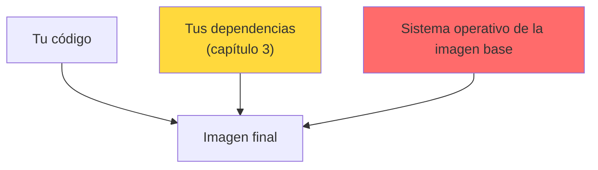

# Seguridad de imágenes de contenedor

Cuando escribimos `FROM node:16`, no estamos importando Node. Estamos importando **una distribución de Linux entera**: su gestor de paquetes, sus librerías del sistema, sus utilidades y todo lo que traigan de serie.

Todo eso se despliega en producción con nuestra aplicación. Y todo eso tiene vulnerabilidades.

## De dónde salen los CVE

Una imagen tiene tres capas de riesgo, y conviene distinguirlas porque se arreglan de forma distinta:



La tercera es la que sorprende: **casi nunca es culpa nuestra y casi siempre es la más numerosa**. La arreglamos cambiando de imagen base, no tocando nuestro código.

## Laboratorio: la comparativa que lo explica todo

Vamos a escanear dos imágenes base y comparar. Nada más:

```bash
docker run --rm -v /var/run/docker.sock:/var/run/docker.sock \
  aquasec/trivy:latest image --scanners vuln node:16
```

```
node:16 (debian 11.7)
Total: 990 (UNKNOWN: 2, LOW: 103, MEDIUM: 509, HIGH: 360, CRITICAL: 16)
```

Ahora la alternativa moderna:

```bash
docker run --rm -v /var/run/docker.sock:/var/run/docker.sock \
  aquasec/trivy:latest image --scanners vuln node:22-alpine
```

```
node:22-alpine (alpine 3.22)
Total: 20 (UNKNOWN: 0, LOW: 12, MEDIUM: 6, HIGH: 2, CRITICAL: 0)
```

| | `node:16` | `node:22-alpine` |
|---|---|---|
| **Total** | **990** | **20** |
| Críticas | 16 | **0** |
| Altas | 360 | 2 |

**De 990 a 20. De 16 críticas a ninguna.** Sin tocar una línea de código: solo cambiando la línea `FROM`.

Dos motivos explican la diferencia. Node 16 llegó a fin de vida en 2023, así que lleva años sin recibir parches. Y Debian arrastra muchísimos más paquetes de sistema que Alpine, así que hay más superficie donde acumular fallos.

:::tip La lección práctica

Antes de invertir un día persiguiendo CVEs, mira nuestra línea `FROM`. Es habitual que una sola actualización de imagen base elimine el 95% de los hallazgos.

:::

## Escanear nuestra propia imagen

```bash
cd devsecops-demo
docker build -t devsecops-demo:1.0 .

docker run --rm -v /var/run/docker.sock:/var/run/docker.sock \
  aquasec/trivy:latest image devsecops-demo:1.0
```

Trivy separa los resultados en dos bloques: los paquetes del sistema operativo (los 990 de arriba) y los de nuestra aplicación (los 20 del capítulo 3). Un único comando cubre ambos.

## Entender las severidades

Ordenar por severidad es lo primero que hay que aprender a **no** hacer a ciegas. Un CRITICAL en una librería que nuestro código nunca llega a llamar es menos urgente que un HIGH en la ruta de autenticación.

Tres preguntas que valen más que la etiqueta:

1. **¿Hay versión corregida?** Si no la hay, actualizar no es la solución.
2. **¿Se llega a ese código?** Trivy no lo sabe; nosotros sí.
3. **¿Está expuesto al usuario?** Una vulnerabilidad en una herramienta de build que no viaja a la imagen final es ruido.

Para el día a día, este es el filtro razonable:

```bash
docker run --rm -v /var/run/docker.sock:/var/run/docker.sock \
  aquasec/trivy:latest image \
  --severity HIGH,CRITICAL \
  --ignore-unfixed \
  devsecops-demo:1.0
```

`--ignore-unfixed` es el más útil de los dos: oculta lo que todavía no tiene parche disponible, o sea, lo que no podemos arreglar hoy. El resto es nuestra lista de tareas real.

## El gate: romper el pipeline

Informar está bien. Bloquear es lo que cambia el comportamiento:

```bash
docker run --rm -v /var/run/docker.sock:/var/run/docker.sock \
  aquasec/trivy:latest image \
  --severity CRITICAL --exit-code 1 devsecops-demo:1.0

echo $?
```

```
1
```

Ese `1` es el que hace fallar el job. En el pipeline:

```yaml
# .github/workflows/imagen.yml
name: Imagen
on: [push]

jobs:
  escaneo:
    runs-on: ubuntu-latest
    steps:
      - uses: actions/checkout@v4
      - run: docker build -t demo:${{ github.sha }} .

      # Informa de todo, sin bloquear
      - uses: aquasecurity/trivy-action@master
        with:
          image-ref: demo:${{ github.sha }}
          format: 'sarif'
          output: 'trivy.sarif'

      - uses: github/codeql-action/upload-sarif@v3
        with:
          sarif_file: 'trivy.sarif'

      # Bloquea solo lo crítico y con parche disponible
      - uses: aquasecurity/trivy-action@master
        with:
          image-ref: demo:${{ github.sha }}
          severity: 'CRITICAL'
          ignore-unfixed: true
          exit-code: '1'
```

El patrón de los dos pasos es deliberado: **informamos de todo, bloqueamos por poco**. Así tenemos visibilidad completa sin que el equipo se pelee con el pipeline.

## Falsos positivos

Se silencian en un fichero `.trivyignore`:

```
# CVE-2019-1010022: glibc, el proyecto lo disputa y no hay parche.
# Revisar: 2026-12-01
CVE-2019-1010022
```

Pon siempre **motivo y fecha de revisión**. Un `.trivyignore` sin comentarios se convierte en un vertedero donde acaba escondido el CVE que sí importaba.

## Alternativas

| Herramienta | Fuerte en | Flojo en |
|---|---|---|
| **Trivy** | Todo en uno: SO, dependencias, IaC, secretos. Rápido | — |
| **Grype** | Muy buena detección en paquetes de sistema | Menos alcance |
| **Docker Scout** | Integrado en Docker Desktop, buena interfaz | Funciones limitadas en el plan gratuito |
| **Snyk** | Prioriza según explotabilidad, buenos consejos | De pago para lo interesante |

Trivy cubre el 90% de los casos siendo gratis y sin cuenta. Es un buen sitio donde quedarse.

## Esto es solo la mitad

Escanear nos dice **qué vulnerabilidades tiene** la imagen. No nos dice nada sobre **cómo está construida**: si corre como root, si tiene el sistema de ficheros en escritura, si arrastra un compilador que no necesitamos.

De hecho, Semgrep ya nos avisó en el capítulo anterior:

```
Dockerfile:22   [ERROR]   missing-user
```

El `Dockerfile` del laboratorio no tiene ninguna instrucción `USER`, así que el proceso corre como root. Esa mitad —el endurecimiento de la imagen— la cubre el capítulo de [seguridad de imágenes del curso de Docker](../docker/118.Multi_stage_y_distroless.md), junto con multi-stage y distroless.

## Resumen

- Una imagen base es una distribución entera, y su sistema operativo aporta la mayoría de los CVEs
- `node:16` → **990 vulnerabilidades**; `node:22-alpine` → **20**. Solo cambiando el `FROM`
- Antes de perseguir CVEs, actualiza la imagen base
- `--ignore-unfixed` deja a la vista lo que de verdad podemos arreglar
- El patrón que funciona: **informar de todo, bloquear solo lo crítico**
- Escanear y endurecer son cosas distintas: esto cubre la primera

## Recursos adicionales

- [Analizar la seguridad de imágenes Docker](/blog/analizar_seguridad_docker) — Trivy, Snyk y Grype comparados
- [Escalar privilegios en Docker](/blog/escalar_privilegios_en_docker) — por qué correr como root importa
- [Hadolint, verifica y mejora tus Dockerfiles](/blog/hadolint-verificar-mejorar-dockerfile)
- [Dockerfiles multi-stage y distroless](../docker/118.Multi_stage_y_distroless.md)

---

> 💡 **Recuerda**: la vulnerabilidad más barata de arreglar es la que eliminas no instalándola.

**En el próximo capítulo respondemos a la pregunta de qué hay exactamente dentro de nuestra imagen, y cómo demostrar que nadie la ha manipulado.**
