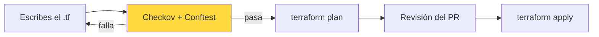

# Seguridad en la infraestructura como código

La infraestructura como código tiene una propiedad estupenda para la seguridad: **es texto**. Y si es texto, se puede revisar antes de que exista nada.

Un bucket mal configurado en la consola de AWS lo descubrimos cuando alguien lo encuentra. El mismo bucket en un `main.tf` lo descubrimos en el pull request, treinta segundos después de escribirlo y antes de que exista.

La otra cara: un error en IaC se replica. Si el módulo está mal, lo está en los cuarenta entornos que lo usan.

## Laboratorio: auditar el Terraform

Usamos [Checkov](https://www.checkov.io/), que trae más de mil comprobaciones para AWS, Azure, GCP, Kubernetes y Docker.

```bash
cd devsecops-demo

docker run --rm -v "$PWD/infra:/tf" bridgecrew/checkov:latest -d /tf --compact
```

Tarda unos once segundos. Extracto real de la salida:

```
Check: CKV_AWS_145: "Ensure that S3 buckets are encrypted with KMS by default"
	FAILED for resource: aws_s3_bucket.datos
	File: /main.tf:11-13

Check: CKV2_AWS_6: "Ensure that S3 bucket has a Public Access block"
	FAILED for resource: aws_s3_bucket.datos
	File: /main.tf:11-13

Check: CKV2_AWS_5: "Ensure that Security Groups are attached to another resource"
	FAILED for resource: aws_security_group.servidor
	File: /main.tf:30-48

secrets scan results:
Check: CKV_SECRET_6: "Base64 High Entropy String"
	FAILED for resource: 72a39a22f19780735f3fd193d41fbe9b9fa08063
	File: /main.tf:58-59
```

Cada hallazgo trae el identificador de la comprobación, el recurso, las líneas exactas y un enlace a la guía de remediación.

Fijémonos en el último: **Checkov también busca secretos**. Ha encontrado la contraseña de la base de datos que ya nos marcó gitleaks en el capítulo 2. Tres herramientas distintas, el mismo hallazgo — y eso está bien, porque no todo el mundo ejecuta las tres.

## Lo que Checkov no puede saber

Checkov comprueba buenas prácticas universales: cifremos los buckets, no abramos el SSH al mundo, activemos los logs. Todo eso vale para cualquier empresa.

Lo que no sabe son **nuestras** reglas:

- "Todos los recursos llevan la etiqueta `centro-de-coste`"
- "Solo desplegamos en `eu-west-1`"
- "Nada de instancias mayores que `t3.large` sin aprobación"

Eso es *Policy as Code*, y se escribe con **OPA** (*Open Policy Agent*) en un lenguaje llamado **Rego**.

## Laboratorio: nuestra propia política

Usamos [Conftest](https://www.conftest.dev/), que aplica políticas de OPA a ficheros de configuración.

Antes de escribir nada, conviene mirar cómo ve Conftest nuestro Terraform:

```bash
docker run --rm -v "$PWD:/project" openpolicyagent/conftest:latest parse infra/main.tf
```

```json
{
  "resource": {
    "aws_s3_bucket_acl": {
      "datos": [ { "acl": "public-read", "bucket": "${aws_s3_bucket.datos.id}" } ]
    },
    "aws_db_instance": {
      "principal": [ { "publicly_accessible": true, "password": "SuperSecret123" } ]
    }
  }
}
```

El detalle que hace perder media hora a todo el mundo: **cada recurso es una lista**, no un objeto. Por eso las reglas llevan un `[_]` al final. Si nuestra política pasa cuando debería fallar, es casi siempre esto.

```rego
# policy/s3.rego
package main

# Ningún bucket puede tener una ACL pública.
deny contains msg if {
	acl := input.resource.aws_s3_bucket_acl[name][_]
	startswith(acl.acl, "public")
	msg := sprintf("El bucket '%s' tiene ACL publica (%s)", [name, acl.acl])
}

# Ninguna base de datos puede ser accesible desde internet.
deny contains msg if {
	db := input.resource.aws_db_instance[name][_]
	db.publicly_accessible == true
	msg := sprintf("La base de datos '%s' es accesible publicamente", [name])
}
```

```bash
docker run --rm -v "$PWD:/project" openpolicyagent/conftest:latest \
  test infra/main.tf -p policy
```

```
FAIL - infra/main.tf - main - El bucket 'datos' tiene ACL publica (public-read)
FAIL - infra/main.tf - main - La base de datos 'principal' es accesible publicamente

2 tests, 0 passed, 0 warnings, 2 failures, 0 exceptions
```

Rego se lee raro al principio, pero el patrón es siempre el mismo: **una regla `deny` que produce un mensaje cuando se cumple una condición**. Si `deny` está vacío, la política pasa.

## Checkov, tfsec y Trivy

Las tres hacen lo mismo con matices:

| | Checkov | tfsec / Trivy |
|---|---|---|
| **Cobertura** | Muy amplia: AWS, Azure, GCP, K8s, Docker, secretos | Amplia, muy buena en Terraform |
| **Velocidad** | Media | Rápida |
| **Políticas propias** | Python o YAML | Rego |
| **Detalle del informe** | Muy bueno, con guías | Más escueto |

tfsec se fusionó con Trivy, así que si ya usamos Trivy para imágenes y dependencias, `trivy config` nos cubre la IaC sin añadir herramientas:

```bash
docker run --rm -v "$PWD:/src" aquasec/trivy:latest config /src
```

Menos herramientas, un solo formato de informe y un solo criterio de severidad. Suele compensar.

## En el pipeline

```yaml
# .github/workflows/iac.yml
name: IaC
on: [push, pull_request]

jobs:
  checkov:
    runs-on: ubuntu-latest
    steps:
      - uses: actions/checkout@v4
      - uses: bridgecrewio/checkov-action@master
        with:
          directory: infra/
          framework: terraform
          soft_fail: true          # informa, todavía no bloquea
          output_format: sarif
          output_file_path: checkov.sarif
      - uses: github/codeql-action/upload-sarif@v3
        with:
          sarif_file: checkov.sarif
```

Ese `soft_fail: true` es deliberado. Un Terraform con años encima puede dar cientos de hallazgos el primer día, y bloquear de golpe solo consigue que nos pidan quitar el control.

El camino que funciona:

1. **Informar** (`soft_fail: true`) y medir cuántos hallazgos hay
2. **Congelar la deuda**: bloquear solo lo que se añade nuevo
3. **Ir bajando** la deuda existente por severidad
4. **Bloquear** cuando el número sea manejable

## Dónde encaja esto en el ciclo



El control va **antes** del `plan`, no después del `apply`. Es la diferencia entre evitar el problema y tener que arreglarlo.

## Resumen

- La IaC es texto, así que se audita antes de que la infraestructura exista
- Checkov detecta buenas prácticas universales, y de paso también secretos
- Nuestras reglas de negocio no las conoce ninguna herramienta: eso es Policy as Code con Rego
- En Conftest, **cada recurso es una lista**: sin el `[_]` la política pasa en silencio
- Si ya usamos Trivy, `trivy config` nos ahorra una herramienta
- Empecemos informando, congelemos la deuda y bloqueemos cuando sea manejable

## Recursos adicionales

- [Documentación de Checkov](https://www.checkov.io/)
- [Conftest](https://www.conftest.dev/)
- [OPA y Gatekeeper en Kubernetes](../kubernetes/407.OPA.md) — la misma idea aplicada al cluster
- [Infraestructura como código](../devops/201.Infraestructura_codigo.md) — los fundamentos de Terraform

---

> 💡 **Recuerda**: revisar el `main.tf` cuesta treinta segundos. Revisar la cuenta de AWS después del incidente cuesta un fin de semana.

**En el próximo capítulo resolvemos el problema que llevamos arrastrando desde el capítulo 2: dónde van los secretos si no van en el código.**
