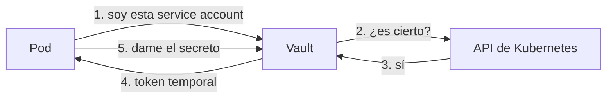

# Secretos en producción

En el capítulo 2 aprendimos a detectar secretos en el código. Quedaba pendiente la pregunta obvia: **si no van ahí, ¿dónde van?**

## Los tres niveles

No todo el mundo necesita lo mismo. Estos son los escalones, de peor a mejor:

| Nivel | Cómo | Problema |
|---|---|---|
| 0 | En el código | Cualquiera con acceso al repo los tiene, y quedan en el historial |
| 1 | Variables de entorno y ficheros `.env` | Mejor, pero siguen en texto plano y no se rotan solos |
| 2 | Gestor de secretos | Cifrados, auditados, con permisos y rotación |

El nivel 1 ya resuelve el 80% del problema y cuesta una tarde. **No nos saltemos el nivel 1 esperando a montar el nivel 2**: mucha gente lleva años con secretos en el código porque Vault le parecía mucho trabajo.

Lo mínimo, aplicado al laboratorio:

```javascript
// ❌ src/config.js tal y como está
aws: {
  accessKeyId: 'AKIA3FKQ7XZ2NPWL9TDV',
}

// ✅ leerlo del entorno y fallar pronto si falta
aws: {
  accessKeyId: process.env.AWS_ACCESS_KEY_ID,
}
```

```javascript
// Y validar al arrancar, no cuando se use
const obligatorias = ['AWS_ACCESS_KEY_ID', 'DATABASE_URL'];
const faltan = obligatorias.filter((v) => !process.env[v]);
if (faltan.length) {
  throw new Error(`Faltan variables de entorno: ${faltan.join(', ')}`);
}
```

Fallar al arrancar es mucho mejor que descubrir a las tres de la mañana que una variable estaba vacía.

## Qué aporta un gestor de secretos

Cuatro cosas que las variables de entorno no dan:

- **Cifrado en reposo** y control de acceso por identidad, no por "quien tenga el fichero"
- **Auditoría**: quién leyó qué secreto y cuándo
- **Rotación**: cambiar una credencial sin desplegar
- **Credenciales dinámicas**: usuarios de base de datos que se crean al pedirlos y caducan solos

La cuarta es la que de verdad cambia el modelo. Si una credencial vive una hora, robarla vale mucho menos.

## Laboratorio: Vault en local

[Vault](https://www.vaultproject.io/) tiene un modo de desarrollo que arranca en memoria, sin cifrar y con un token fijo. Perfecto para aprender, prohibido para cualquier otra cosa.

```bash
docker run -d --rm --name vault-dev -p 8200:8200 \
  -e VAULT_DEV_ROOT_TOKEN_ID=root \
  hashicorp/vault:latest
```

Tenemos la interfaz web en `http://localhost:8200` — entramos con el token `root`.

### Guardar y recuperar

```bash
docker exec -e VAULT_ADDR=http://127.0.0.1:8200 -e VAULT_TOKEN=root vault-dev \
  vault kv put secret/devsecops-demo \
  api_key=abc123 db_password=hunter2
```

```
created_time       2026-08-30T09:55:44Z
version            1
```

Ese `version` importa: Vault guarda el histórico, así que podemos volver a una versión anterior si una rotación sale mal.

```bash
docker exec -e VAULT_ADDR=http://127.0.0.1:8200 -e VAULT_TOKEN=root vault-dev \
  vault kv get -field=api_key secret/devsecops-demo
```

```
abc123
```

El `-field` devuelve el valor pelado, que es lo que necesitamos para inyectarlo en un script:

```bash
export API_KEY=$(vault kv get -field=api_key secret/devsecops-demo)
npm start
```

Ya no hay ningún secreto en el repositorio.

:::danger El modo dev no es producción

Guarda todo **en memoria** (se pierde al reiniciar), arranca **desenclavado** y usa un token raíz fijo. Un Vault real requiere almacenamiento persistente, un proceso de *unseal* con varias claves repartidas entre personas distintas, y TLS.

:::

## El problema del secreto cero

Aquí llega la pregunta incómoda: para leer de Vault necesitamos un token. ¿Y dónde guardamos ese token?

Si acabamos con el token de Vault escrito en el código, hemos movido el problema, no lo hemos resuelto.

La solución es no usar tokens estáticos, sino que la aplicación **demuestre su identidad** con algo que ya tiene:

- En Kubernetes, su *service account*
- En AWS, el rol IAM de la instancia
- En GitHub Actions, el token OIDC del workflow

Vault verifica esa identidad contra la plataforma y entrega un token temporal. No hay ningún secreto que guardar.



## Kubernetes: External Secrets Operator

La forma más cómoda de que esto llegue a nuestras aplicaciones sin que ellas sepan nada de Vault. El operador lee del gestor y mantiene un `Secret` nativo sincronizado:

```yaml
apiVersion: external-secrets.io/v1beta1
kind: ExternalSecret
metadata:
  name: devsecops-demo
spec:
  refreshInterval: 1h
  secretStoreRef:
    name: vault-backend
    kind: SecretStore
  target:
    name: devsecops-demo-secrets
  data:
    - secretKey: api-key
      remoteRef:
        key: devsecops-demo
        property: api_key
```

Nuestro Deployment consume un `Secret` normal y corriente. La aplicación no lleva ni una línea de código de Vault, y el secreto se refresca solo cada hora.

:::warning Los Secrets de Kubernetes no están cifrados

Van en **base64**, que es codificación, no cifrado. Cualquiera con permisos de lectura sobre los Secrets del namespace los ve en claro.

Por eso importa tanto el RBAC. Lo tenemos en el [capítulo de seguridad del curso de Kubernetes](../kubernetes/119.Seguridad.md).

:::

## Alternativas

| Herramienta | Cuándo |
|---|---|
| **Vault** | Multi-cloud, credenciales dinámicas, requisitos serios de auditoría |
| **AWS Secrets Manager** | Ya estamos en AWS y no queremos operar nada |
| **Azure Key Vault / GCP Secret Manager** | Lo mismo en su nube |
| **SOPS + age** | Equipos pequeños, GitOps, secretos cifrados en el propio repositorio |
| **Ansible Vault** | Cifrar secretos en playbooks — ver [el curso de Ansible](../ansible/108.Seguridad.md) |

Si estamos en una sola nube, empecemos por el gestor de nuestro proveedor: cero operación y se integra solo con los permisos que ya tenemos. Vault gana cuando necesitamos credenciales dinámicas o vivimos en varias nubes.

## Rotación

Un secreto que nunca cambia es un secreto que acabará filtrándose. El orden que funciona:

1. Genera la credencial nueva **sin borrar la vieja**
2. Guárdala en el gestor (queda como versión nueva)
3. Deja que las aplicaciones la recojan
4. Comprueba que nadie usa ya la antigua
5. **Ahora** revoca la vieja

Saltarse el paso 4 es la forma habitual de provocar una caída un viernes por la tarde.

## Resumen

- Nivel 1 (variables de entorno) ya resuelve casi todo y cuesta una tarde: no lo pospongamos
- Un gestor añade cifrado, auditoría, rotación y credenciales dinámicas
- El **secreto cero** se resuelve con identidad de plataforma, no con otro token
- En Kubernetes, External Secrets sincroniza sin que la aplicación sepa nada
- Los Secrets de Kubernetes son base64, no cifrado: el control real es el RBAC
- Al rotar: crear, distribuir, **verificar** y solo entonces revocar

## Recursos adicionales

- [Documentación de Vault](https://developer.hashicorp.com/vault/docs)
- [External Secrets Operator](https://external-secrets.io/)
- [Secretos en Docker, buenas prácticas](/blog/secretos_docker_buenas_practicas)
- [Seguridad en Ansible, Vault y credenciales](../ansible/108.Seguridad.md)

---

> 💡 **Recuerda**: el objetivo no es esconder mejor los secretos, es que valgan poco cuando se filtren.

**En el próximo capítulo dejamos de leer configuración y atacamos la aplicación en marcha.**
