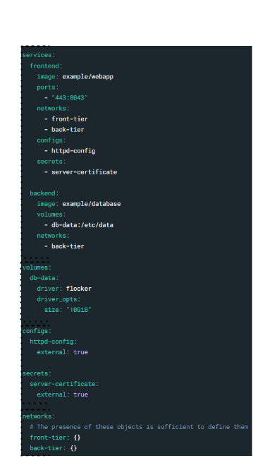

# Docker Compose
Docker compose es una herramienta que nos permite definir y ejecutar aplicaciones formadas por múltiples contenedores. Con Docker compose podemos definir un archivo YAML con la configuración de los servicios que forman nuestra aplicación y luego ejecutarla con un solo comando. Así de simple, vamos a ver cómo funciona.

Dentro vídeo: https://youtu.be/oR0nBx5C9DM

[](https://www.youtube.com/watch?v=oR0nBx5C9DM)

## Como funciona
Su lógica es simple, nos permite definir en un mismo fichero múltiples servicios, volúmenes, redes, secretos y configuraciones, algo que hasta ahora habríamos trabajado de forma individual y usando el cli. Por defecto, se suele usar un fichero llamado "compose.yaml", que es el que docker compose busca por defecto, pero podemos especificar otro personalizado. Este fichero tendría la siguiente estructura:



En esta captura podremos apreciar que:
* Servicios: Contiene la definición de la imagen que van a ejecutar, los puertos que exponen, volúmenes, redes, variables de entorno, etc. Todo lo que hacíamos con el comando `docker run` y que lo podemos definir en un solo bloque.

Y luego, todos los recursos que necesitamos para que nuestra aplicación funcione:
* Volúmenes: que antes definíamos con `docker volume create` o con el flag `-v` en `docker run`, y que ahora automatizaremos su uso (y su creación si no existe).
* Redes: que antes definíamos con `docker network create` o con el flag `--network` en `docker run`, y que ahora automatizaremos su uso (y su creación si no existe).
* Secretos y configuraciones: que antes definíamos con `docker secret create` o con el flag `--secret` en `docker run`. DISCLAIMER: Estos secretos solo funcionan en Docker Swarm, el cual veremos más adelante.


## Instalación
En Docker Desktop ya viene instalado, si utilizas docker engine en tu ordenador con linux o servidores, puedes instalarlo siguiendo la documentación oficial:
[Instalación en docker engine](https://github.com/docker/compose?tab=readme-ov-file#linux)

Este es el extracto de la documentación oficial para instalar docker compose en linux:
```bash
You can download Docker Compose binaries from the release page on this repository.

Rename the relevant binary for your OS to docker compose and copy it to $HOME/.docker/cli-plugins

Or copy it into one of these folders to install it system-wide:

/usr/local/lib/docker/cli-plugins OR /usr/local/libexec/docker/cli-plugins
/usr/lib/docker/cli-plugins OR /usr/libexec/docker/cli-plugins
(might require making the downloaded file executable with chmod +x)
```


En el vídeo de la lista de reproducción de Docker, se muestra el proceso por si tienes dudas.


## Comandos más comunes
A continuación, se muestran los comandos más comunes que podemos usar con docker compose:
* `docker compose up`: Levanta todos los servicios definidos en el fichero compose.
* `docker compose up -d`: Levanta todos los servicios en segundo plano.
* `docker compose down`: Detiene y elimina todos los servicios.
* `docker compose ps`: Muestra el estado de los servicios.
* `docker compose logs`: Muestra los logs de los servicios.
* `docker compose exec <servicio> <comando>`: Ejecuta un comando en un servicio.

Aun así, docker compose tiene bastantes más comandos pero vamos a empezar por los más básicos y esenciales. Os dejo la documentación oficial para que podáis consultarla si tenéis dudas o curiosidad: [Documentación CLI compose](https://docs.docker.com/reference/cli/docker/compose/) y [Documentación Docker Compose](https://docs.docker.com/compose/)


## Ejecutar un fichero compose
Vamos a utilizar un ejemplo sencillo para ver cómo funciona. En este ejemplo, se despliega un servicio nginx:

```yaml
services:
  web:
    image: nginx:latest
    ports:
      - "8080:80"
```

Esta sería una de las sintaxis más sencillas que podemos tener en un fichero compose. En este caso, estamos definiendo un servicio llamado "web" que utiliza la imagen de nginx y expone el puerto 80 del contenedor al puerto 8080 del host.

Para ejecutar este servicio, solo tenemos que guardar este fichero y ejecutar el siguiente comando:

```bash
docker compose up
```

Importante: Este comando debe ejecutarse en la misma carpeta donde se encuentra el fichero compose y este debe llamarse `compose.yaml` . Si quisiéramos usar un fichero con otro nombre o en otra ubicación, tendríamos que especificarlo con el flag `-f`:
```bash
docker compose -f /ruta/al/fichero.yaml up
```

Esta ejecución se mantendrá en primer plano, es decir, que si cerramos la terminal, se detendrá el servicio. Para ejecutarlo en segundo plano, solo tenemos que añadir el flag `-d`:
```bash
docker compose up -d
```

### Ejemplo haciendo build de un Dockerfile
En este caso, vamos a hacer un build de un Dockerfile que tengamos en la misma carpeta que el fichero compose. Para ello, solo tenemos que añadir la clave `build` en el servicio y especificar la ruta del Dockerfile:

```yaml
services:
  web:
    build: .
    ports:
      - "8080:80"
```

### Ejemplo con varios servicios y enrutamiento
Vamos a completar el ejemplo anterior con otro contenedor, que tenga curl instalado para hacer peticiones al servicio nginx. Este sería el fichero compose:

```yaml
services:
  web:
    image: nginx
  test:
    image: nginx
```

En este caso, no voy a exponer ningún puerto, ya que las peticiones las haré desde el contenedor curl al contenedor nginx. Estos contenedores se comunicarán a través de la red por defecto que crea docker compose.

Ejecutaríamos este fichero de la misma forma que el anterior:
```bash
docker compose up -d
```

Ahora genero un terminal interactivo en el contenedor `test` para hacer una petición al contenedor nginx:
```bash
docker compose exec test sh
```

En este caso, `web` es el nombre del servicio que queremos atacar. **Esto suele ser una duda común** y aquí `docker compose` nos facilita la vida encargándose automáticamente del enrutamiento entre servicios.

Desde el contenedor curl podemos hacer una petición al nginx llamando al nombre del servicio `web`, que es el nombre que le hemos dado en el fichero compose. Por lo que nunca tendremos que especificar IPs en cuando trabajamos com `compose` (aunque esto también aplica a kubernetes y otros orquestadores).

Lancemos un contenedor curl en segundo plano para hacer peticiones al servicio nginx:
```bash
# Dentro del contenedor test
curl web:80
```

Podríamos ver la respuesta de nginx. Ya vemos lo sencillo que es trabajar con docker compose y lo que nos facilita el tema de enrutamiento entre servicios. 

Este tema de como adaptar nuestras aplicaciones a contenedores, se ve en la sección [Tu primera app](114.Tu_primera_app.md) y [Docker en producción](115.Docker_en_produccion.md)


## Ver el estado de los servicios
Para ver el estado de los servicios, solo tenemos que ejecutar el siguiente comando:
```bash
docker compose ps
```

También podemos ver los logs de los servicios con el siguiente comando:
```bash
docker compose logs
```

Podríamos también ejecutar un comando en un servicio con el siguiente comando:
```bash
docker compose exec <servicio> <comando>
```

**No olvidar que todo esto también lo podemos hacer desde la interfaz gráfica de Docker Desktop, en la pestaña de "Compose".**


## Parar y eliminar un servicio
Para detener y eliminar un servicio, solo tenemos que ejecutar el siguiente comando:
```bash
docker compose down
```

Docker compose detiene y elimina los servicios definidos en el fichero compose pero, por seguridad, no elimina los volúmenes ni las redes. Si queremos eliminarlos (USAR CON PRECAUCIÓN y BACKUP), podemos añadir el flag `-v`:
```bash
docker compose down -v
```


### Ejemplo 1: Wordpress con mariadb
Como ejemplo más completo, vamos a ver cómo desplegar un wordpress con una base de datos mariadb. Este, añade también la exposición de varios puestos para la base de datos que solo serán accesibles desde la red interna de docker, gracias al comando `expose`.

Lo más importante, persistir los datos con volúmenes. En este caso, se definen primero en un bloque por separado (en este caso sin configuración adicional) y luego se referencian en los servicios que los necesitan. Lo veremos en profundidad en la sección de volúmenes.
```yaml
services:
  db:
    # We use a mariadb image which supports both amd64 & arm64 architecture
    image: mariadb:10.6.4-focal
    # If you really want to use MySQL, uncomment the following line
    #image: mysql:8.0.27
    command: '--default-authentication-plugin=mysql_native_password'
    volumes:
      - db_data:/var/lib/mysql
    restart: always
    environment:
      - MYSQL_ROOT_PASSWORD=somewordpress
      - MYSQL_DATABASE=wordpress
      - MYSQL_USER=wordpress
      - MYSQL_PASSWORD=wordpress
    expose:
      - 3306
      - 33060
  wordpress:
    image: wordpress:latest
    volumes:
      - wp_data:/var/www/html
    ports:
      - 80:80
    restart: always
    environment:
      - WORDPRESS_DB_HOST=db
      - WORDPRESS_DB_USER=wordpress
      - WORDPRESS_DB_PASSWORD=wordpress
      - WORDPRESS_DB_NAME=wordpress
volumes:
  db_data:
  wp_data:
```

También vemos la carga de variables de entorno y la política de `restart` que se aplica a los servicios. En este caso, se reiniciarán siempre que se detengan. ¿Os suena de algo? Sí, es el flag `--restart` que usábamos en `docker run`. Podéis repasarlo todo en la sección [Ejecutar contenedores](104.Ejecutar_un_contenedor.md)


### Ejemplo 2:
Este ejemplo, nos permite ejecutar un nextcloud con una base de datos mariadb y un servidor redis. Aquí vemos por primera vez la definición de redes personalizadas, que vimos como usarlas con el cli en la sección [Redes](111.Redes.md). En este caso, se definen dos redes, una para la base de datos y otra para el servidor redis. Esto permite que nextcloud se comunique con las bases de datos a través de la red interna de docker, sin exponer los puertos al exterior.

Además, al crear una red para cada servicio, se evita que los contenedores de redis y mariadb se comuniquen entre ellos, ya que no es necesario. Esto es una buena práctica de seguridad, limitar todo lo que no sea necesario.

```yaml
services:
  nc:
    image: nextcloud:apache
    restart: always
    ports:
      - 80:80
    volumes:
      - nc_data:/var/www/html
    networks:
      - redisnet
      - dbnet
    environment:
      - REDIS_HOST=redis
      - MYSQL_HOST=db
      - MYSQL_DATABASE=nextcloud
      - MYSQL_USER=nextcloud
      - MYSQL_PASSWORD=nextcloud
  redis:
    image: redis:alpine
    restart: always
    networks:
      - redisnet
    expose:
      - 6379
  db:
    image: mariadb:10.5
    command: --transaction-isolation=READ-COMMITTED --binlog-format=ROW
    restart: always
    volumes:
      - db_data:/var/lib/mysql
    networks:
      - dbnet
    environment:
      - MYSQL_DATABASE=nextcloud
      - MYSQL_USER=nextcloud
      - MYSQL_ROOT_PASSWORD=nextcloud
      - MYSQL_PASSWORD=nextcloud
    expose:
      - 3306
volumes:
  db_data:
  nc_data:
networks:
  dbnet:
  redisnet:
```

Si te has quedado con ganas de más, tenéis más ejemplos en el repositorio de [Awesome Compose](https://github.com/docker/awesome-compose)

Ahora vamos a profundizar en los volúmenes y redes que, en esta sección, nos hemos limitado a mencionar.

## Volúmenes
En el fichero compose, podemos definir volúmenes y redes de la misma forma que definimos servicios. Por ejemplo, si queremos definir un volumen para un servicio, solo tenemos que añadirlo en la sección de volúmenes:

```yaml
volumes:
  db_data:
  wp_data:
```

Y luego, en el servicio que queramos usarlo, solo tenemos que añadirlo en la sección de volúmenes del servicio. En este ejemplo, referenciamos el volumen `db_data` en el servicio `db`, pero también especificamos la ruta donde se montará el volumen en el contenedor. Como sabemos que el directorio `/var/lib/mysql` es donde se guardan los datos de mariadb, lo montamos en ese directorio:
```yaml
services:
  db:
    volumes:
      - db_data:/var/lib/mysql
```

Si quisieramos definir un volumen personalizado, como en la sección de [volúmenes en docker](110.Volumenes_y_archivos.md) podemos hacerlo de la siguiente forma, por ejemplo, si queremos montar un directorio del host en el contenedor:
```yaml
volumes:
  db_data:
    driver: local
    driver_opts:
      type: none
      device: /ruta/al/directorio
      o: bind
```

## Redes
De la misma forma que los volúmenes, podemos definir redes en el fichero compose. Por ejemplo, si queremos definir una red para nuestros servicios, solo tenemos que añadirla en la sección de redes:

```yaml
networks:
  mi_red:
```

Y luego, en el servicio que queramos usarla, solo tenemos que añadirla en la sección de redes del servicio. En este ejemplo, referenciamos la red `mi_red` en el servicio `db`:
```yaml
services:
  db:
    image: nginx
    ports:
      - "8080:80"
    networks:
      - mi_red
```

Si quisiéramos definir una red personalizada, como en la sección de [redes en docker](111.Redes.md) podemos hacerlo de la siguiente forma:
```yaml
networks:
  mi_red:
    driver: bridge
    ipam:
      driver: default
      config: ....
```
        
## Conclusiones
Estos ficheros compose, junto con su cli específico, nos permite agrupa la declaraciones de varios servicios, configuraciones, volúmenes y redes en un solo fichero. Esto nos permite desplegar aplicaciones complejas en un solo comando, tanto para entornos de desarrollo como de producción. (TODO: Referenciar vídeos más avanzados cuando estén disponibles)

Con esto, ya tendríamos una buena base para empezar a trabajar con docker compose. Seguiremos profundizando en Docker compose en las siguientes secciones.


---
* Lista de vídeos en Youtube: [Curso de Docker](https://www.youtube.com/playlist?list=PLQhxXeq1oc2n7YnjRhq7qVMzZWtDY7Zz0)

[Volver al índice](README.md#índice)


