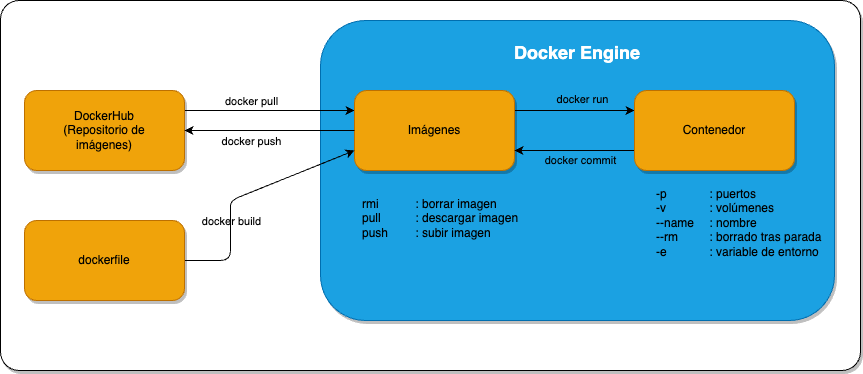

# Conceptos básicos 
Ahora que ya sabemos que es un contenedor, debemos entender algunos conceptos básicos, como el ciclo de vida de un contenedor, en qué consiste una imagen, cómo se crean y cómo se gestionan, entrypoints, volúmenes, redes, etc.

La imagen más descriptiva suele ser la siguiente:


Esto son los conceptos básicos que debemos entender:
* **Contenedor**: Es una instancia de una imagen. Es un proceso que se ejecuta en un entorno aislado.
* **Imagen**: Es un archivo binario que contiene todos los elementos necesarios para ejecutar un contenedor. Es como una plantilla que se utiliza para crear contenedores.
* **Dockerfile**: Es un archivo de texto que contiene las instrucciones necesarias para crear una imagen.
* **Docker Hub**: Es un repositorio de imágenes de contenedor. Es como un GitHub pero de imágenes de contenedor.

Vídeo del episodio:
TODO: Añadir vídeo Youtube


## Contenedor
Un contenedor es una instancia de una imagen. Como vimos en la sección de fundamentos e introducción, un contenedor es un proceso que se ejecuta en un entorno aislado, ojo, **un proceso**. Esto es importante, porque un contenedor no es una máquina virtual, no es un sistema operativo, es un proceso que contiene una aplicación y sus dependencias, tanto de sistema como de librerías. 

Al ejecutar un contenedor, se crea un namespace y un cgroup, que son las funcionalidades de Linus que los permiten ejecutarse de forma aislada.

Los contenedores, se ejecutan con un proposito o un comando principal, cuando este comando finaliza, el contenedor también finaliza. Esto es importante, porque un contenedor puede ejecutar una tarea y finalizar, o puede ejecutar un servicio que se mantenga siempre en ejecución.

Este comando principal, se define en el Dockerfile, en la instrucción `CMD` o `ENTRYPOINT`. La diferencia entre ambos es que `CMD` se puede sobreescribir al ejecutar el contenedor, mientras que `ENTRYPOINT` no. Lo veremos más adelante.

Podemos ejecutar un contenedor, pararlo, reiniciarlo, eliminarlo, etc. Aunque un contenedor se elimine, no se elimina la imagen, recordemos que este solo es una instancia de la imagen. Por lo que podemos ejecutar un contenedor con la misma imagen las veces que queramos.

Por último, una imagen no solo es una definición de una aplicación, sino que también puede contener datos o incluso el estado de una aplicación. Es decir, podríamos ejecutar un contenedor, almacenar datos, cargar archivos en memoria RAM y salvar el estado del contenedor. Como si fuera una snapshot de una máquina virtual. Este proceso de guardar el estado o "commit" nos permite generar una imagen nueva con el estado actual del contenedor.

## Imagen
Una imagen en un archivo que contiene todos los elementos necesarios para ejecutar un contenedor. Es como una plantilla que se utiliza para crear contenedores. Una imagen contiene los siguientes elementos:
* **Librerías de Sistema Operativo**: Aunque no es un sistema operativo completo, si que contiene las librerías y dependencias necesarias para ejecutar una aplicación.
* **Librerías de lenguaje**: Las librerías de terceros del lenguaje de programación que utilicemos.
* **Aplicación**: La aplicación que queremos ejecutar.
* **Configuración**: La configuración de arranque de la aplicación.

Supongamos que tenemos una aplicación escrita en Java, necesitaremos una imagen que contenga el JDK o JRE, la aplicación compilada junto a las librerías de terceros y la definición de como se debe ejecutar la aplicación (por ejemplo, se tiene que ejecutar con el comando `java applicación.jar`).

Normalmente, las imágenes se crean a partir de un Dockerfile, que un archivo que nos permite definir el proceso de construcción de una imagen.

Como ya hemos mencionado, se podría guardar el estado de un contenedor en ejecución en una imagen, pero no suele ser lo más común. La buena práctica es que las imágenes sean estáticas y no dependan del estado de un contenedor. Permitiendo así, que se puedan ejecutar en cualquier entorno agnósticas a la máquina y sistema operativo.

## Dockerfile
Estos archivos, son un conjunto de instrucciones secuenciales que le especifican a Docker cómo construir una imagen. Permite usar múltiplles instrucciones para instalar dependencias, copiar archivos, definir variables de entorno, etc.

Suelen comenzar por una instrucción `FROM`, que define la imagen base que se va a utilizar. A partir de ahí, se pueden definir múltiples instrucciones para modificar la imagen base y adaptarla a nuestras necesidades.

Por ejemplo, si queremos crear una imagen con un servidor web Apache, podríamos crear un Dockerfile con el siguiente dockerfile:
```Dockerfile
FROM ubuntu:22.04
RUN apt-get update && apt-get install -y apache2
COPY index.html /var/www/html/
CMD ["apache2ctl", "-D", "FOREGROUND"]
```
En ejemplo anterior, partimos de una imagen base de Ubuntu 22.04, actualizamos los paquetes e instalamos Apache2. Copiamos un archivo `index.html` en la carpeta de Apache y ejecutamos el comando `apache2ctl -D FOREGROUND` para arrancar el servidor.

Básicamente, es como si tuvieramos un Linux en el que lanzamos una serie de comandos y configuraciones para posteriormente guardar ese proceso en una imagen que podremos ejecutar sin tener que repetir todo el proceso.

## Docker Hub
Es un repositorio de imágenes de contenedor. En Docker Hub, podemos encontrar imágenes de contenedores ya creadas por la comunidad, que podemos utilizar para nuestros proyectos. También podemos subir nuestras propias imágenes y compartirlas con la comunidad.

Este repositorio es propiedad de Docker, pero no es el único. Dentro del estándar de Docker, existen otros repositorios como GitHub Container Registry, GitLab Container Registry, Amazon Elastic Container Registry, Google Container Registry, etc. Es decir, podemos almacenar nuestras imágenes en cualquier repositorio que soporte el estándar de Docker, aunque Docker Hub es de los más populares. 

## Resumen
En los siguientes capítulos, profundizaremos de forma práctica en estos conceptos. Veremos cómo crear imágenes, cómo crear contenedores, cómo gestionarlos, cómo compartirlos, cómo trabajar con volúmenes y redes, etc. Pero es importante tener claros estos conceptos para entender el propósito de los contenedores.

Ya vemos que la capacidad de empaquetar en imágenes, definidas en Dockerfiles, nos permite o bien compartirte una imagen o el proceso de construcción de una imagen. Esto es muy útil para compartir aplicaciones, para trabajar en equipo, para desplegar aplicaciones en diferentes entornos, etc.

Además, una vez generada una imagen, nos olvidamos de cualquier conflicto que pueda surgir con el sistema operativo o con las dependencias de la aplicación. Tradicionalmente, una máquina virtual podía ejecutar múltiples aplicaciones que requerían diferentes versiones de librerías, pero con Docker, cada aplicación se ejecuta en un contenedor aislado con sus propias dependencias.


---
* Curso por @pabpereza para [Youtube](https://www.youtube.com/@Pabpereza)
* Lista de reproducción del curso en [Curso de Docker](https://www.youtube.com/playlist?list=PLQhxXeq1oc2n7YnjRhq7qVMzZWtDY7Zz0)

[Volver al índice](README.md#índice)