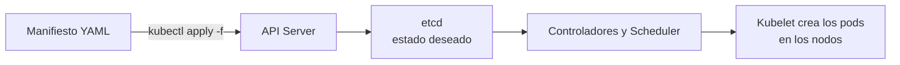

# Conceptos básicos y kubectl
En este capítulo vamos a ver cómo configurar nuestro kubectl para que pueda comunicarse con nuestro cluster de Kubernetes y cómo definir manifiestos para poder aplicarlos de forma sencilla.

Dentro vídeo: https://youtu.be/cOFcLadQa70

[](https://youtu.be/cOFcLadQa70)

## Conceptos básicos
Para empezar, tenemos que tener claro que en Kubernetes todo es un recurso u objeto. Un recurso es cualquier cosa que se pueda definir en un cluster de Kubernetes, como un pod, un deployment, un service, etc. Cada recurso es de un tipo y tiene unas propiedades y atributos que lo definen. Estos recursos se pueden definir en archivos manifiesto que se aplican al cluster para que se creen o modifiquen.


## Esquema de recursos en Kubernetes
El pod es el recurso más básico de Kubernetes y es, a su vez, un grupo de uno o varios contenedores. Los pods no suelen crearse directamente, sino a través de otros recursos como deployments, statefulsets, etc. Estos recursos se encargan de gestionar los pods y de asegurarse de que siempre haya el número de pods que se ha definido en el cluster.

Además de los pods, hay otros recursos que se pueden definir en Kubernetes: los services, que exponen los pods al exterior; los volumes, que almacenan datos de forma persistente; los namespaces, que agrupan recursos, etc.

Iremos profundizando en cada uno de estos recursos a lo largo del curso, pero es importante tener claro que todo en Kubernetes es un recurso y que se define en archivos manifiesto que se aplican al cluster.


## Manifiestos
Por debajo de todas las acciones de Kubernetes, lo que el motor entiende son archivos manifiesto que definen cada elemento. Pueden escribirse en formato YAML o JSON. Aunque Kubernetes los procesa finalmente en formato JSON, lo más habitual para los humanos es escribirlos en YAML.

Cuando se coge cierta experiencia, se dejan de usar comandos sueltos para pasar a usar manifiestos, pudiendo aplicar varios a la vez y haciendo el proceso menos tedioso.

Además, un manifiesto nos sirve para versionar la configuración de los recursos de nuestro cluster, por ejemplo, en un repositorio git. Y no solo sirven para crear recursos: también podemos coger cualquier recurso existente en un cluster y obtener su manifiesto para guardarlo o modificarlo. Esto facilita mucho la gestión de los recursos del cluster.



### ¿Cómo se estructura un manifiesto?
Un manifiesto de Kubernetes se compone de cuatro partes principales:
* **apiVersion**: versión de la API de Kubernetes que se va a usar.
* **kind**: tipo de recurso que se va a definir.
* **metadata**: información adicional del recurso (nombre, etiquetas, etc).
* **spec**: especificación del recurso (contenedores, volúmenes, etc).

### Ejemplo de un manifiesto
```yaml
apiVersion: v1
kind: Pod
metadata:
  name: podtest
spec:
  containers:
  - name: cont1
    image: nginx:alpine
```

Este sería un ejemplo muy sencillo, pero en un manifiesto podemos definir cualquier tipo de recurso de Kubernetes: pods, deployments, services, etc.


### Definir un pod en un manifiesto
Vamos a ponerlo en práctica.

Creamos la definición de un pod de prueba que escribirá "Hello World!" y se quedará en ejecución durante 1 hora:
```yaml
apiVersion: v1
kind: Pod
metadata:
  name: myapp-pod
  labels:
    app: myapp
spec:
  containers:
  - name: myapp-container
    image: busybox
    command: ['sh', '-c', 'echo Hello World!; sleep 3600']
```

Luego podríamos crear el elemento, o aplicar cualquier manifiesto, con el comando:
```shell
kubectl apply -f <manifiesto.yaml>
```

En nuestro caso, sería:
```shell
kubectl apply -f pod.yaml
```

También podríamos eliminarlo usando el manifiesto con el comando:
```shell
kubectl delete -f pod.yaml
```


## Kubectl
Kubectl es la herramienta de línea de comandos que nos permite interactuar con nuestro cluster de Kubernetes. Con ella podemos crear, modificar, eliminar y consultar los recursos del cluster. Además, también nos permite ver logs, ejecutar comandos en los contenedores, etc.

### Configurar kubectl
En la creación del cluster de Kubernetes se nos proporcionó un archivo de configuración que nos permite conectarnos a él. Se encuentra en el nodo maestro (o control plane) en la ruta `/etc/kubernetes/admin.conf`. Para poder usarlo desde nuestro equipo, lo copiaremos a la ruta `~/.kube/config` de nuestro equipo local.

Kubectl busca por defecto en `~/.kube/config` la configuración del cluster. Si queremos usar otro archivo de configuración, podemos usar la variable de entorno `KUBECONFIG` para indicarle a kubectl dónde buscar:

```shell
export KUBECONFIG=/ruta/al/archivo.conf
```

### Kubeconfig
Este fichero de configuración contiene la ruta de la API del clúster, el certificado de seguridad, las credenciales de acceso y el contexto de kubectl:

```yaml
apiVersion: v1
kind: Config
clusters:
- name: mi-cluster
  cluster:
    server: https://192.168.1.100:6443
    certificate-authority: /ruta/ca.crt  # Certificado del clúster
users:
- name: mi-usuario
  user:
    client-certificate: /ruta/client.crt
    client-key: /ruta/client.key
contexts:
- name: mi-contexto
  context:
    cluster: mi-cluster
    user: mi-usuario
current-context: mi-contexto
```


### Kubectl config y contextos
El comando `kubectl config` nos permite gestionar la configuración de kubectl. Algunos comandos útiles son:
* `kubectl config view`: muestra la configuración actual.
* `kubectl config get-contexts`: muestra los contextos disponibles.
* `kubectl config use-context <nombre-contexto>`: cambia el contexto actual.

También podemos añadir nuevos contextos con el comando `kubectl config set-context <nombre-contexto> --cluster=<nombre-cluster> --user=<nombre-usuario>`, sin tener que modificar el archivo de configuración manualmente.


## Resumen
Ya iremos profundizando; con tener claro el funcionamiento general y cómo configurar kubectl es suficiente para empezar a trabajar con Kubernetes.

A lo largo del curso veremos todos los objetos que podemos definir en Kubernetes y las distintas etiquetas, atributos y propiedades que podemos usar para definirlos en estos manifiestos.

---
* Lista de vídeos en Youtube: [Curso Kubernetes](https://www.youtube.com/playlist?list=PLQhxXeq1oc2k9MFcKxqXy5GV4yy7wqSma)

[Volver al índice](README.md#índice)
