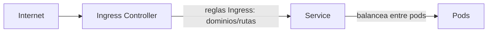
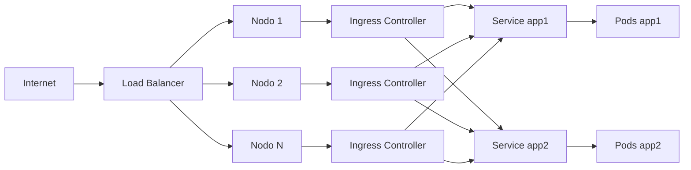

# Ingress en Kubernetes

En Kubernetes, exponer aplicaciones al exterior puede hacerse de varias formas. Los **Services** permiten exponer pods dentro o fuera del clúster, pero si necesitas enrutar tráfico HTTP/HTTPS externo a diferentes servicios internos según el dominio o la ruta, necesitas un recurso adicional: **Ingress**.

## ¿Cómo se relacionan Service, Ingress e Ingress Controller?

- **Service**: expone y balancea el acceso a los pods. Puede ser interno (ClusterIP) o externo (NodePort, LoadBalancer).
- **Ingress**: define reglas de enrutamiento HTTP/HTTPS para exponer uno o varios servicios internos bajo una única IP/punto de entrada, gestionando rutas y dominios.
- **Ingress Controller**: es el componente (normalmente un pod) que observa los objetos Ingress y aplica las reglas, actuando como proxy inverso (por ejemplo, nginx).

### Diagrama visual del flujo de tráfico



- El tráfico externo llega al **Ingress Controller**.
- El **Ingress** define a qué **Service** debe enviarse cada petición según la ruta o dominio.
- El **Service** balancea el tráfico entre los pods correspondientes.

De este modo, puedes tener múltiples aplicaciones (web, API, etc.) expuestas bajo diferentes rutas o dominios, todas gestionadas de forma centralizada y segura.

Cualquier tecnología que sirviera como proxy inverso se puede utilizar como `ingress controller`. Uno de los más comunes es nginx.

[Ejemplos de configuración de nginx para diferentes plataformas ( docker desktop, minikube, AWS, GCP, Azure...)](https://github.com/kubernetes/ingress-nginx/blob/main/docs/deploy/index.md)

## Instalación de un ingress controller
Podemos instalar el ingress controller basado en nginx con [[helm]]. 

Domentación oficial: [ingress-nginx](https://docs.nginx.com/nginx-ingress-controller/installation/installing-nic/installation-with-helm/)

Simplemente ejecutamos el siguiente comando para instalar el ingress controller de nginx:
``` bash 
helm install nginx-ingress ingress-nginx/ingress-nginx \
  --namespace ingress-nginx \
  --create-namespace \
  --set controller.service.type=NodePort \
  --set controller.ingressClassResource.name=nginx \
  --set controller.ingressClass=nginx
```
sudo ufw disable
Ahora ya podemos añadir objetos de tipo `ingress` en kubernetes.

## Deployments para el caso práctico 
Para este ejemplo, vamos a crear dos deployments de ejemplo, `app1` y `app2`, que simulan aplicaciones web. Estos deployments expondrán un servicio en el puerto 8080.
```yaml
apiVersion: apps/v1
kind: Deployment
metadata:
  name: app1
  labels:
    app: app1
spec:
  replicas: 3
  selector:
    matchLabels:
      app: app1
  template:
    metadata:
      labels:
        app: app1
    spec:
      containers:
      - name: nginx
        image: nginx
        ports:
        - containerPort: 80
        command: ["/bin/sh", "-c"]
        args:
          - |
            echo '¡Son la primera, la aplicación numero 1!' > /usr/share/nginx/html/index.html && \
            nginx -g 'daemon off;'
---
apiVersion: v1
kind: Service
metadata:
  name: servicio-app1
spec:
  selector:
    app: app1
  ports:
    - port: 8080
      targetPort: 80
  type: ClusterIP
```

Para la app2, solo hemos modificado el mensaje que se muestra en la página web y el 'app1' por 'app2':
```yaml
apiVersion: apps/v1
kind: Deployment
metadata:
  name: app2
  labels:
    app: app2
spec:
  replicas: 3
  selector:
    matchLabels:
      app: app2
  template:
    metadata:
      labels:
        app: app2
    spec:
      containers:
      - name: nginx
        image: nginx
        ports:
        - containerPort: 80
        command: ["/bin/sh", "-c"]
        args:
          - |
            echo '¡Soy la segunda, la aplicación numero 2!' > /usr/share/nginx/html/index.html && \
            nginx -g 'daemon off;'
---
apiVersion: v1
kind: Service
metadata:
  name: servicio-app2
spec:
  selector:
    app: app2
  ports:
    - port: 8080
      targetPort: 80
  type: ClusterIP
```

Una vez que tenemos el laboratorio listo, podemos ver como funcionan los ingress.

Podemos declarar el objeto ingress de kubernetes como en el siguiente ejemplo:
``` yaml 
apiVersion: networking.k8s.io/v1
kind: Ingress
metadata:
  name: minimal-ingress
  annotations:
    nginx.ingress.kubernetes.io/rewrite-target: /
spec:
  rules:
  - http:
      paths:
      - path: /testpath
        pathType: Prefix
        backend:
          service:
            name: test
            port:
              number: 80

```

Este es muy básico, y simplemente redirige el tráfico que llega a la ruta `/testpath` al servicio `test` en el puerto 80. Tenemos múltiples formas de definir un `ingress`, dependiendo de nuestras necesidades.

Lo mas común es diferenciar el tráfico entrante por la ruta de la petición o por el host de la petición. Vamos a ver ejemplos de ambos casos.


## Ingress por path

```yaml
apiVersion: networking.k8s.io/v1
kind: Ingress
metadata:
  name: minimal-ingress
  annotations:
    nginx.ingress.kubernetes.io/rewrite-target: /
spec:
  ingressClassName: nginx
  rules:
  - http:
      paths:
      - path: /app1
        pathType: Prefix
        backend:
          service:
            name: servicio-app1
            port:
              number: 8080
      - path: /app2
        pathType: Prefix
        backend:
          service:
            name: servicio-app2
            port:
              number: 8080
```

## Ingress por host
Aunque lo mas común, es diferenciar por el host de la petición, es decir, por el nombre de dominio. En este caso, el manifiesto sería algo así:
```yaml
apiVersion: networking.k8s.io/v1
kind: Ingress
metadata:
  name: host-ingress
  annotations:
    nginx.ingress.kubernetes.io/rewrite-target: /
spec:
  ingressClassName: nginx
  rules:
  - host: app1.example.com
    http:
      paths:
      - path: /
        pathType: Prefix
        backend:
          service:
            name: servicio-app1
            port:
              number: 8080
  - host: app2.example.com
    http:
      paths:
      - path: /
        pathType: Prefix
        backend:
          service:
            name: servicio-app2
            port:
              number: 8080
```


## Creación de un ingress con TLS y varias rutas
Veamos ahora un ejemplo más completo de un objeto `ingress` que expone las aplicaciones `app1` y `app2` bajo diferentes dominios, con soporte para TLS y múltiples rutas. El manifiesto podría ser algo así:

```yaml
apiVersion: networking.k8s.io/v1
kind: Ingress
metadata:
  name: multi-app-ingress
  annotations:
    nginx.ingress.kubernetes.io/rewrite-target: /
spec:
  ingressClassName: nginx
  tls:
  - hosts:
    - app1.example.com
    - app2.example.com
    secretName: example-tls-secret
  rules:
  - host: app1.example.com
    http:
      paths:
      - path: /
        pathType: Prefix
        backend:
          service:
            name: servicio-app1
            port:
              number: 8080
  - host: app2.example.com
    http:
      paths:
      - path: /
        pathType: Prefix
        backend:
          service:
            name: servicio-app2
            port:
              number: 8080
```

Podemos ver que hemos añadido una sección `tls` que especifica los hosts y el secreto que contiene el certificado TLS. Esto permite que las peticiones a `app1.example.com` y `app2.example.com` se sirvan de forma segura a través de HTTPS.

Si hacemos un curl a `https://app1.example.com` o `https://app2.example.com`, el tráfico se cifrará utilizando el certificado especificado en el secreto `example-tls-secret`.

Como no lo hemos creado aún, kubernetes usará el certificado por defecto, que no es válido, y nos dará un error de certificado no válido, aunque el tráfico se cifrará.

Veremos cómo crear este secreto más adelante, en la sección de [secretos y configmaps](117.Secrets_configmaps.md).

De momento, como solo podemos generar certificados autofirmados, no podremos acceder a las aplicaciones desde un navegador, ya que este no confiará en el certificado autofirmado. Sin embargo, podemos probarlo con `curl` usando la opción `-k` para ignorar los errores de certificado y depurar el tráfico HTTPS.
```bash
curl -k https://app1.example.com
```


## Gestión de objetos ingress
y como todos los objetos de kubernetes, los principales comando de gestión son:
``` bash
kubectl get ingress
kubectl delete ingress <nombre>
kubectl edit ingress <nombre>
```
Nos permiten listar, eliminar o editar los objetos `ingress` respectivamente.

## ¿Y como se productiviza esto?
Te preguntarás, y tenemos que llamar a los puertos de los nodos directamente, ¿no? ¿Y si tengo varios nodos? ¿Y si tengo varios ingress controllers?

Lo habitual en entornos on-prem (y en nube solo que son gestionados por el proveedor) es tener un balanceador de carga que se encargue de distribuir el tráfico entre los nodos del clúster.

Recordemos que hemos abierto un node port en cada uno de los nodos que redirige el tráfico al ingress controller, este a los correspondientes servicios y estos a los pods.
Por lo tanto, el flujo de tráfico sería algo así:



Parece un poco rebuscado, pero esto garantiza balanceo de carga tanto en los pods, como en los nodos, permitiéndote aumentar el número de nodos y pods según la carga de trabajo sin interrumpir el servicio ni tener que tocar ninguna configuración previa, una maldita pasada.

## Conclusión
En este artículo hemos visto cómo funcionan los Ingress Controllers en Kubernetes, cómo se relacionan con los Services y cómo podemos definir reglas de enrutamiento para exponer nuestras aplicaciones de forma segura y eficiente. Hemos cubierto ejemplos prácticos de configuración, incluyendo el uso de TLS para cifrar el tráfico.

Nos vemos en el siguiente.

---
* Lista de vídeos en Youtube: [Curso Kubernetes](https://www.youtube.com/playlist?list=PLQhxXeq1oc2k9MFcKxqXy5GV4yy7wqSma)

[Volver al índice](README.md#índice)
