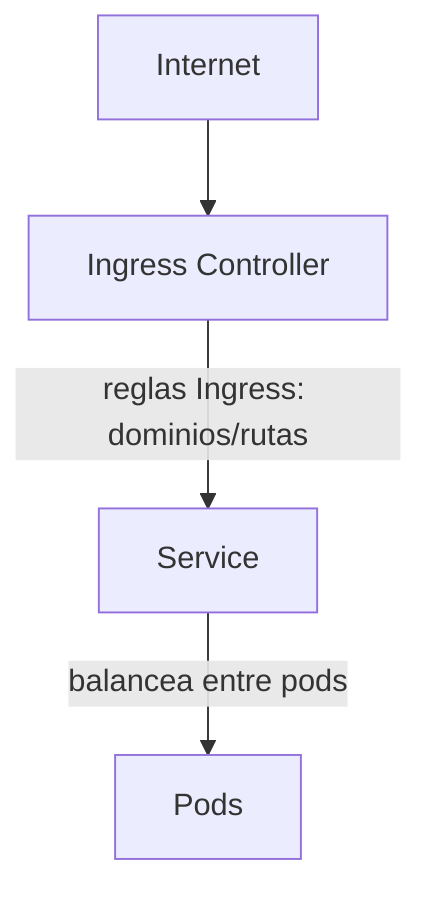

# Ingress en Kubernetes

En Kubernetes, exponer aplicaciones al exterior puede hacerse de varias formas. Los **Services** permiten exponer pods dentro o fuera del clúster, pero si necesitas enrutar tráfico HTTP/HTTPS externo a diferentes servicios internos según el dominio o la ruta, necesitas un recurso adicional: **Ingress**.

## ¿Cómo se relacionan Service, Ingress e Ingress Controller?

- **Service**: expone y balancea el acceso a los pods. Puede ser interno (ClusterIP) o externo (NodePort, LoadBalancer).
- **Ingress**: define reglas de enrutamiento HTTP/HTTPS para exponer uno o varios servicios internos bajo una única IP/punto de entrada, gestionando rutas y dominios.
- **Ingress Controller**: es el componente (normalmente un pod) que observa los objetos Ingress y aplica las reglas, actuando como proxy inverso (por ejemplo, nginx).

### Diagrama visual del flujo de tráfico



- El tráfico externo llega al **Ingress Controller**.
- El **Ingress** define a qué **Service** debe enviarse cada petición según la ruta o dominio.
- El **Service** balancea el tráfico entre los pods correspondientes.

De este modo, puedes tener múltiples aplicaciones (web, API, etc.) expuestas bajo diferentes rutas o dominios, todas gestionadas de forma centralizada y segura.

Cualquier tecnología que sirviera como proxy inverso se puede utilizar como `ingress controller`. Uno de los más comunes es nginx.

[Ejemplos de configuración de nginx para diferentes plataformas ( docker desktop, minikube, AWS, GCP, Azure...)](https://github.com/kubernetes/ingress-nginx/blob/main/docs/deploy/index.md)

## Instalación de un ingress controller
Podemos instalar el ingress controller basado en nginx con [[helm]]. 

Primero añadimos el repositorio de `ingress-nginx` y actualizamos:
``` bash 
 helm repo add ingress-nginx https://kubernetes.github.io/ingress-nginx
 helm repo update
 ```

Descargamos el chart:
``` bash
helm fetch ingress-nginx/ingress-nginx --untar
```

Modificamos el fichero `values.yaml` y en la línea que pone `kind: Deployment` actualizamos el valor por `DaemonSet` quedando así:
``` yaml
## DaemonSet or Deployment
kind: DaemonSet
```

Instalamos el chart que acabamos de modificar:
``` shell
helm install myingress .
```

Ahora ya podemos añadir objetos de tipo `ingress` en kubernetes.

## Manifiesto de kubernetes
Podemos declarar el objeto del manifiesto de kubernetes como en el siguiente ejemplo:
``` yaml 
apiVersion: networking.k8s.io/v1beta1 
kind: Ingress 
metadata:
  name: my-ingress
  annotations:
    nginx.ingress.kubernetes.io/rewrite-target: /
rules:
  - host: <hostname> 
    http:
      paths:
      - backend:
          service:
            name: <nombre> 
            port:
              number: <puerto> 
        path: /
        pathType: ImplementationSpecific
```


## Creación de un ingress con TLS y varias rutas
Veamos ahora un ejemplo más completo de un objeto `ingress` que expone una aplicación web y una API, utilizando rutas y dominios diferentes:

```yaml
apiVersion: networking.k8s.io/v1
kind: Ingress
metadata:
  name: multi-app-ingress
  annotations:
    nginx.ingress.kubernetes.io/rewrite-target: /
    nginx.ingress.kubernetes.io/ssl-redirect: "true"
spec:
  tls:
    - hosts:
        - web.example.com
        - api.example.com
      secretName: example-tls-secret
  rules:
    - host: web.example.com
      http:
        paths:
          - path: /
            pathType: Prefix
            backend:
              service:
                name: web-service
                port:
                  number: 80
          - path: /blog
            pathType: Prefix
            backend:
              service:
                name: blog-service
                port:
                  number: 8080
    - host: api.example.com
      http:
        paths:
          - path: /v1
            pathType: Prefix
            backend:
              service:
                name: api-v1-service
                port:
                  number: 8001
          - path: /v2
            pathType: Prefix
            backend:
              service:
                name: api-v2-service
                port:
                  number: 8002
```

Podemos ver que es este caso estamos definiendo varios hosts y rutas para diferentes servicios. Además, estamos utilizando TLS para asegurar las conexiones a los dominios `web.example.com` y `api.example.com`.

Claro, para el uso de TLS, necesitaremos crear un secrteo de tipo `tls` que contenga el certificado y la clave privada. Este secreto se referenciará en la sección `tls` del manifiesto.

Lo veremos en su propia sección en más detalle, pero ahora, usaremos el comando `kubectl create secret tls` para crear el secreto necesario:

```bash
kubectl create secret tls example-tls-secret --cert=path/to/tls.crt --key=path/to/tls.key
```

Ahora sí, como cualquier otro manifiesto de kubernetes, lo podemos aplicar con el comando:
``` bash
kubectl apply -f multi-app-ingress.yaml
```


## Gestión de objetos ingress
Los principales comando de gestión son:
``` bash
kubectl get ingress
kubectl delete ingress <nombre>
kubectl edit ingress <nombre>
```


---
* Lista de vídeos en Youtube: [Curso Kubernetes](https://www.youtube.com/playlist?list=PLQhxXeq1oc2k9MFcKxqXy5GV4yy7wqSma)

[Volver al índice](README.md#índice)