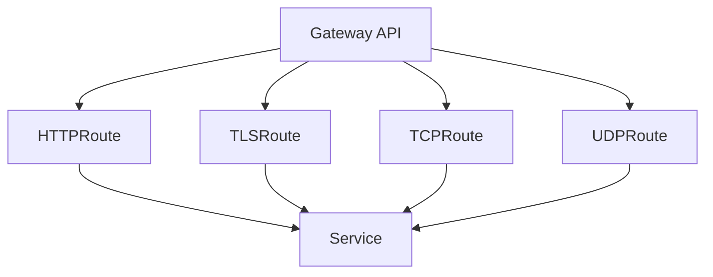

# Gateway en Kubernetes
En Kubernetes, los Gateways representan la evolución del enrutamiento de tráfico hacia y desde los servicios del clúster. Mientras que los recursos tradicionales como Service e Ingress han sido ampliamente utilizados para exponer aplicaciones, la Gateway API proporciona un modelo más flexible, extensible y estandarizado para gestionar el tráfico de red.

***ATENCIÓN:*** Esta sección está en investigación y publicaré un vídeo cuando entienda mejor esta nueva API de Kubernetes.

## ¿Qué es un Gateway?

Un Gateway es un recurso que define cómo el tráfico externo (o interno) entra y sale del clúster de Kubernetes. Permite separar la configuración de red (como dominios, certificados, rutas y políticas) de la implementación de las aplicaciones, facilitando la gestión y la seguridad.

## Objetivos de la Gateway API

- Proporcionar un control más granular y declarativo sobre el tráfico.
- Permitir la integración con diferentes controladores y proveedores de red.
- Mejorar la seguridad y la observabilidad del tráfico.
- Facilitar la gestión de múltiples dominios, rutas y protocolos.

## Diferencias entre Ingress y Gateway

- **Ingress**: Es un recurso más simple y ampliamente soportado, pero limitado en cuanto a flexibilidad y extensibilidad.
- **Gateway**: Permite definir múltiples listeners, soporta distintos protocolos, y separa claramente las responsabilidades entre la infraestructura de red y las aplicaciones.

## Tipos de Gateway en Kubernetes
La Gateway API permite definir distintos tipos de Gateway según el protocolo y el uso que se le quiera dar. Los tipos más comunes son:

### 0. HTTP Gateway

Permite gestionar tráfico HTTP/HTTPS, ideal para exponer aplicaciones web.

**Ejemplo:**
```yaml
apiVersion: gateway.networking.k8s.io/v1beta1
kind: Gateway
metadata:
  name: http-gateway
spec:
  gatewayClassName: nginx
  listeners:
    - name: http
      protocol: HTTP
      port: 80
      allowedRoutes:
        namespaces:
          from: All
```

### 1. HTTPRoute
Define rutas HTTP específicas, permitiendo un control detallado sobre cómo se enruta el tráfico hacia
los servicios.
**Ejemplo:**
```yaml
apiVersion: gateway.networking.k8s.io/v1beta1
kind: HTTPRoute
metadata:
  name: http-route
spec:
  parentRefs:
    - name: http-gateway
  rules:
    - matches:
        - path:
            type: Prefix
            value: /app1
      backendRefs:
        - name: servicio-app1
          port: 8080
    - matches:
        - path:
            type: Prefix
            value: /app2
      backendRefs:
        - name: servicio-app2
          port: 8080
```

También, como en el ingres, podríamos hacer la refirección en base al nombre del host:
```yaml
apiVersion: gateway.networking.k8s.io/v1beta1
kind: HTTPRoute
metadata:
  name: http-route-host
spec:
  parentRefs:
    - name: http-gateway
  rules:
    - matches:
        - host:
            type: Prefix
            value: app1.example.com
      backendRefs:
        - name: servicio-app1
          port: 8080
    - matches:
        - host:
            type: Prefix
            value: app2.example.com
      backendRefs:
        - name: servicio-app2
          port: 8080
```

### 2. TLS Gateway

Permite gestionar tráfico HTTPS con certificados TLS, proporcionando seguridad en la comunicación.

**Ejemplo:**
```yaml
apiVersion: gateway.networking.k8s.io/v1beta1
kind: Gateway
metadata:
  name: tls-gateway
spec:
  gatewayClassName: nginx
  listeners:
    - name: https
      protocol: HTTPS
      port: 443
      tls:
        mode: Terminate
        certificateRefs:
          - name: mi-certificado-tls
      allowedRoutes:
        namespaces:
          from: All
```

### 3. TCP Gateway

Permite exponer servicios que utilizan protocolos TCP, como bases de datos o aplicaciones personalizadas.

**Ejemplo:**
```yaml
apiVersion: gateway.networking.k8s.io/v1beta1
kind: Gateway
metadata:
  name: tcp-gateway
spec:
  gatewayClassName: nginx
  listeners:
    - name: tcp
      protocol: TCP
      port: 3306
      allowedRoutes:
        namespaces:
          from: All
```

### 4. UDP Gateway

Permite gestionar tráfico UDP, útil para servicios como DNS o streaming.

**Ejemplo:**
```yaml
apiVersion: gateway.networking.k8s.io/v1beta1
kind: Gateway
metadata:
  name: udp-gateway
spec:
  gatewayClassName: nginx
  listeners:
    - name: udp
      protocol: UDP
      port: 53
      allowedRoutes:
        namespaces:
          from: All
```


## Routes en Gateway API
Las Routes son recursos que definen cómo se enruta el tráfico hacia los servicios dentro del clúster. Existen varios tipos de Routes, cada uno adaptado a diferentes necesidades:




## ¿Qué aprenderás en esta sección?

- Introducción al modelo Gateway API de Kubernetes.
- Instalación y configuración de un Gateway Controller.
- Definición y uso de recursos Gateway y HTTPRoute.
- Ejemplo práctico: Exponiendo un servicio mediante Gateway.
- Buenas prácticas y consideraciones de seguridad.

---
* Lista de vídeos en Youtube: [Curso Kubernetes](https://www.youtube.com/playlist?list=PLQhxXeq1oc2k9MFcKxqXy5GV4yy7wqSma)

[Volver al índice](README.md#índice)
