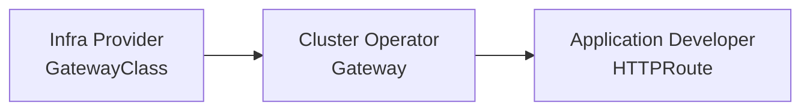

# Gateway API en Kubernetes

En el capítulo anterior vimos los [Ingress Controllers](112.Ingress_controller.md) y cómo nos permiten exponer servicios HTTP/HTTPS al exterior. Funcionan, pero tienen limitaciones importantes: cada proveedor usa sus propias anotaciones, no hay separación clara entre quién gestiona la infraestructura y quién gestiona las aplicaciones, y todo lo que no entra en la spec básica acaba siendo un `nginx.ingress.kubernetes.io/...` que solo funciona en tu controller.

**Gateway API** es la respuesta oficial de Kubernetes a todos esos problemas. No es una versión 2 de Ingress, es un rediseño completo de cómo se gestiona el tráfico entrante en un clúster.

## ¿Por qué Gateway API?

Ingress nació siendo una API muy simple, casi minimalista, con la idea de que "lo avanzado lo resuelve cada controlador". El resultado es que hoy en día, cualquier caso de uso real requiere anotaciones propietarias: traffic splitting, redirecciones, reescritura de URLs, matching por headers... todo acaba siendo una cadena mágica específica del proveedor.

Gateway API nace con otra filosofía: **que todo eso forme parte de la spec estándar**, para que un manifiesto funcione igual en NGINX, Envoy, Cilium o Traefik.

Un resumen rápido de lo que Ingress no puede hacer sin anotaciones:

- Enrutar por headers o query parameters.
- Traffic splitting con pesos (canary deployments).
- Redirecciones y rewrites declarativos.
- Routing TCP/UDP o gRPC.
- Separar responsabilidades entre equipo de infra y desarrolladores.
- Referenciar servicios entre namespaces distintos.

Gateway API resuelve todo eso de forma nativa.

## Los tres roles: el gran cambio conceptual

Si solo te llevas una idea de este capítulo, que sea esta: Gateway API está diseñado alrededor de **tres roles** distintos que corresponden a personas reales de una organización. Cada rol gestiona un tipo de recurso diferente, y ninguno puede pisar al otro.


```mermaid
flowchart LR
  A[Infra Provider<br/>GatewayClass] --> B[Cluster Operator<br/>Gateway]
  B --> C[Application Developer<br/>HTTPRoute]
```

- **Infrastructure Provider**: gestiona la infraestructura (la nube, los nodos, los balanceadores). Define qué tipos de Gateway están disponibles. Su recurso es `GatewayClass`.
- **Cluster Operator**: administra un clúster concreto y decide qué puntos de entrada (puertos, TLS, dominios) se exponen. Su recurso es `Gateway`.
- **Application Developer**: desarrolla aplicaciones y solo se preocupa de enrutar el tráfico hacia sus servicios. Su recurso es `HTTPRoute` (o `GRPCRoute`, `TCPRoute`...).

¿Por qué importa esto en la práctica? Porque en Ingress cualquier desarrollador puede meter una anotación que afecta al load balancer de todo el clúster. En Gateway API, el desarrollador solo puede crear Routes que se enganchan a los Gateways que el operador le ha preparado. La infraestructura queda protegida por diseño.

## Los recursos principales

### GatewayClass

Es un recurso **cluster-scoped** (no tiene namespace) que define *qué controlador* gestiona un tipo de Gateway. Es el equivalente a `StorageClass` para volúmenes o `IngressClass` para Ingress.

```yaml
apiVersion: gateway.networking.k8s.io/v1
kind: GatewayClass
metadata:
  name: nginx
spec:
  controllerName: gateway.nginx.org/nginx-gateway-controller
```

Normalmente no lo crearás a mano: cuando instales un controller (NGINX Gateway Fabric, Envoy Gateway, Cilium...), él mismo creará su GatewayClass.

### Gateway

Describe un **punto de entrada** al clúster: qué puertos escucha, qué protocolos, qué dominios y qué TLS usa. Piensa en él como la definición declarativa de un load balancer.

```yaml
apiVersion: gateway.networking.k8s.io/v1
kind: Gateway
metadata:
  name: prod-gateway
  namespace: default 
spec:
  gatewayClassName: nginx
  listeners:
  - name: http
    protocol: HTTP
    port: 80
  - name: https
    protocol: HTTPS
    port: 443
    hostname: "*.example.com"
****    tls:
      mode: Terminate
      certificateRefs:
      - name: wildcard-tls-secret
```

Cada `listener` es una combinación de puerto + protocolo + (opcionalmente) hostname. Si dos listeners entran en conflicto, el Gateway entero se queda inválido.

### HTTPRoute

Define las **reglas de enrutamiento** HTTP. Se "engancha" a uno o varios Gateways a través del campo `parentRefs`:

```yaml
apiVersion: gateway.networking.k8s.io/v1
kind: HTTPRoute
metadata:
  name: myapp-route
  namespace: myapp
spec:
  parentRefs:
  - name: prod-gateway
    namespace: infra
    sectionName: https
  hostnames:
  - "myapp.example.com"
  rules:
  - matches:
    - path:
        type: PathPrefix
        value: /api
      headers:
      - name: X-Version
        value: v2
    backendRefs:
    - name: myapp-v2-service
      port: 8080
      weight: 90
    - name: myapp-v1-service
      port: 8080
      weight: 10
```

Este ejemplo hace algo que Ingress no puede hacer sin anotaciones: enrutar por path **y** header al mismo tiempo, y repartir el tráfico 90/10 entre dos versiones del servicio. Todo en la spec estándar.

Las capacidades principales de HTTPRoute incluyen:

- Matching por path, headers, query params y método HTTP.
- Traffic splitting con `weight`.
- Filtros para añadir, modificar o eliminar headers.
- Redirecciones (`RequestRedirect`) y rewrites (`URLRewrite`).
- Request mirroring para enviar copias del tráfico a otro backend.

### Otros Routes

Además de HTTPRoute, Gateway API define otros tipos para casos más específicos:

- **GRPCRoute**: enrutado nativo para gRPC por service y method.
- **TLSRoute**: enrutado por SNI con TLS passthrough (sin terminar la conexión).
- **TCPRoute** y **UDPRoute**: enrutado puro L4 para bases de datos, DNS, etc. (aún experimental).

### ReferenceGrant

Un detalle importante: Gateway API permite que un `HTTPRoute` de un namespace se enganche a un `Gateway` de otro. Pero por seguridad, el namespace destino debe **autorizar explícitamente** ese acceso con un `ReferenceGrant`:

```yaml
apiVersion: gateway.networking.k8s.io/v1beta1
kind: ReferenceGrant
metadata:
  name: allow-myapp-routes
  namespace: infra
spec:
  from:
  - group: gateway.networking.k8s.io
    kind: HTTPRoute
    namespace: myapp
  to:
  - group: gateway.networking.k8s.io
    kind: Gateway
```

Así el equipo de infra controla qué namespaces pueden publicar rutas en sus Gateways.

## Ingress vs Gateway API

| Aspecto                 | Ingress                                  | Gateway API                                      |
| ----------------------- | ---------------------------------------- | ------------------------------------------------ |
| **Separación de roles** | No — todo en un solo objeto              | Sí — GatewayClass / Gateway / Route              |
| **Header routing**      | Solo con anotaciones propietarias        | Nativo en HTTPRoute                              |
| **Traffic splitting**   | Solo con anotaciones                     | Nativo con `weight`                              |
| **Redirects/Rewrites**  | Anotaciones específicas del controller   | Filters estándar                                 |
| **Routing TCP/UDP**     | No soportado                             | TCPRoute / UDPRoute (experimental)               |
| **Routing gRPC**        | Solo hacks con anotaciones               | GRPCRoute nativo                                 |
| **Cross-namespace**     | No                                       | Sí, con ReferenceGrant                           |
| **Portabilidad**        | Cada controller, sus anotaciones         | Spec estándar entre controllers                  |
| **TLS**                 | En el propio Ingress (del desarrollador) | En el Listener del Gateway (del operador)        |

## Instalación en un clúster

Gateway API se instala en dos pasos: primero los **CRDs** (los tipos de recurso) y después un **controller** que los reconcilia. Los CRDs por sí solos no hacen nada — es como tener el formulario pero no el funcionario que lo tramita.

### Paso 1: instalar los CRDs

Gateway API publica sus CRDs en dos canales: **Standard** (estable, para producción) y **Experimental** (features en alpha). Para un clúster normal usaremos Standard:

```bash
kubectl apply -f https://github.com/kubernetes-sigs/gateway-api/releases/download/v1.5.1/standard-install.yaml
```

### Paso 2: instalar un controller

Como vienes de `ingress-nginx` en el capítulo anterior, lo natural es usar **NGINX Gateway Fabric**, que es el sucesor oficial mantenido por el mismo equipo. Lo instalamos con Helm:

```bash
helm install ngf oci://ghcr.io/nginx/charts/nginx-gateway-fabric \
  --create-namespace -n nginx-gateway
```

Esto despliega el controller y registra automáticamente un `GatewayClass` llamado `nginx`. Podemos comprobar que todo está arriba:

```bash
kubectl get pods -n nginx-gateway
kubectl get gatewayclasses
```

> Nota: Gateway API e Ingress son APIs independientes en Kubernetes, así que pueden convivir en el mismo clúster. De hecho, es la forma recomendada de migrar: instalas Gateway API al lado del `ingress-nginx` existente, mueves rutas poco a poco y retiras el viejo cuando no quede ningún Ingress.

### Cambiar el tipo de Service en on-premise

Por defecto, NGINX Gateway Fabric provisiona el `Service` del data plane como `LoadBalancer`, que es lo lógico en cloud pero un problema en on-premise, minikube, kind o k3s en homelab: no hay un balanceador externo que asigne IP y el Service se queda en `<pending>` para siempre.

La forma nativa de cambiarlo es con un recurso `NginxProxy` que describe cómo queremos que se despliegue el data plane, y referenciarlo desde el `Gateway` con el campo `spec.infrastructure.parametersRef`. Por ejemplo, para exponerlo como `NodePort` con puertos fijos:

```yaml
apiVersion: gateway.nginx.org/v1alpha2
kind: NginxProxy
metadata:
  name: nodeport-proxy
  namespace: default
spec:
  kubernetes:
    service:
      type: NodePort
      nodePorts:
      - listenerPort: 80
        port: 30080
      - listenerPort: 443
        port: 30443
```

Y en el `Gateway` lo referenciamos:

```yaml
apiVersion: gateway.networking.k8s.io/v1
kind: Gateway
metadata:
  name: prod-gateway
  namespace: default
spec:
  gatewayClassName: nginx
  infrastructure:
    parametersRef:
      group: gateway.nginx.org
      kind: NginxProxy
      name: nodeport-proxy
  listeners:
  - name: http
    protocol: HTTP
    port: 80
    hostname: "*.example.com"
```

Cuando el control plane reconcilie este `Gateway`, el `Service` del data plane se creará como `NodePort` en lugar de `LoadBalancer`. Los valores válidos son los mismos que cualquier Service de Kubernetes: `LoadBalancer` (por defecto), `NodePort` (on-premise sin LB o con balanceador externo por delante) y `ClusterIP` (solo tráfico interno al clúster, útil si vas a poner algo como MetalLB delante).

La gran ventaja de este enfoque frente a tocarlo vía Helm es que puedes tener **distintos tipos de Service por cada `Gateway`** en el mismo clúster: uno externo como `LoadBalancer` y otro interno como `ClusterIP`, por ejemplo. Cada Gateway referencia su propio `NginxProxy`.

## Ejemplo completo con TLS

Vamos a reutilizar el caso práctico del capítulo anterior (`app1` y `app2`) y exponerlo con Gateway API y TLS.

Primero, el **Cluster Operator** define el Gateway con el listener HTTPS y el certificado TLS:

```yaml
apiVersion: gateway.networking.k8s.io/v1
kind: Gateway
metadata:
  name: prod-gateway
  namespace: infra
spec:
  gatewayClassName: nginx
  listeners:
  - name: https
    protocol: HTTPS
    port: 443
    hostname: "*.example.com"
    tls:
      mode: Terminate
      certificateRefs:
      - name: example-tls-secret
```

Y después, el **desarrollador** define sus rutas, que solo le importan los hostnames y los servicios:

```yaml
apiVersion: gateway.networking.k8s.io/v1
kind: HTTPRoute
metadata:
  name: app1-route
  namespace: default
spec:
  parentRefs:
  - name: prod-gateway
    namespace: infra
    sectionName: https
  hostnames:
  - "app1.example.com"
  rules:
  - matches:
    - path:
        type: PathPrefix
        value: /
    backendRefs:
    - name: servicio-app1
      port: 8080
---
apiVersion: gateway.networking.k8s.io/v1
kind: HTTPRoute
metadata:
  name: app2-route
  namespace: default
spec:
  parentRefs:
  - name: prod-gateway
    namespace: infra
    sectionName: https
  hostnames:
  - "app2.example.com"
  rules:
  - matches:
    - path:
        type: PathPrefix
        value: /
    backendRefs:
    - name: servicio-app2
      port: 8080
```

La diferencia estructural es clara: el TLS ya no es problema del desarrollador. El operador configura el certificado una vez en el Gateway y cualquier Route que se enganche lo hereda automáticamente.

> Si tienes ya un clúster con `ingress-nginx` en producción y quieres pasarte a Gateway API sin reescribirlo todo a mano, en el blog tienes una guía práctica: [Migrar de Ingress a Gateway API en Kubernetes](/blog/migrar_ingress_a_gateway_api_kubernetes).

## Balanceo de carga entre versiones (traffic splitting)

Una de las cosas que Ingress solo puede hacer con anotaciones propietarias es repartir tráfico entre varios servicios con pesos. En Gateway API es parte de la spec estándar: basta con poner varios `backendRefs` en la misma `rule` con el campo `weight`.

Imagina que tenemos dos versiones de `app1` desplegadas como dos Services distintos: `servicio-app1` (la estable) y `servicio-app1-v2` (la nueva que queremos probar). Queremos mandar el 80% del tráfico a la versión estable y el 20% a la nueva para un canary deployment:

```yaml
apiVersion: gateway.networking.k8s.io/v1
kind: HTTPRoute
metadata:
  name: app1-canary
  namespace: default
spec:
  parentRefs:
  - name: prod-gateway
    namespace: infra
    sectionName: https
  hostnames:
  - "app1.example.com"
  rules:
  - matches:
    - path:
        type: PathPrefix
        value: /
    backendRefs:
    - name: servicio-app1
      port: 8080
      weight: 80
    - name: servicio-app1-v2
      port: 8080
      weight: 20
```

El controller reparte las peticiones entre ambos backends en la proporción indicada. Si quieres subir el canary al 50/50, cambias los pesos y haces `kubectl apply`. Si todo va bien y quieres promover la v2, pones `weight: 100` en `servicio-app1-v2` y `0` en el estable. Cero anotaciones, cero magia específica del controlador.

Y esto no se limita a canary: el mismo mecanismo te sirve para **A/B testing**, para **blue/green deployments** (teniendo dos Services apuntando a dos Deployments distintos) o simplemente para repartir carga entre dos backends equivalentes. Combinándolo con matching por headers puedes hacer cosas muy potentes, como mandar a la v2 solo las peticiones que lleven una cookie concreta:

```yaml
  rules:
  - matches:
    - headers:
      - name: X-Canary
        value: "true"
    backendRefs:
    - name: servicio-app1-v2
      port: 8080
  - matches:
    - path:
        type: PathPrefix
        value: /
    backendRefs:
    - name: servicio-app1
      port: 8080
```

Con esto, los usuarios normales van a la v1 y los que llegan con el header `X-Canary: true` (tu equipo de QA, por ejemplo) van directos a la v2. Imposible hacerlo así de limpio con un Ingress tradicional.

## Verificar que todo está conectado

Cuando algo no funciona en Gateway API, lo primero que hay que mirar es el `status` de los objetos. El controller publica ahí si el recurso ha sido aceptado o si hay algún error:

```bash
# ¿Ha aceptado el controller mi Gateway?
kubectl describe gateway prod-gateway -n infra
# Busca: status.conditions con type=Accepted, status=True

# ¿Se ha adjuntado mi HTTPRoute al Gateway?
kubectl describe httproute app1-route
# Busca: status.parents[].conditions con type=Accepted, status=True
```

Si el Route aparece como `Accepted: False`, el mensaje suele decir exactamente qué falla: que no hay `ReferenceGrant`, que el hostname no coincide con el listener, que el backend no existe, etc.

## Gestión de objetos Gateway API

Como cualquier otro recurso de Kubernetes, los comandos habituales funcionan:

```bash
kubectl get gateways -A
kubectl get httproutes -A
kubectl describe httproute <nombre>
kubectl delete httproute <nombre>
```

## Conclusión

Gateway API es el futuro del tráfico entrante en Kubernetes. Resuelve los problemas estructurales de Ingress (anotaciones propietarias, falta de separación de roles, capacidades limitadas) con una spec estándar, portable y pensada para organizaciones reales con equipos distintos gestionando infra y aplicaciones.

Si estás empezando un clúster nuevo en 2026, no dudes: ve directamente a Gateway API. Si tienes un clúster con `ingress-nginx` en producción, puedes convivir con ambos e ir migrando rutas poco a poco hacia NGINX Gateway Fabric u otro controller conformante.

Nos vemos en el siguiente.

---
* Lista de vídeos en Youtube: [Curso Kubernetes](https://www.youtube.com/playlist?list=PLQhxXeq1oc2k9MFcKxqXy5GV4yy7wqSma)

[Volver al índice](README.md#índice)
