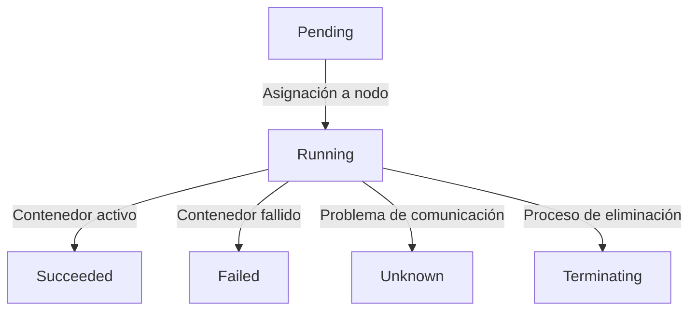
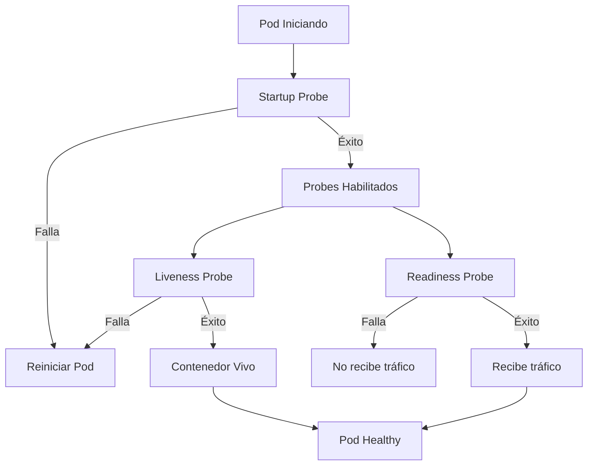

# Probes, liveness y readiness en Kubernetes
Ya hemos visto como Kubernetes se encarga de restablecer un servicio o un pod cuando este falla y se reinicia pero, si no especificamos nada, esta auto reparación solo se produce cuando el pod directamente se ha detenido.

Podría pasar que el pod siga funcionando, su proceso o servicio siga activo e incluso sirviendo peticiones, pero que no esté funcionando correctamente. Por ejemplo, un API que responde a las peticiones pero que no está conectado a la base de datos, o por ejemplo, un pod que ha levantado bien el servidor web pero que no ha podido cargar la aplicación que tiene que servir.

Sin pruebas específicas sobre el estado de los pods, es dificil diagnosticar si un pod está funcionando correctamente o no. Para esto, Kubernetes nos ofrece las **Probes**. 

Tenemos tres tipos de probes:
- **Liveness Probe**: Comprueba si el pod está vivo. Si falla, Kubernetes reiniciará el pod.
- **Readiness Probe**: Comprueba si el pod está listo para recibir tráfico. Si falla, Kubernetes dejará de enviarle tráfico hasta que esté listo de nuevo.
- **Startup Probe**: Comprueba si el pod ha arrancado correctamente. Si falla, Kubernetes reiniciará el pod.


Antes de ver cómo funcionan, repasemos brevenmente el ciclo de vida de un pod en Kubernetes:

## Ciclo de vida de un Pod
Un pod en Kubernetes pasa por varios estados a lo largo de su ciclo de vida. Estos estados son:


Aquí hay que sacar en claro que las probes se ejecutan en el estado **Running** del pod, y que si una probe falla, el pod puede ser reiniciado o marcado como no listo para recibir tráfico, manteniendo su estado en **Pending** o **Running** según corresponda.

Veamos cómo se configuran las probes en un pod en orden de comprobación:


Destacar que la **Startup Probe** se ejecuta al inicio del pod, y si falla, el pod se reinicia. Una vez que la Startup Probe ha tenido éxito, las otras probes (Liveness y Readiness) se habilitan.

Lo normal es que Readiness y Liveness se ejecuten de forma continua, mientras que Startup solo se ejecuta una vez al inicio del pod. Además, esta última solo se suele utilizar en aplicaciones que tardan mucho en arrancar, como bases de datos o aplicaciones con dependencias pesadas, permitiendo poner comprobaciones de tiempo de espera más largas al principio y luego pasar a las comprobaciones más rápidas de Liveness y Readiness.

## Configuración de Probes
Para configurar las probes, se añaden al contenedor del pod en el archivo de configuración YAML. Vamos a partir del ejemplo de la sección de [Deployments](./108.Deployments.md) y añadir las probes:

```yaml
apiVersion: apps/v1
kind: Deployment
metadata:
  name: nginx-deployment
  labels:
    app: nginx
spec:
    replicas: 3
    selector:
        matchLabels:
        app: nginx
    template:
        metadata:
        labels:
            app: nginx
        spec:
        containers:
        - name: nginx
            image: nginx
            ports:
            - containerPort: 80
            livenessProbe:
                httpGet:
                    path: /healthz
                    port: 80
                initialDelaySeconds: 30
                periodSeconds: 10
            readinessProbe:
                httpGet:
                    path: /ready
                    port: 80
                initialDelaySeconds: 5
                periodSeconds: 5
            startupProbe:
                httpGet:
                    path: /start
                    port: 80
                initialDelaySeconds: 5
                periodSeconds: 5
```


[Volver al índice](README.md#índice)
