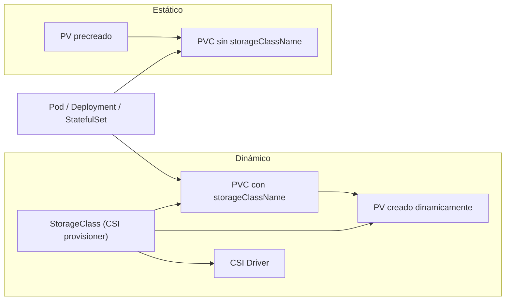

# Introducción
La persistencia de datos es un pilar en cualquier plataforma de contenedores. Ya vimos los [volúmenes en Docker](../docker/110.Volumenes_y_archivos.md) aunque Kubernetes abstrae el almacenamiento mediante varios objetos que colaboran entre sí para desacoplar: 
1. La infraestructura física o lógica (discos, NFS, Ceph, EBS, etc.)
2. Las necesidades de las aplicaciones (tamaño, modo de acceso, rendimiento)
3. El modo en que se aprovisiona (manual/estático vs automático/dinámico)

Esto es así en kubernetes porque las aplicaciones desplegadas en pods son efímeras y no deben depender del almacenamiento local del nodo. Imáginate que un pod se elimina o mueve a otro nodo, si el almacenamiento estuviera en el nodo local, los datos se perderían o quedarían inaccesibles.

Por eso en kubernetes se suele trabajar el almacenamiento persistente mediante volúmenes de red, almacenamiento gestionado en la nube o sistemas distribuidos.

Lo primero, veamos los conceptos clave que lo hacen posible:
* **PV (PersistentVolume)**: Representa una pieza de almacenamiento ya aprovisionada en el cluster.
* **PVC (PersistentVolumeClaim)**: Solicitud de consumo de almacenamiento por parte de un namespace/aplicación.
* **StorageClass**: Define clases de almacenamiento con parámetros de aprovisionamiento dinámico (tipo de disco, reclamación, volumenMode, etc.).
* **CSI (Container Storage Interface)**: Estándar que permite que proveedores de almacenamiento implementen drivers portables para Kubernetes.

Abordaremos:
* Diferencias entre aprovisionamiento **estático** y **dinámico**
* Parámetros importantes (`accessModes`, `reclaimPolicy`, `volumeMode`, `storageClassName`, `bindingMode`)
* Ejemplos prácticos YAML
* Diagrama de relaciones entre los objetos
* Control de cuotas con `ResourceQuota`

> Consejo: Antes de desplegar aplicaciones con estado (stateful) valida requisitos de IOPS, latencia y disponibilidad para escoger la clase de almacenamiento correcta.

---

## Tabla rápida de conceptos
| Objeto | ¿Quién lo crea? | ¿Cuándo se usa? | Rol principal | Estático | Dinámico |
|--------|-----------------|-----------------|---------------|---------|----------|
| PV | Operador / Admin | Cuando se quiere aprovisionar manualmente | Representa almacenamiento físico/lógico | Sí | Referenciado por StorageClass (indirecto) |
| PVC | Desarrollador / App | Cuando la app necesita almacenamiento | Solicita y vincula almacenamiento | Sí (claim a PV existente) | Sí (dispara creación vía StorageClass) |
| StorageClass | Operador | Define parámetros de aprovisionamiento dinámico | Plantilla de volúmenes | No aplica directamente | Sí |
| CSI Driver | Proveedor | Instalado en cluster | Implementa operaciones de volumen | Habilita PV pre-creados | Habilita creación dinámica |

---

## Provisionamiento Estático vs Dinámico 



1. La aplicación crea un **PVC** solicitando tamaño y modo de acceso.
2. Kubernetes intenta vincular el PVC:
   * Si especifica `storageClassName`, se crea un **PV** dinámicamente usando el **CSI driver** asociado a esa `StorageClass`.
   * Si NO especifica `storageClassName`, Kubernetes busca un **PV** estático existente que coincida (tamaño, `accessModes`, `volumeMode`, `storageClassName` vacía / nula).
3. El PVC se vincula (Bound) y el Pod monta el volumen.
4. Al eliminar el PVC, la acción sobre el PV depende de `persistentVolumeReclaimPolicy` (Recycle, Retain, Delete — hoy `Recycle` está deprecado en muchos escenarios).

---

## Parámetros Fundamentales
### accessModes
* `ReadWriteOnce (RWO)`: Un nodo puede montar lectura/escritura.
* `ReadWriteMany (RWX)`: Varios nodos pueden montar lectura/escritura (NFS, CephFS...).
* `ReadOnlyMany (ROX)`: Varios nodos lectura.

### persistentVolumeReclaimPolicy
* `Retain`: Conserva datos tras eliminar el PVC (requiere limpieza manual).
* `Delete`: Elimina el recurso subyacente (ej. disco cloud).
* `Recycle` (obsoleto): Intentaba limpiar y dejar listo para otra claim.

### volumeMode
* `Filesystem` (por defecto): El volumen se monta como sistema de ficheros.
* `Block`: Se presenta como bloque crudo (útil para BD especializadas).

### bindingMode (StorageClass)
* `Immediate`: Crea el PV en cuanto se crea el PVC.
* `WaitForFirstConsumer`: Pospone la creación hasta que un Pod que use el PVC esté programándose (optimiza localización / zona).

### storageClassName
En el PVC determina la clase que se usará para aprovisionamiento dinámico. Si se omite, se intenta un bind estático a un PV libre compatible. Si el cluster tiene una StorageClass marcada como `default`, se puede asignar automáticamente.

---

## Aprovisionamiento Estático
En el aprovisionamiento estático el administrador crea manualmente uno o varios **PV** apuntando a recursos existentes (ej: NFS, disco montado, LUN). Luego los desarrolladores crean **PVC** que se enlazan a esos PV.

### Ejemplo PV Estático (NFS)
```yaml
apiVersion: v1
kind: PersistentVolume
metadata:
  name: pv-nfs-demo
  labels:
    tipo: compartido
spec:
  capacity:
    storage: 40Gi
  accessModes:
    - ReadWriteMany
  persistentVolumeReclaimPolicy: Retain
  volumeMode: Filesystem
  nfs:
    path: /ruta/carpeta/nfs
    server: <host> # Puede ser un servidor NFS interno
    readOnly: false
```

### PVC que reclama ese PV
Podemos usar `selector.matchLabels` para forzar que el claim se vincule sólo a PV con etiquetas específicas.
```yaml
apiVersion: v1
kind: PersistentVolumeClaim
metadata:
  name: pvc-nfs-demo
spec:
  accessModes:
    - ReadWriteMany
  resources:
    requests:
      storage: 10Gi
  selector:
    matchLabels:
      tipo: compartido
  volumeMode: Filesystem
```

> Si el PV ofrece más capacidad que la solicitada por el PVC (ej. 40Gi vs 10Gi), el bind aún es válido: el PVC no recorta el PV, simplemente consume parte lógica.

Aplicación:
```bash
kubectl apply -f pv-nfs.yaml
kubectl apply -f pvc-nfs.yaml
```

Comprobar estado:
```bash
kubectl get pv
kubectl get pvc
```

Estado esperado: `STATUS: Bound` en el PVC.

---

## Aprovisionamiento Dinámico con StorageClass + CSI
El aprovisionamiento dinámico evita la creación manual de PV. Cuando un PVC especifica una `storageClassName`, Kubernetes delega la creación de un PV en el **provisioner** definido por esa StorageClass (normalmente parte de un **CSI driver**).

### ¿Qué es CSI?
**Container Storage Interface** es un estándar de la CNCF que permite que los proveedores implementen un driver único para diferentes orquestadores. En Kubernetes, el CSI driver corre como Pods/DaemonSets y expone capacidades de crear, montar, snapshot, expandir volúmenes, etc.

### Ejemplo StorageClass (NFS CSI)
```yaml
apiVersion: storage.k8s.io/v1
kind: StorageClass
metadata:
  name: nfs-csi
provisioner: nfs.csi.k8s.io
parameters:
  # Parámetros específicos del driver (depende proveedor)
reclaimPolicy: Retain
volumeBindingMode: Immediate
allowVolumeExpansion: true
```

### PVC dinámico
```yaml
apiVersion: v1
kind: PersistentVolumeClaim
metadata:
  name: pvc-dinamico-nfs
spec:
  storageClassName: nfs-csi
  accessModes:
    - ReadWriteMany
  resources:
    requests:
      storage: 5Gi
  volumeMode: Filesystem
```

Al aplicar el PVC, el CSI provisioner creará un PV acorde.

> Nota: Algunos drivers soportan expansión en caliente del volumen si `allowVolumeExpansion: true` y se actualiza `spec.resources.requests.storage` del PVC.

### Otros ejemplos de provisioner
* AWS EBS: `provisioner: ebs.csi.aws.com` (normalmente RWO)
* GCP PD: `provisioner: pd.csi.storage.gke.io`
* Ceph RBD: `provisioner: rook-ceph.rbd.csi.ceph.com`
* Longhorn: `provisioner: driver.longhorn.io`

---

## Consumir un PVC desde un Pod
Ejemplo mejorado (indentación y campos clave):
```yaml
apiVersion: v1
kind: Pod
metadata:
  name: nginx-con-volumen
spec:
  containers:
    - name: nginx
      image: nginx:1.27-alpine
      ports:
        - containerPort: 80
      volumeMounts:
        - name: datos
          mountPath: /usr/share/nginx/html
  volumes:
    - name: datos
      persistentVolumeClaim:
        claimName: pvc-nfs-demo # O pvc-dinamico-nfs según flujo
```

Aplicar:
```bash
kubectl apply -f pod-nginx.yaml
kubectl describe pod nginx-con-volumen | grep -A5 Volumes
```

---


### ¿Cuál usar?
| Escenario | Recomendación |
|-----------|---------------|
| Test rápido / laboratorio | PV estático sencillo (NFS) |
| Multi-tenant con distintos patrones | StorageClass con distintos parámetros (gold, silver, backup) |
| Cloud con discos gestionados | Aprovisionamiento dinámico (EBS / PD / etc.) |
| Rendimiento crítico (BD) | StorageClass específica (IOPS alto, volumenMode Block) |
| Migraciones heredadas | PV estático apuntando a almacenamiento ya existente |

---

## ResourceQuota para limitar almacenamiento
Puedes restringir cuánto almacenamiento pide un namespace y cuántos PVC puede crear.

### Limitar tamaño total y número de PVC
```yaml
apiVersion: v1
kind: ResourceQuota
metadata:
  name: cuota-almacenamiento
  namespace: demo
spec:
  hard:
    requests.storage: 50Gi   # Suma de todos los PVC requests
    persistentvolumeclaims: "10" # Número máximo de PVC
```

### Limitar por StorageClass específica
Algunas versiones de Kubernetes permiten usar recursos específicos tipo: `storageclass.storage.k8s.io/<nombre>.requests.storage`.
```yaml
apiVersion: v1
kind: ResourceQuota
metadata:
  name: cuota-nfs-clase
  namespace: demo
spec:
  hard:
    storageclass.storage.k8s.io/nfs-csi.requests.storage: 20Gi
```

> Si el cluster no soporta el recurso específico, valida con `kubectl api-resources | grep storageclass.storage.k8s.io`.

### Verificar uso
```bash
kubectl describe quota cuota-almacenamiento -n demo
```

---

## Buenas Prácticas
1. Define una StorageClass por perfil (rendimiento, backup, criptografía).
2. Usa `WaitForFirstConsumer` en entornos multi-zona para evitar volúmenes en zonas erróneas.
3. Aplica etiquetas en PV estáticos para control fino de binding.
4. Documenta políticas de `Retain` para evitar acumulación de volúmenes huérfanos.
5. Monitoriza el estado de PVC (`Pending`) como indicador de problemas de aprovisionamiento.
6. Usa `StatefulSet` para aplicaciones que requieren volúmenes persistentes por réplica.

---

## Checklist de Decisiones Rápidas
| Pregunta | Si la respuesta es... | Acción |
|----------|-----------------------|--------|
| ¿Necesito flexibilidad y escalado? | Sí | StorageClass + CSI |
| ¿Es un entorno de pruebas fijo? | Sí | PV estático |
| ¿Necesito compartir datos entre Pods/Nodos? | Sí | RWX (NFS, CephFS) |
| ¿Necesito máximo rendimiento local? | Sí | RWO (discos locales / cloud SSD) |
| ¿Necesito snapshots o expansión? | Sí | Ver capacidades del CSI driver |

---

## Resumen
Kubernetes abstrae el almacenamiento con PV (recurso), PVC (petición), StorageClass (plantilla/parametrización) y CSI (implementación estándar). El aprovisionamiento estático exige más gestión manual y se orienta a entornos controlados; el dinámico acelera la entrega y reduce intervención operativa. Elegir correctamente la clase, política de reclamación y modo de acceso evita cuellos de botella y sorpresas en producción.

---
* Lista de vídeos en Youtube: [Curso Kubernetes](https://www.youtube.com/playlist?list=PLQhxXeq1oc2k9MFcKxqXy5GV4yy7wqSma)

[Volver al índice](README.md#índice)
