# Gestión Avanzada de Recursos: ResourceQuotas y LimitRanges

## Introducción: Gestión de Recursos en Entornos Multi-tenant

En un cluster de Kubernetes compartido (multi-tenant), la gestión eficiente de los recursos computacionales es crítica para garantizar la estabilidad y el rendimiento.

Por defecto, un Pod en Kubernetes no tiene límites de recursos definidos. Puede consumir toda la CPU y memoria disponible en el nodo si la aplicación lo requiere. Esta falta de restricciones conlleva dos riesgos operativos principales:
1.  **El problema del "Vecino Ruidoso" (Noisy Neighbor):** Una aplicación con un comportamiento anómalo o un bug puede acaparar los recursos del nodo, degradando el rendimiento de otras cargas de trabajo críticas que comparten la misma infraestructura.
2.  **OOMKilled (Out Of Memory):** Si el consumo de memoria excede la capacidad física del nodo, el kernel de Linux invocará al OOM Killer para terminar procesos y liberar memoria. Este mecanismo puede terminar pods críticos de forma impredecible.

Dentro vídeo: https://youtu.be/C5Zg08HkG6o
[](https://youtu.be/C5Zg08HkG6o)

Para mitigar estos riesgos y gobernar el consumo de recursos, Kubernetes proporciona dos primitivas esenciales: **ResourceQuotas** (Límites agregados a nivel de Namespace) y **LimitRanges** (Restricciones a nivel de Pod/Contenedor).

```mermaid
graph TD
    subgraph Cluster ["☁️ Cluster Kubernetes"]
        subgraph NS ["🏢 Namespace (El Edificio)"]
            style NS fill:#1f2023,stroke:#3b82f6,stroke-width:2px
            
            RQ["👮 ResourceQuota (Presupuesto Total: 8GB)"]
            style RQ fill:#d97706,stroke:#fff,color:#fff
            
            LR["🤖 LimitRange (Reglas por Defecto: 128MB)"]
            style LR fill:#10b981,stroke:#fff,color:#fff
            
            subgraph Pods
                P1["📦 Pod A (Usa 2GB)"]
                P2["📦 Pod B (Usa 4GB)"]
                P3["📦 Pod C (Usa ???)"]
            end
            
            RQ -.->|Controla la Suma| Pods
            LR -.->|Inyecta valores| P3
        end
    end
```



## 1. ResourceQuotas: Restricciones Agregadas por Namespace

Una **ResourceQuota** es un objeto que impone restricciones sobre el consumo total de recursos agregados dentro de un Namespace. Su función principal es limitar la cantidad total de recursos de cómputo y almacenamiento que pueden ser consumidos por todos los objetos dentro de ese espacio de nombres.

### Capacidades de Control
*   **Recursos de Cómputo:** Suma total de CPU y Memoria (tanto `requests` como `limits`).
*   **Conteo de Objetos:** Número máximo de recursos permitidos (Pods, Services, PVCs, ConfigMaps, etc.).
*   **Almacenamiento:** Cantidad total de almacenamiento solicitada a través de PVCs.

### Ejemplo de Configuración

```yaml
apiVersion: v1
kind: ResourceQuota
metadata:
  name: quota-namespace-backend
  namespace: backend
spec:
  hard:
    # Límite total de recursos garantizados (requests)
    requests.memory: 8Gi
    
    # Límite total absoluto (limits)
    limits.memory: 16Gi
    
    # Restricción de cantidad de objetos para proteger el plano de control
    pods: "10"
    services: "5"
```

> **Nota Técnica:** Si la creación de un nuevo Pod resulta en que el consumo total del Namespace exceda cualquiera de estos valores, el servidor de la API rechazará la solicitud con un código de estado `403 Forbidden`.

## 2. LimitRanges: Restricciones a Nivel de Contenedor

Mientras que ResourceQuota gestiona el total, el **LimitRange** establece restricciones granulares a nivel de **Pod y Contenedor individual**. Permite definir políticas de recursos mínimos y máximos, así como asignar valores por defecto.


### Funciones Críticas
1.  **Validación:** Asegura que ningún contenedor solicite recursos por debajo de un mínimo útil o por encima de un máximo permitido.
2.  **Asignación por Defecto:** Inyecta automáticamente valores de `request` y `limit` a los contenedores que no los especifican explícitamente. Esto es vital en Namespaces con ResourceQuotas activas, ya que la quota exige que todo Pod tenga recursos definidos.

### Ejemplo de Configuración

```yaml
apiVersion: v1
kind: LimitRange
metadata:
  name: limites-contenedor-backend
  namespace: backend
spec:
  limits:
  - type: Container
    # 1. Valores por defecto (aplicados si el manifiesto del Pod no los incluye)
    defaultRequest:
      memory: 128Mi
    default: # Corresponde a 'defaultLimit'
      memory: 512Mi
      
    # 2. Límites máximos permitidos por contenedor individual
    max:
      memory: 1Gi
      
    # 3. Límites mínimos requeridos
    min:
      memory: 64Mi
```

## Tabla Comparativa: ResourceQuota vs LimitRange

| Característica | ResourceQuota | LimitRange |
| :--- | :--- | :--- |
| **Alcance** | Namespace completo (Suma agregada). | Pod/Contenedor individual. |
| **Objetivo Principal** | Control de costes, cuotas de equipo y capacidad. | Estandarización, QoS y prevención de abusos puntuales. |
| **Métrica Controlada** | Total de CPU/Memoria usada en el Namespace. | Min/Max CPU/Memoria por unidad de ejecución. |
| **Comportamiento** | Rechaza la creación si se excede el total. | Rechaza (si viola min/max) o Muta (inyecta defaults). |

## Caso Práctico: Interacción de Políticas

```mermaid
sequenceDiagram
    participant User as 👤 Dev
    participant API as ⚙️ K8s API
    participant LR as 🤖 LimitRange
    participant RQ as 👮 ResourceQuota
    participant NS as 🏢 Namespace

    Note over NS: Estado Actual:<br/>Usado 3.5 CPU / Límite 4.0 CPU
    
    User->>API: 🚀 Desplegar Pod (Sin especificar recursos)
    
    rect rgb(30, 30, 40)
        Note right of API: Paso 1: Admisión
        API->>LR: ¿Tiene defaults?
        LR-->>API: Sí, aplica Default: 1 CPU
        Note right of API: El Pod ahora pide 1 CPU
    end
    
    rect rgb(50, 20, 20)
        Note right of API: Paso 2: Validación de Cuota
        API->>RQ: ¿Cabe 1 CPU más?
        RQ->>NS: Check Suma: 3.5 + 1.0 = 4.5 CPU
        NS-->>RQ: ❌ Excede Límite (Max 4.0)
        RQ-->>API: ⛔ DENEGADO
    end
    
    API-->>User: 💥 Error 403: Forbidden (Exceeded Quota)
```


Analicemos el flujo de admisión cuando ambas políticas están activas en el namespace `backend`:
1.  **Estado Actual:** ResourceQuota permite 4 CPU totales (3.5 CPU ya en uso). Disponible: **0.5 CPU**.
2.  **Política:** LimitRange define un `defaultRequest` de **1 CPU**.

**Escenario:** Se intenta desplegar un Pod sin especificación de recursos.

**Flujo de Ejecución:**
1.  El Pod es recibido por el API Server.
2.  El **LimitRange** (Admission Controller) detecta la ausencia de especificaciones e inyecta el `defaultRequest: 1 CPU`.
3.  El Pod modificado pasa a validación de **ResourceQuota**.
4.  La Quota calcula el nuevo total: `3.5 (existente) + 1 (nuevo) = 4.5 CPU`.
5.  Como 4.5 excede el límite de 4, la Quota **RECHAZA** la solicitud.

**Resultado:** El despliegue falla. Aunque el usuario no solicitó recursos explícitamente, la política de asignación por defecto provocó una violación de la cuota agregada.

---
* Lista de vídeos en Youtube: [Curso Kubernetes](https://www.youtube.com/playlist?list=PLQhxXeq1oc2k9MFcKxqXy5GV4yy7wqSma)

[Volver al índice](README.md#índice)
