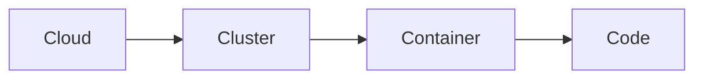

# Seguridad en Kubernetes

La seguridad en Kubernetes es un tema muy amplio. En este capítulo veremos los fundamentos, que luego ampliaremos en la especialización CKS del curso. Podemos agruparla en varias categorías:
* Seguridad de accesos e identidades (autenticación y autorización)
* Contexto de seguridad (Security Context)
* Estándares de seguridad para pods (Pod Security Standards)
* Políticas de red (Network Policies)

Antes de entrar en materia, conviene conocer el modelo de las **4C** de la seguridad cloud native: **C**loud (la infraestructura), **C**luster (Kubernetes), **C**ontainer (las imágenes y su runtime) y **C**ode (tu aplicación). Cada capa envuelve a la siguiente: de poco sirve un código perfecto si cualquiera puede acceder al cluster, y viceversa.



## Autenticación, autorización y control de admisión
Cada llamada que hacemos a la API de Kubernetes pasa por tres fases: se **autentica**, se **autoriza** y, por último, atraviesa el **control de admisión**, que puede validar o incluso modificar la petición antes de persistirla.

Este diagrama ilustra el proceso:


### Autenticación
La autenticación es el proceso de identificación de un usuario. Kubernetes soporta varios métodos de autenticación: certificados x509, tokens, OpenID Connect (OIDC), etc.

### Autorización
La autorización es el proceso de determinar si un usuario, ya identificado, tiene permisos para realizar una acción. Kubernetes soporta varios modos de autorización, siendo RBAC el estándar de facto.

Profundizaremos en esta parte en los capítulos de [usuarios](./120.Usuarios.md) y [roles](./121.Roles.md).

#### RBAC (Role Based Access Control)
RBAC es un método de autorización basado en roles. En este método definimos roles con permisos y luego asignamos esos roles a usuarios, grupos o service accounts.

Para conseguir granularidad, se definen operaciones (verbos como `get`, `list`, `create`, `update`, `delete`...) sobre recursos concretos. Por ejemplo, podemos definir un rol `pod-reader` que solo pueda leer pods, y asignárselo a un usuario `reader`. O un rol `admin` con permisos completos sobre los recursos de un namespace.

Esto nos permite aplicar el **principio de mínimo privilegio**: cada identidad tiene únicamente los permisos que necesita, ni uno más.

### Controlador de admisión (Admission Controller)
El controlador de admisión es un componente que intercepta las peticiones a la API de Kubernetes después de la autenticación y autorización, pero antes de que el objeto se guarde en etcd. Puede **validar** la petición (rechazarla si no cumple ciertas condiciones) o **mutarla** (modificarla, por ejemplo inyectando valores por defecto, como vimos con los LimitRange).

Podemos ver los controladores de admisión habilitados en el fichero `/etc/kubernetes/manifests/kube-apiserver.yaml` del nodo maestro:
```bash
sudo grep admission /etc/kubernetes/manifests/kube-apiserver.yaml
```

En la especialización CKS veremos los [admission controllers en profundidad](./404.Admission_controllers.md), incluyendo webhooks de validación y mutación personalizados.

## Security Context
Los pods y contenedores en Kubernetes pueden ejecutarse con un contexto de seguridad. Este contexto define los privilegios del contenedor: con qué usuario se ejecuta, qué capacidades del kernel tiene, si puede escalar privilegios, etc.

Por ejemplo, podemos configurar un contexto de seguridad para que un contenedor se ejecute con un usuario sin privilegios, sin posibilidad de convertirse en root y sin poder escribir en su sistema de ficheros.

Estos contextos se definen dentro del `spec` de los pods (a nivel de pod) o dentro de cada contenedor (a nivel de contenedor; este último tiene preferencia si ambos definen el mismo campo):
```yaml
apiVersion: v1
kind: Pod
metadata:
  name: nginx
spec:
  securityContext:
    runAsUser: 1000
    runAsGroup: 3000
    fsGroup: 2000
  containers:
  - name: nginx
    image: nginx
    ports:
    - containerPort: 80
    securityContext:
      runAsNonRoot: true
      allowPrivilegeEscalation: false
      readOnlyRootFilesystem: true
      capabilities:
        drop: ["ALL"]
```

Los campos más importantes que debes conocer:
- **runAsUser / runAsGroup**: UID y GID con los que se ejecuta el proceso del contenedor.
- **runAsNonRoot**: impide arrancar el contenedor si su imagen está configurada para ejecutarse como root.
- **fsGroup**: grupo propietario de los volúmenes montados.
- **allowPrivilegeEscalation**: impide que el proceso gane más privilegios que su padre (bloquea binarios setuid como `sudo`).
- **readOnlyRootFilesystem**: monta el sistema de ficheros raíz del contenedor en solo lectura.
- **capabilities**: permite añadir o eliminar capacidades del kernel de Linux. La buena práctica es `drop: ["ALL"]` y añadir solo las imprescindibles.
- **privileged**: da acceso completo al host. Evítalo siempre que sea posible; es una de las principales vías de escape de contenedores.

Si una de las propiedades del contexto de seguridad se incumple (por ejemplo, `runAsNonRoot: true` con una imagen que corre como root), el contenedor no se ejecutará: se quedará en estado de error y el motivo aparecerá en su mensaje de estado (`kubectl describe pod`).


## Pod Security Standards y Pod Security Admission
Quizá te suenen las **Pod Security Policies (PSP)**: permitían definir políticas de seguridad globales para todos los pods. Quedaron obsoletas en Kubernetes 1.21 y fueron **eliminadas definitivamente en la 1.25**. Si te las encuentras en documentación o tutoriales, es señal de que ese contenido está desactualizado.

Su sustituto nativo es **Pod Security Admission (PSA)**, un admission controller integrado que aplica los **Pod Security Standards (PSS)**, tres niveles de seguridad predefinidos:

- **privileged**: sin restricciones. Para cargas del sistema que realmente lo necesitan.
- **baseline**: bloquea lo más peligroso (contenedores privilegiados, hostNetwork, hostPath...), con mínima fricción para aplicaciones normales.
- **restricted**: el más estricto. Obliga a `runAsNonRoot`, eliminar capacidades, bloquear escalada de privilegios, etc.

Se aplica etiquetando los namespaces. Por ejemplo, para forzar el nivel `restricted` en un namespace:
```bash
kubectl label namespace mi-app pod-security.kubernetes.io/enforce=restricted
```

Además del modo `enforce` (rechaza los pods que incumplen), existen los modos `audit` (lo registra en el log de auditoría) y `warn` (avisa al usuario al crear el pod), que son perfectos para evaluar el impacto antes de bloquear nada:
```bash
kubectl label namespace mi-app \
  pod-security.kubernetes.io/enforce=baseline \
  pod-security.kubernetes.io/warn=restricted \
  pod-security.kubernetes.io/audit=restricted
```

Para necesidades más avanzadas (políticas personalizadas, mutación), se utilizan motores de políticas como **OPA Gatekeeper** o **Kyverno**, que veremos en la [especialización CKS](./407.OPA.md).

## Network Policies
Por defecto, los pods en Kubernetes pueden comunicarse con cualquier otro pod y todo el tráfico está permitido. Podemos configurar políticas de red para restringir este tráfico.

> **Requisito:** las NetworkPolicies las aplica el plugin de red (CNI). Cilium o Calico las soportan; otros plugins más básicos, como Flannel a secas, las ignoran silenciosamente.

Cuando una política selecciona a un pod, todo el tráfico del tipo indicado (`Ingress`, `Egress` o ambos) queda denegado por defecto para ese pod, salvo lo que la política permita explícitamente.

Por ejemplo, podemos configurar una política para que a un pod con el label `role: db` solo le llegue tráfico desde determinados orígenes y solo pueda salir hacia determinados destinos:

```yaml
apiVersion: networking.k8s.io/v1
kind: NetworkPolicy
metadata:
  name: ingress-egress-policy
  namespace: default
spec:
  podSelector:
    matchLabels:
      role: db
  policyTypes:
    - Ingress
    - Egress
  ingress:
    - from:
        - ipBlock:
            cidr: 172.17.0.0/16
            except:
              - 172.17.1.0/24
        - namespaceSelector:
            matchLabels:
              project: myproject
        - podSelector:
            matchLabels:
              role: frontend
      ports:
        - protocol: TCP
          port: 6379
  egress:
    - to:
        - ipBlock:
            cidr: 10.0.0.0/24
      ports:
        - protocol: TCP
          port: 5978
```
En este ejemplo, permitimos el tráfico entrante al puerto 6379 desde tres orígenes posibles: un rango de IPs (con una excepción), cualquier pod de los namespaces con el label `project: myproject`, o los pods con el label `role: frontend` del propio namespace.

También restringimos el tráfico saliente a un rango de IPs y a un puerto concreto.

Podemos usar `{}` en el `podSelector` para seleccionar todos los pods del namespace. Combinado con una lista vacía de reglas, es el patrón clásico de **default deny**. Por ejemplo, para denegar todo el tráfico de entrada del namespace:
```yaml
apiVersion: networking.k8s.io/v1
kind: NetworkPolicy
metadata:
  name: default-deny-ingress
  namespace: default
spec:
  podSelector: {}
  policyTypes:
    - Ingress
```
Si no incluimos `Egress` en `policyTypes`, el tráfico de salida no se ve afectado por esta política.

Veremos patrones más avanzados de políticas de red en la [especialización CKS](./403.Network_policies_avanzadas.md).

## Resumen
- Toda petición a la API pasa por autenticación, autorización (RBAC) y control de admisión.
- El **securityContext** limita los privilegios de cada pod y contenedor: usuario no root, sin escalada de privilegios, capacidades mínimas.
- Las **Pod Security Policies ya no existen**: el mecanismo actual son los **Pod Security Standards** aplicados con **Pod Security Admission** a nivel de namespace.
- Las **NetworkPolicies** restringen el tráfico entre pods; sin ellas, todo está permitido.

En los próximos capítulos profundizaremos en [usuarios y service accounts](./120.Usuarios.md) y en [roles y permisos RBAC](./121.Roles.md).

---
* Lista de vídeos en Youtube: [Curso Kubernetes](https://www.youtube.com/playlist?list=PLQhxXeq1oc2k9MFcKxqXy5GV4yy7wqSma)

[Volver al índice](README.md#índice)
