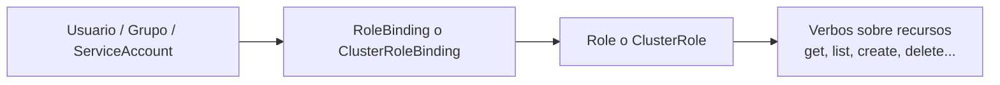

# RBAC en Kubernetes: Roles, ClusterRoles y Bindings

En el [capítulo anterior](./120.Usuarios.md) creamos identidades (usuarios y service accounts), pero por sí solas no pueden hacer nada en el cluster. RBAC (Role Based Access Control) es el mecanismo de autorización con el que les damos permisos.

RBAC se compone de cuatro objetos, que conviene entender como dos parejas:
- **Role / ClusterRole**: definen **qué** se puede hacer (verbos sobre recursos).
- **RoleBinding / ClusterRoleBinding**: definen **quién** puede hacerlo (asignan el rol a usuarios, grupos o service accounts).



La diferencia entre las versiones "Cluster" y las normales es el ámbito: un `Role` y un `RoleBinding` viven dentro de un namespace; un `ClusterRole` y un `ClusterRoleBinding` aplican a todo el cluster (incluyendo recursos sin namespace, como los nodos).

## Roles
Podemos definir roles en Kubernetes creando objetos de tipo `Role`. Por ejemplo:

```yaml
apiVersion: rbac.authorization.k8s.io/v1
kind: Role
metadata:
  namespace: default
  name: pod-admin
rules:
- apiGroups: [""] # "" indica el core API group (pods, services, configmaps...)
  resources: ["pods"]
  verbs: ["get", "watch", "list", "delete", "create", "update", "patch"] # Podríamos usar "*" para indicar todos los verbos
```

Estos nos permiten granularizar el acceso a cada uno de los recursos y los permisos específicos que les queremos otorgar.

Los **verbos** son las operaciones permitidas: `get`, `list` y `watch` para lectura; `create`, `update`, `patch` y `delete` para escritura. Los **apiGroups** indican el grupo del recurso: `""` para el core (pods, services...), `apps` para deployments y statefulsets, `batch` para jobs y cronjobs, etc. Si dudas del grupo de un recurso, `kubectl api-resources` te lo dice.

También podemos restringir el permiso a objetos concretos por nombre con `resourceNames`:
```yaml
rules:
- apiGroups: [""]
  resources: ["configmaps"]
  resourceNames: ["app-config"]
  verbs: ["get", "update"]
```

## RoleBindings
Crear un rol solo es el primer paso. Para usarlo, tenemos que asignarlo a un usuario, grupo o service account mediante un objeto `RoleBinding`. Por ejemplo:

```yaml
apiVersion: rbac.authorization.k8s.io/v1
kind: RoleBinding
metadata:
  name: pod-admin-binding
  namespace: default
subjects:
- kind: User
  name: jdoe # Nombre del usuario (el CN de su certificado)
  apiGroup: rbac.authorization.k8s.io
roleRef:
  kind: Role # Este debe ser Role o ClusterRole
  name: pod-admin # Nombre del rol que queremos asignar
  apiGroup: rbac.authorization.k8s.io
```

Con esto creamos la relación entre el rol `pod-admin` y el usuario `jdoe`, limitada al namespace `default`.

Si el sujeto fuera una service account, el `subjects` cambiaría ligeramente:
```yaml
subjects:
- kind: ServiceAccount
  name: mi-app-sa
  namespace: default
```

## ClusterRoles y ClusterRoleBindings
Un `ClusterRole` tiene la misma estructura que un `Role`, pero sin namespace. Se usa para:
- Dar permisos sobre recursos de ámbito de cluster (nodos, persistent volumes, namespaces...).
- Definir un rol una sola vez y reutilizarlo en varios namespaces (vinculándolo con RoleBindings).
- Dar permisos globales en todo el cluster (vinculándolo con un ClusterRoleBinding).

```yaml
apiVersion: rbac.authorization.k8s.io/v1
kind: ClusterRole
metadata:
  name: node-reader
rules:
- apiGroups: [""]
  resources: ["nodes"]
  verbs: ["get", "list", "watch"]
---
apiVersion: rbac.authorization.k8s.io/v1
kind: ClusterRoleBinding
metadata:
  name: node-reader-binding
subjects:
- kind: User
  name: jdoe
  apiGroup: rbac.authorization.k8s.io
roleRef:
  kind: ClusterRole
  name: node-reader
  apiGroup: rbac.authorization.k8s.io
```

Un detalle que confunde al principio (y que adoran preguntar en los exámenes): un `RoleBinding` puede referenciar un `ClusterRole`. En ese caso, los permisos del ClusterRole solo aplican **en el namespace del RoleBinding**. Es el patrón para definir roles genéricos reutilizables.

Kubernetes trae varios ClusterRoles predefinidos que cubren la mayoría de casos: `view` (solo lectura), `edit` (lectura y escritura, sin tocar RBAC), `admin` (control total de un namespace) y `cluster-admin` (control total del cluster).

## Crear roles y bindings con comandos
Como siempre, todo lo anterior se puede hacer de forma imperativa, mucho más rápido para los exámenes:

```bash
# Crear un rol
kubectl create role pod-admin --verb=get,list,watch,create,update,patch,delete --resource=pods -n default

# Crear un binding para un usuario
kubectl create rolebinding pod-admin-binding --role=pod-admin --user=jdoe -n default

# Crear un cluster role y su binding
kubectl create clusterrole node-reader --verb=get,list,watch --resource=nodes
kubectl create clusterrolebinding node-reader-binding --clusterrole=node-reader --user=jdoe

# Binding de un ClusterRole predefinido a una service account, limitado a un namespace
kubectl create rolebinding app-view --clusterrole=view --serviceaccount=default:mi-app-sa -n default
```

## Consultar y verificar permisos
Podemos consultar los roles y los bindings con `kubectl get roles` y `kubectl get rolebindings` (con `-n` para un namespace concreto), y ver su detalle con `describe`:

```bash
kubectl get roles -n default
kubectl describe role pod-admin -n default
```

Esto nos mostraría una salida similar a la siguiente:
```text
Name:         pod-admin
Labels:       <none>
Annotations:  <none>
PolicyRule:
  Resources  Non-Resource URLs  Resource Names  Verbs
  ---------  -----------------  --------------  -----
  pods       []                 []              [get watch list delete create update patch]
```

Y la herramienta estrella para verificar permisos es `kubectl auth can-i`, que responde si una acción está permitida:
```bash
# ¿Puedo (mi usuario actual) crear pods en default?
kubectl auth can-i create pods -n default

# ¿Puede el usuario jdoe borrar deployments?
kubectl auth can-i delete deployments --as=jdoe -n default

# ¿Puede una service account leer secretos?
kubectl auth can-i get secrets --as=system:serviceaccount:default:mi-app-sa

# Listar todo lo que puede hacer un usuario
kubectl auth can-i --list --as=jdoe -n default
```

Este comando es oro puro tanto para administrar como para auditar la seguridad del cluster, y aparece constantemente en los exámenes CKA y CKS.

## Buenas prácticas RBAC
- Aplica el **principio de mínimo privilegio**: empieza sin permisos y añade solo lo necesario.
- Evita los wildcards (`*`) en verbos, recursos o apiGroups, salvo en roles de administración deliberados.
- Vincula roles a **grupos** en lugar de a usuarios individuales cuando sea posible.
- Nunca des `cluster-admin` a una aplicación ni a la service account `default`.
- Audita los permisos periódicamente con `kubectl auth can-i --list`.

---
* Lista de vídeos en Youtube: [Curso Kubernetes](https://www.youtube.com/playlist?list=PLQhxXeq1oc2k9MFcKxqXy5GV4yy7wqSma)

[Volver al índice](README.md#índice)
