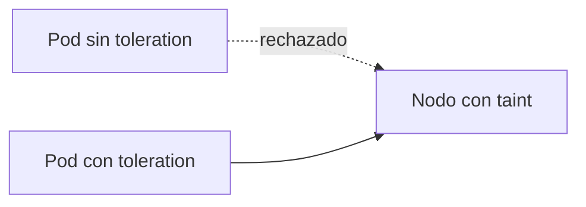

# Taints y tolerations en Kubernetes

En el [capítulo anterior](./122.Scheduling_labels.md) vimos cómo atraer pods hacia ciertos nodos con labels y affinity. Los taints y tolerations son el mecanismo opuesto: permiten que un **nodo repela pods**, salvo que estos declaren explícitamente que pueden tolerarlo.

La analogía clásica: un taint es como un cartel de "prohibido el paso" en la puerta del nodo, y la toleration es el pase VIP que permite a ciertos pods ignorar el cartel. Ojo: el pase no obliga al pod a ir a ese nodo, solo le permite entrar. Si quieres además **atraerlo** al nodo, tendrás que combinarlo con affinity.



De hecho, ya los hemos usado: cuando en la [instalación](./103.Instalacion.md) quitamos el taint `node-role.kubernetes.io/control-plane` del nodo maestro para que pudiera ejecutar pods, estábamos gestionando taints.

## Anatomía de un taint
Un taint tiene tres partes: una **clave**, un **valor** (opcional) y un **efecto**: `clave=valor:efecto`.

Existen tres efectos posibles:
* `NoSchedule`: no se programarán pods nuevos sin la toleration. Los que ya estaban ejecutándose se quedan.
* `PreferNoSchedule`: versión "blanda", el scheduler intenta evitar el nodo, pero lo usará si no hay alternativa.
* `NoExecute`: además de no programar pods nuevos, **expulsa** los pods que ya estaban ejecutándose y no toleren el taint.

## Gestionar taints en los nodos
Añadir un taint a un nodo:
```bash
kubectl taint nodes nodo1 dedicado=gpu:NoSchedule
```

Eliminarlo (mismo comando con un guion al final):
```bash
kubectl taint nodes nodo1 dedicado=gpu:NoSchedule-
```

Consultar los taints de los nodos:
```bash
kubectl describe node nodo1 | grep -i taint

# O para todos los nodos de una vez:
kubectl get nodes -o custom-columns=NAME:.metadata.name,TAINTS:.spec.taints
```

## Tolerations en los pods
Para que un pod pueda ejecutarse en un nodo con taint, declaramos una toleration en su `spec`:

```yaml
apiVersion: v1
kind: Pod
metadata:
  name: pod-gpu
spec:
  tolerations:
  - key: "dedicado"
    operator: "Equal"
    value: "gpu"
    effect: "NoSchedule"
  containers:
  - name: cuda-app
    image: nvidia/cuda
```

El campo `operator` admite dos valores:
- `Equal` (por defecto): la toleration coincide si clave, valor y efecto son iguales a los del taint.
- `Exists`: basta con que exista la clave, sin importar el valor:

```yaml
  tolerations:
  - key: "dedicado"
    operator: "Exists"
    effect: "NoSchedule"
```

Una toleration con `operator: Exists` y sin clave ni efecto tolera **cualquier taint** (es lo que usan los DaemonSets de sistema, como los agentes de red, para ejecutarse hasta en los nodos maestros).

### tolerationSeconds: tolerar durante un tiempo
Con el efecto `NoExecute` podemos indicar cuánto tiempo aguanta el pod en el nodo antes de ser expulsado:

```yaml
  tolerations:
  - key: "node.kubernetes.io/unreachable"
    operator: "Exists"
    effect: "NoExecute"
    tolerationSeconds: 300
```

Esto enlaza con un detalle interesante: cuando un nodo falla, Kubernetes le añade automáticamente taints como `node.kubernetes.io/not-ready` o `node.kubernetes.io/unreachable` con efecto `NoExecute`. Todos los pods llevan, por defecto, una toleration de 300 segundos para estos taints: por eso un pod tarda unos 5 minutos en reubicarse cuando su nodo se cae. Si tu aplicación necesita una recuperación más rápida, puedes bajar ese valor.

## Casos de uso habituales
- **Nodos dedicados**: reservar nodos para un equipo o tipo de carga (`dedicado=equipo-a:NoSchedule`) combinándolo con affinity para atraer solo sus pods.
- **Hardware especializado**: nodos con GPU que solo deben ejecutar cargas que la usen (y no llenarse de pods normales).
- **Nodos del control plane**: el ejemplo más conocido, el taint `node-role.kubernetes.io/control-plane:NoSchedule`.
- **Mantenimiento y desalojo**: `kubectl drain` y los taints automáticos de nodo (`not-ready`, `unreachable`, `disk-pressure`...) usan este mecanismo por debajo.

## Taints vs labels: ¿cuándo usar cada uno?
| Necesidad | Mecanismo |
|-----------|-----------|
| "Este pod debe ir a nodos con SSD" | Labels + nodeSelector/affinity |
| "Este nodo solo acepta pods autorizados" | Taints + tolerations |
| "Estos nodos son exclusivos para el equipo X" | Ambos combinados |

La regla mnemotécnica: los **labels atraen**, los **taints repelen**.

---
* Lista de vídeos en Youtube: [Curso Kubernetes](https://www.youtube.com/playlist?list=PLQhxXeq1oc2k9MFcKxqXy5GV4yy7wqSma)

[Volver al índice](README.md#índice)
