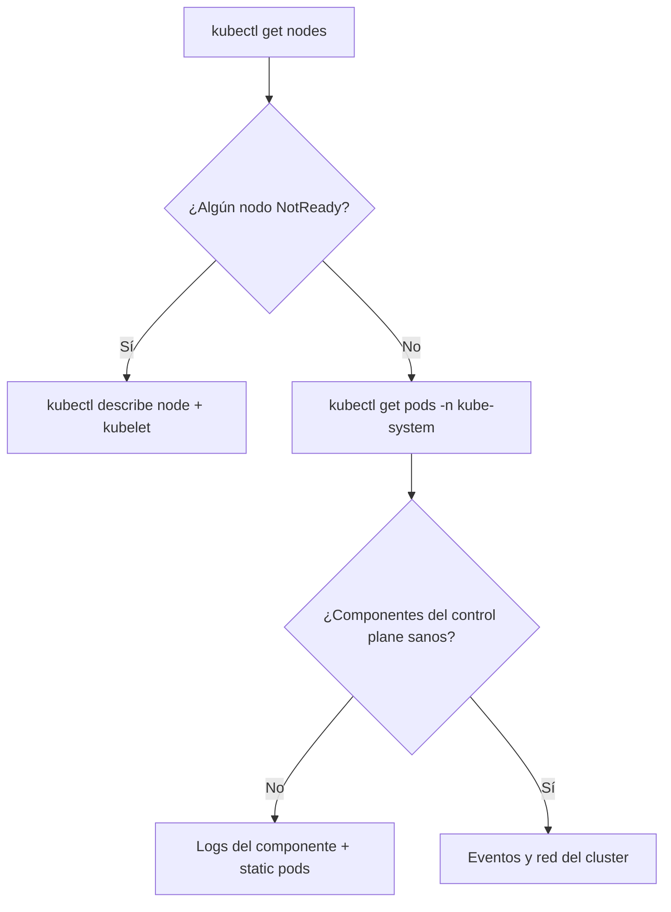

# Troubleshooting del cluster de Kubernetes

El troubleshooting es la sección con más peso del examen CKA (un 30%) y, casualmente, también lo que más harás en la vida real. En este capítulo nos centramos en los problemas del **cluster** (nodos y control plane); la depuración de aplicaciones la veremos en la [especialización CKAD](./306.Troubleshooting_aplicaciones.md).

## Metodología general
Ante un cluster con problemas, sigue siempre el mismo orden: de lo general a lo concreto.



Los comandos de partida, siempre:
```bash
kubectl get nodes
kubectl get pods -n kube-system
kubectl get events -A --sort-by=.metadata.creationTimestamp
kubectl cluster-info
```

## Diagnóstico de nodos: el kubelet
Cuando un nodo aparece como `NotReady`, el sospechoso número uno es el **kubelet**. Conéctate al nodo por SSH y revisa:

```bash
# Estado del servicio
sudo systemctl status kubelet

# Logs del kubelet (el 90% de las respuestas están aquí)
sudo journalctl -u kubelet -f

# Si está parado, arrancarlo y habilitarlo
sudo systemctl enable --now kubelet
```

Causas típicas de un kubelet que no arranca (todas han caído en exámenes):
- **Servicio parado o deshabilitado**: se arregla con `systemctl enable --now kubelet`.
- **Swap activada**: el kubelet no arranca por defecto con swap (`swapoff -a`).
- **Errores de configuración**: el fichero de configuración del kubelet está en `/var/lib/kubelet/config.yaml`. Un parámetro mal escrito (por ejemplo, una ruta de certificado incorrecta) aparecerá claramente en `journalctl`.
- **Certificados caducados o rutas erróneas**: revisa `/etc/kubernetes/kubelet.conf`, que es el kubeconfig que usa el kubelet para hablar con el API server.
- **El runtime de contenedores caído**: `systemctl status containerd`.

`kubectl describe node <nodo>` también informa de **presiones** del nodo: `MemoryPressure`, `DiskPressure` o `PIDPressure` indican falta de recursos, no un fallo de software.

## Static pods: cómo funciona el control plane
Aquí está el concepto clave para depurar el control plane: en un cluster de kubeadm, el API server, etcd, el scheduler y el controller manager **no los gestiona Kubernetes**, sino el kubelet directamente. Son **static pods**.

El kubelet vigila el directorio `/etc/kubernetes/manifests/` y ejecuta cualquier manifiesto que encuentre ahí:
```bash
ls /etc/kubernetes/manifests/
# etcd.yaml  kube-apiserver.yaml  kube-controller-manager.yaml  kube-scheduler.yaml
```

Esto tiene tres consecuencias prácticas:
1. Para **modificar** un componente del control plane, editas su fichero en ese directorio y el kubelet lo recrea solo (lo hicimos al restaurar etcd en el [capítulo anterior](./201.Mantenimiento_backup.md)).
2. Para **"reiniciar"** un componente, puedes mover su manifiesto fuera del directorio y devolverlo.
3. Si rompes la sintaxis de uno de estos YAML, el componente desaparece sin dejar rastro en `kubectl`... porque kubectl necesita el API server, que quizás acabas de romper.

Los static pods se reconocen porque llevan el nombre del nodo como sufijo (`kube-apiserver-k8scp`) y porque su campo `ownerReferences` apunta al nodo.

## Cuando el API server está caído
Si `kubectl` responde `The connection to the server ... was refused`, no puedes usar kubectl para arreglarlo. Toca trabajar a más bajo nivel, directamente con el runtime de contenedores mediante `crictl`:

```bash
# Listar contenedores (incluidos los caídos)
sudo crictl ps -a

# Ver los logs de un contenedor concreto
sudo crictl logs <container-id>
```

Si el contenedor del API server ni siquiera aparece, el kubelet no está consiguiendo crearlo: revisa `journalctl -u kubelet`, que mostrará el error de parseo o configuración del manifiesto.

Los errores más comunes en el examen son ediciones incorrectas de `/etc/kubernetes/manifests/kube-apiserver.yaml`: un flag mal escrito, una ruta de certificado errónea o un puerto cambiado. Compara siempre contra una copia de seguridad o contra otro cluster sano.

También puedes consultar los logs en disco sin pasar por el API:
```bash
ls /var/log/pods/
ls /var/log/containers/
```

## Problemas con scheduler y controller manager
Mismos principios que el API server: son static pods. Sus síntomas son distintos:
- **Scheduler roto**: los pods nuevos se quedan en `Pending` eternamente, sin eventos de asignación a nodo.
- **Controller manager roto**: los deployments no crean replicasets, los replicasets no crean pods, los nodos caídos no se detectan... el cluster "no reacciona".

```bash
kubectl -n kube-system logs kube-scheduler-<nodo>
kubectl -n kube-system logs kube-controller-manager-<nodo>
```

## Problemas de red del cluster
Si los nodos están `Ready` pero los pods no se comunican, revisa por este orden:

1. **La CNI**: ¿están sanos los pods del plugin de red?
```bash
kubectl -n kube-system get pods -l k8s-app=cilium # o calico-node, según tu CNI
```
Un síntoma típico de CNI rota es que los pods nuevos se queden en `ContainerCreating` con eventos de tipo `NetworkPlugin not ready`.

2. **kube-proxy**: si los pods se alcanzan por IP pero no a través de los services, el sospechoso es kube-proxy:
```bash
kubectl -n kube-system get pods -l k8s-app=kube-proxy
kubectl -n kube-system logs <pod-de-kube-proxy>
```

3. **CoreDNS**: si la resolución de nombres falla (`nslookup kubernetes.default` desde un pod no responde), revisa los pods de CoreDNS y su service `kube-dns`. Profundizaremos en DNS en la [especialización CKAD](./304.CoreDNS_DNS.md).

## Chuleta de comandos
| Síntoma | Primer comando |
|---------|----------------|
| Nodo NotReady | `journalctl -u kubelet` en el nodo |
| kubectl no conecta | `sudo crictl ps -a` en el control plane |
| Pods en Pending | `kubectl describe pod` (eventos) + estado del scheduler |
| Pods en ContainerCreating | Estado de la CNI en kube-system |
| Services no responden | kube-proxy y endpoints (`kubectl get ep`) |
| DNS no resuelve | Pods de CoreDNS y service kube-dns |
| Deployment no crea pods | Logs del controller manager |

## Resumen
- Metodología: nodos → control plane → red. Siempre de lo general a lo concreto.
- El kubelet es el corazón de cada nodo: `systemctl` y `journalctl` son tus mejores amigos.
- El control plane son **static pods** definidos en `/etc/kubernetes/manifests/`; el kubelet los recrea al editar los ficheros.
- Cuando el API server está caído, `crictl` y los logs en `/var/log/pods/` te permiten trabajar sin kubectl.

---
* Lista de vídeos en Youtube: [Curso Kubernetes](https://www.youtube.com/playlist?list=PLQhxXeq1oc2k9MFcKxqXy5GV4yy7wqSma)

[Volver al índice](README.md#índice)
