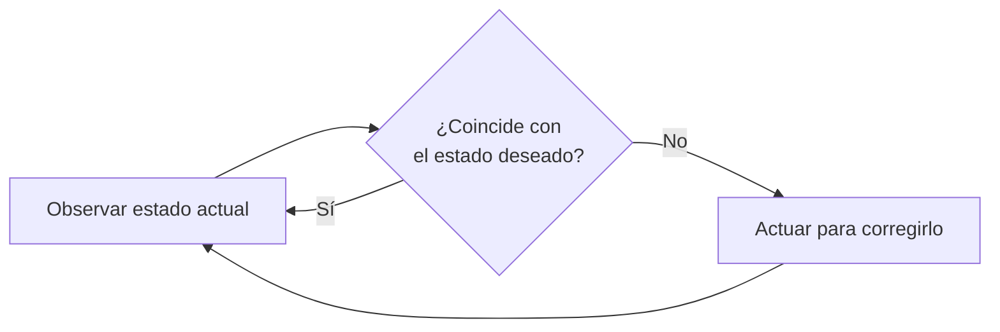

# CRDs y Operators en Kubernetes

La definición de recursos personalizados (CRD, Custom Resource Definition) es una de las características más potentes de Kubernetes. Nos permite extender la API añadiendo nuestros propios tipos de recursos, que se comportan como cualquier recurso nativo: se crean con manifiestos, se consultan con kubectl y se protegen con RBAC.

De hecho, ya hemos usado CRDs sin saberlo: los recursos de [Gateway API](./113.Gateway.md) (`Gateway`, `HTTPRoute`), los `NetworkPolicies` de Calico o los `VolumeSnapshots` del [capítulo de almacenamiento](./205.Almacenamiento_avanzado.md) son recursos personalizados.

## Consultar recursos personalizados
Podemos consultar las CRDs instaladas en el cluster con el comando `kubectl get` (son recursos de ámbito de cluster, sin namespace):
```bash
kubectl get crd
```

Es muy normal que aparezcan recursos personalizados que no hemos definido nosotros: los instalan los componentes que desplegamos. Por ejemplo, Cilium define recursos como `ciliumnetworkpolicies.cilium.io`, y cert-manager define `certificates.cert-manager.io`.

Podemos obtener los detalles de una CRD usando el comando `kubectl describe`:
```bash
kubectl describe crd <nombre del recurso>

# Y explorar su estructura, como con cualquier recurso nativo
kubectl explain crontab.spec
```

## Definir un recurso personalizado
Para definir un recurso personalizado, creamos un fichero YAML con la definición del recurso. Por ejemplo, una CRD que define un tipo `CronTab`:
```yaml
apiVersion: apiextensions.k8s.io/v1
kind: CustomResourceDefinition
metadata:
  # El nombre debe ser <plural>.<grupo>
  name: crontabs.example.com
spec:
  group: example.com
  versions:
    - name: v1
      served: true   # Esta versión está disponible en la API
      storage: true  # Esta es la versión que se persiste en etcd
      schema:
        openAPIV3Schema:
          type: object
          properties:
            spec:
              type: object
              properties:
                cronSpec:
                  type: string
                image:
                  type: string
                replicas:
                  type: integer
  scope: Namespaced  # O Cluster, para recursos sin namespace
  names:
    plural: crontabs
    singular: crontab
    kind: CronTab
    shortNames:
      - ct
```

> Si encuentras ejemplos con `apiVersion: apiextensions.k8s.io/v1beta1`, están desactualizados: esa versión fue eliminada en Kubernetes 1.22. La versión `v1` exige definir el esquema OpenAPI, que es lo que permite a Kubernetes validar nuestros objetos.

Creamos la CRD aplicando el manifiesto:
```bash
kubectl apply -f crontab-crd.yaml
```

## Crear un objeto de un recurso personalizado
Una vez registrada la CRD, podemos crear objetos de ese tipo como si fueran recursos nativos:
```yaml
apiVersion: "example.com/v1"
kind: CronTab
metadata:
  name: my-new-cron-object
spec:
  cronSpec: "* * * * */5"
  image: my-awesome-cron-image
  replicas: 3
```

A partir de aquí, todo funciona como siempre:
```bash
kubectl get crontabs # Listar los objetos crontab del namespace actual
kubectl get ct -A # Usando el shortName, en todos los namespaces
kubectl describe crontab my-new-cron-object # Detalles del objeto
kubectl delete crontab my-new-cron-object # Eliminarlo
```

## El patrón Operator: CRDs con cerebro
Aquí está el matiz importante: una CRD, por sí sola, **solo almacena datos**. Nuestro `CronTab` se guarda en etcd, pero nadie hace nada con él. Para que un recurso personalizado tenga comportamiento, necesita un **controlador**: un proceso que observe esos objetos y actúe para que la realidad coincida con lo declarado.

Este es exactamente el mismo patrón de los controladores nativos (un Deployment no haría nada sin el controller manager), aplicado a recursos propios. Es el bucle de reconciliación:



Un **Operator** es la combinación de ambas piezas: CRDs + controlador propio, normalmente desplegado como un deployment dentro del cluster. El nombre viene de que codifican el conocimiento de un **operador humano**: cómo instalar, actualizar, hacer backup y recuperar una aplicación compleja.

### Ejemplos reales
- **cert-manager**: defines un recurso `Certificate` y el operator se encarga de pedirlo a Let's Encrypt, renovarlo y guardarlo en un Secret.
- **Prometheus Operator**: defines un `ServiceMonitor` y el operator reconfigura Prometheus para monitorizar tu servicio.
- **CloudNativePG / MySQL Operator**: defines un recurso `Cluster` y el operator despliega la base de datos, configura la replicación, gestiona el failover y los backups.

La experiencia de usuario es siempre la misma: en lugar de gestionar decenas de objetos de bajo nivel, declaras **un** recurso de alto nivel y el operator hace el resto. Puedes explorar el catálogo de operators disponibles en [OperatorHub.io](https://operatorhub.io/).

### ¿Y si quiero crear mi propio operator?
Queda fuera del alcance del examen, pero los frameworks habituales son:
- **Kubebuilder** y **Operator SDK** (Go): los más completos, usados por la mayoría de operators de la CNCF.
- **Kopf** (Python) o **Metacontroller**: opciones más ligeras para automatizaciones sencillas.

Para el CKA basta con dominar el lado de consumidor: instalar una CRD, crear sus objetos, consultarlos y entender que detrás hay un controlador reconciliando.

## Resumen
- Las CRDs extienden la API de Kubernetes con tipos propios, validados por su esquema OpenAPI (`apiextensions.k8s.io/v1`).
- Un recurso personalizado sin controlador solo almacena datos; un **Operator** (CRD + controlador) añade el comportamiento.
- El patrón de reconciliación es el mismo que usan los controladores nativos de Kubernetes.
- Gran parte del ecosistema que ya usas (cert-manager, Gateway API, Cilium...) funciona sobre CRDs.

---
* Lista de vídeos en Youtube: [Curso Kubernetes](https://www.youtube.com/playlist?list=PLQhxXeq1oc2k9MFcKxqXy5GV4yy7wqSma)

[Volver al índice](README.md#índice)
