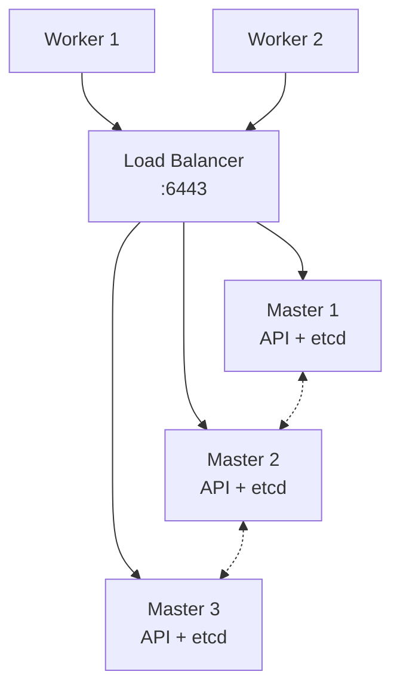

# High Availability y Disaster Recovery en Kubernetes

Hasta ahora, todos nuestros clusters han tenido un único nodo maestro. Eso significa un único punto de fallo: si ese nodo cae, las aplicaciones siguen funcionando (los pods ya programados no se tocan), pero el cluster queda "congelado": sin API, sin scheduler, sin auto-reparación. En este capítulo veremos cómo se diseña un cluster realmente resiliente y qué hacer cuando, aun así, todo sale mal.

## Topologías de alta disponibilidad
Un control plane en alta disponibilidad consiste en ejecutar **varios nodos maestros** detrás de un balanceador. kubeadm soporta dos topologías:

### Etcd apilado (stacked)
Cada nodo del control plane ejecuta su propia instancia de etcd, junto al resto de componentes. Es la topología por defecto de kubeadm y la más sencilla: 3 nodos maestros = 3 miembros de etcd.



- **Pros**: menos máquinas, configuración automática con kubeadm.
- **Contras**: si cae un nodo, pierdes a la vez un API server y un miembro de etcd (los fallos van emparejados).

### Etcd externo
El cluster de etcd corre en sus propias máquinas, separado de los nodos del control plane. Desacopla los fallos (perder un master no afecta a etcd), pero duplica la infraestructura: 3 masters + 3 nodos de etcd.

La decisión práctica: stacked para la mayoría de los casos; externo cuando el cluster es grande o etcd necesita recursos dedicados.

## El quórum de etcd: por qué siempre número impar
etcd usa el algoritmo de consenso Raft y necesita **mayoría absoluta (quórum)** para aceptar escrituras. Con `n` miembros, el quórum es `(n/2)+1`:

| Miembros | Quórum | Fallos tolerados |
|----------|--------|------------------|
| 1 | 1 | 0 |
| 2 | 2 | **0** |
| 3 | 2 | 1 |
| 4 | 3 | 1 |
| 5 | 3 | 2 |

Dos detalles que pregunta el examen y que sorprenden:
- **2 nodos son peores que 1**: no toleran ningún fallo y duplican las probabilidades de perder el quórum.
- **4 no mejora a 3**: tolera los mismos fallos (1). Por eso etcd siempre se despliega en números impares: 3 para la mayoría de los casos, 5 para entornos críticos.

Si etcd pierde el quórum, el cluster entero pasa a **solo lectura**: los pods siguen corriendo, pero nada puede cambiar hasta recuperar la mayoría o restaurar de backup.

## Montar un control plane HA con kubeadm
El proceso es el mismo que vimos en la [instalación](./103.Instalacion.md), con dos diferencias clave.

1. **Necesitas un balanceador** delante de los API servers (HAProxy, keepalived, o el balanceador de tu nube) escuchando en el puerto 6443. El `--control-plane-endpoint` que ya usamos apunta a él, no a un nodo concreto. Esta es la razón por la que siempre lo configuramos como un nombre DNS: nos permite pasar de 1 a N masters sin regenerar el cluster.

2. Al inicializar, añadimos `--upload-certs`, que sube los certificados compartidos a un secret temporal para no copiarlos a mano:
```bash
sudo kubeadm init --control-plane-endpoint "k8s-lb:6443" --upload-certs --pod-network-cidr=192.168.0.0/16
```

La salida nos dará **dos** comandos join distintos: uno para workers (como siempre) y otro para masters adicionales, con el flag `--control-plane`:
```bash
sudo kubeadm join k8s-lb:6443 --token <token> \
  --discovery-token-ca-cert-hash sha256:<hash> \
  --control-plane --certificate-key <clave>
```

Con tres masters unidos, podemos verificar el estado de los miembros de etcd como vimos en el [capítulo de mantenimiento](./201.Mantenimiento_backup.md) (`etcdctl member list`).

> Los componentes replicados no pisan unos a otros: el API server es stateless (pueden trabajar los tres a la vez), mientras que el scheduler y el controller manager usan **elección de líder**: solo uno está activo y el resto espera en standby.

## Alta disponibilidad de las aplicaciones
De nada sirve un control plane redundante si la aplicación vive en un solo pod. Las piezas, casi todas ya vistas en el curso, son:

- **Réplicas repartidas**: varios replicas con [anti-affinity o topology spread constraints](./122.Scheduling_labels.md) para que no compartan nodo o zona.
- **Probes**: [liveness y readiness](./114.Probes_live_readiness.md) para que el tráfico solo llegue a pods sanos.
- **PodDisruptionBudgets (PDB)**: la pieza nueva. Limitan cuántos pods de una aplicación pueden estar caídos **a la vez** durante interrupciones voluntarias (un `kubectl drain`, una actualización de nodos):

```yaml
apiVersion: policy/v1
kind: PodDisruptionBudget
metadata:
  name: web-pdb
spec:
  minAvailable: 2   # O maxUnavailable: 1
  selector:
    matchLabels:
      app: web
```

Con este PDB, un `drain` que fuera a dejar menos de 2 pods disponibles se queda esperando hasta que las réplicas se reubiquen. Es el pegamento entre el mantenimiento de nodos (CKA) y la disponibilidad de las aplicaciones.

```bash
kubectl get pdb
kubectl create pdb web-pdb --selector=app=web --min-available=2 # Forma imperativa
```

## Disaster Recovery
La alta disponibilidad protege contra fallos de componentes; el disaster recovery (DR) protege contra catástrofes: pérdida del datacenter, corrupción de etcd, un borrado accidental masivo.

El plan de DR mínimo de un cluster de Kubernetes:
1. **Backups automáticos de etcd** (lo vimos en [mantenimiento](./201.Mantenimiento_backup.md)): un snapshot periódico via cronjob del sistema, almacenado **fuera** del cluster.
2. **Copia de `/etc/kubernetes/pki`**: sin la CA, un snapshot de etcd no basta para reconstruir el control plane.
3. **Manifiestos como código (GitOps)**: si todo lo desplegado vive en git, reconstruir un cluster es reinstalar + reaplicar. Es la mejor herramienta de DR que existe.
4. **Backup de volúmenes de aplicaciones**: snapshots CSI o [Velero](https://velero.io/), que orquesta backup de recursos + volúmenes hacia un almacenamiento de objetos.

Y tan importante como hacer backups: **probar la restauración**. Un plan de DR que nunca se ha ensayado es una hipótesis, no un plan. Practica el ciclo completo (snapshot → cluster nuevo → restore → aplicaciones arriba) en un entorno de laboratorio.

### Métricas de un plan de DR
Dos siglas que conviene conocer (y que aparecen en cualquier conversación seria de DR):
- **RPO** (Recovery Point Objective): cuántos datos puedes permitirte perder. Lo define la frecuencia de tus backups.
- **RTO** (Recovery Time Objective): cuánto tiempo puedes estar caído. Lo define lo automatizado que esté tu procedimiento de restauración.

## Resumen
- HA del control plane: 3+ masters tras un balanceador, topología stacked (simple) o etcd externo (desacoplado).
- etcd necesita quórum: siempre número impar de miembros; sin quórum, el cluster queda en solo lectura.
- `kubeadm init --upload-certs` + `kubeadm join --control-plane` montan el HA; scheduler y controller manager usan elección de líder.
- La HA de aplicaciones se construye con réplicas + anti-affinity + probes + **PodDisruptionBudgets**.
- DR = backups de etcd y PKI fuera del cluster + GitOps + backup de volúmenes (Velero) + restauraciones ensayadas.

---
* Lista de vídeos en Youtube: [Curso Kubernetes](https://www.youtube.com/playlist?list=PLQhxXeq1oc2k9MFcKxqXy5GV4yy7wqSma)

[Volver al índice](README.md#índice)
