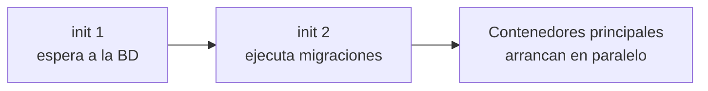

# Pods e init containers en Kubernetes

Bienvenido a la especialización CKAD del curso, la del desarrollador de aplicaciones. Empezamos retomando los [pods](./106.Pods.md) desde la perspectiva de quien construye la aplicación: ¿cómo preparo el terreno antes de que arranque mi contenedor principal? La respuesta son los **init containers**.

## ¿Qué es un init container?
Un init container es un contenedor que se ejecuta **antes** que los contenedores principales del pod, y que debe **terminar con éxito** para que estos arranquen. Si defines varios, se ejecutan **en orden, de uno en uno**.



La diferencia clave con un contenedor normal: los contenedores de `containers` están pensados para **seguir corriendo**, los de `initContainers` para **ejecutarse y terminar**. Por eso no admiten probes de liveness/readiness: su "readiness" es terminar con código 0.

Si un init container falla, el kubelet lo reintenta (respetando la `restartPolicy` del pod) hasta que tenga éxito. Mientras tanto, el pod aparece en estados como `Init:0/2` o `Init:CrashLoopBackOff`, oro puro para diagnosticar.

## Casos de uso típicos
- **Esperar dependencias**: no arrancar la app hasta que la base de datos o un servicio respondan.
- **Preparar datos**: descargar configuración, clonar un repositorio o generar ficheros en un volumen compartido.
- **Migraciones**: ejecutar las migraciones de esquema antes de levantar la aplicación.
- **Separar privilegios**: tareas que requieren permisos elevados (ajustar parámetros del kernel, cambiar propietarios de un volumen) se hacen en el init container, y la app corre sin privilegios. Patrón muy bien visto en seguridad.

## Ejemplo práctico
Un pod cuya aplicación no arranca hasta que el servicio `mydb` existe y resuelve por DNS:

```yaml
apiVersion: v1
kind: Pod
metadata:
  name: myapp
spec:
  initContainers:
  - name: wait-for-db
    image: busybox:1.36
    command: ['sh', '-c', 'until nslookup mydb.default.svc.cluster.local; do echo esperando a mydb; sleep 2; done']
  - name: prepare-data
    image: busybox:1.36
    command: ['sh', '-c', 'echo "<h1>preparado por init</h1>" > /workdir/index.html']
    volumeMounts:
    - name: workdir
      mountPath: /workdir
  containers:
  - name: app
    image: nginx
    volumeMounts:
    - name: workdir
      mountPath: /usr/share/nginx/html
  volumes:
  - name: workdir
    emptyDir: {}
```

Fíjate en el patrón del segundo init: comparte un volumen `emptyDir` con el contenedor principal. Es la forma estándar de **pasar ficheros** de la fase de inicialización a la aplicación.

Podemos observar la secuencia de arranque:
```bash
kubectl get pod myapp -w
# NAME    READY   STATUS            RESTARTS   AGE
# myapp   0/1     Init:0/2          0          2s
# myapp   0/1     Init:1/2          0          10s
# myapp   0/1     PodInitializing   0          15s
# myapp   1/1     Running           0          20s
```

Y consultar los logs de un init container concreto con el flag `-c`:
```bash
kubectl logs myapp -c wait-for-db
```

## Detalles que pregunta el examen
- **Orden y bloqueo**: los init containers corren secuencialmente; el primero que falla bloquea todo lo demás.
- **Recursos**: el request/limit "efectivo" del pod durante la inicialización es el **máximo** de cada init container (no la suma), porque corren de uno en uno.
- **Reejecución**: si el pod se reinicia por completo, los init containers se ejecutan de nuevo. Deben ser **idempotentes** (que repetirlos no rompa nada).
- **Diagnóstico**: pod clavado en `Init:X/Y` → `kubectl describe pod` + `kubectl logs <pod> -c <init>`.

## Hooks de ciclo de vida: postStart y preStop
Relacionados con el arranque y parada, los contenedores (los normales) admiten dos hooks:

```yaml
  containers:
  - name: app
    image: nginx
    lifecycle:
      postStart:
        exec:
          command: ["/bin/sh", "-c", "echo arrancado >> /tmp/log"]
      preStop:
        exec:
          command: ["/bin/sh", "-c", "nginx -s quit; sleep 5"]
```

- **postStart** se ejecuta inmediatamente tras crear el contenedor (sin garantía de orden respecto al entrypoint).
- **preStop** se ejecuta antes de enviar el SIGTERM al contenedor. Es el lugar para cierres ordenados (graceful shutdown): vaciar conexiones, desregistrarse de un balanceador...

El pod tiene un periodo de gracia (`terminationGracePeriodSeconds`, 30s por defecto) para terminar limpiamente antes del SIGKILL. preStop consume parte de ese tiempo.

## Resumen
- Los init containers preparan el terreno: corren en orden, deben terminar con éxito y bloquean el arranque de la app.
- Patrones clave: esperar dependencias, preparar datos en un `emptyDir` compartido y separar privilegios.
- Sus recursos no se suman (corren secuencialmente) y deben ser idempotentes.
- `postStart`/`preStop` completan el ciclo de vida; preStop + grace period = apagado ordenado.

En el [siguiente capítulo](./302.Multicontainer_sidecars.md) veremos la otra forma de componer pods: varios contenedores conviviendo a la vez, con los patrones sidecar, ambassador y adapter.

---
* Lista de vídeos en Youtube: [Curso Kubernetes](https://www.youtube.com/playlist?list=PLQhxXeq1oc2k9MFcKxqXy5GV4yy7wqSma)

[Volver al índice](README.md#índice)
