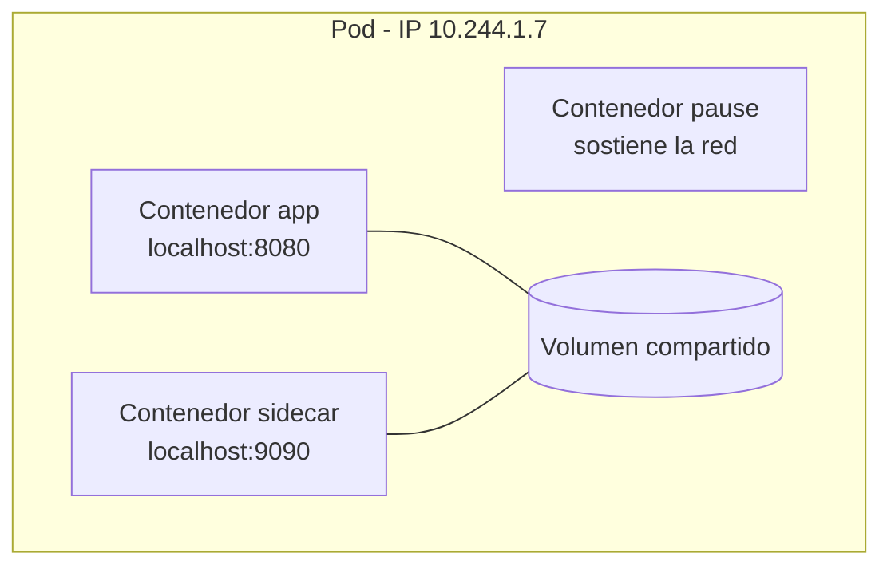
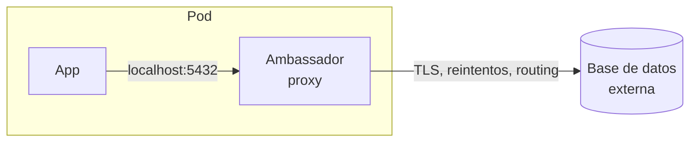

# Pods multi-contenedor: sidecars, ambassador y adapter

Los pods son una unidad de ejecución de uno o varios contenedores, concretamente la unidad más pequeña con la que se puede trabajar en Kubernetes. Hasta ahora casi siempre hemos usado un contenedor por pod, pero la verdadera potencia del diseño aparece cuando varios contenedores **colaboran** dentro del mismo pod.

## Qué comparten los contenedores de un pod
Los contenedores agrupados en un pod comparten:
- **La red**: misma IP y mismo espacio de puertos; se hablan entre sí por `localhost`.
- **Los volúmenes**: cualquier volumen del pod puede montarse en varios contenedores, que es como se intercambian ficheros.

Además, algo transparente para el usuario: por cada pod existe un contenedor `pause`, que es quien sostiene los namespaces de red mientras los demás contenedores arrancan, mueren o se reinician.



La pregunta de diseño es siempre la misma: ¿estos procesos necesitan escalar y desplegarse **juntos**? Si sí, mismo pod. Si no (una app y su base de datos, por ejemplo), pods separados. El examen CKAD adora este criterio.

## El patrón sidecar
Un **sidecar** es un contenedor auxiliar que acompaña al principal para añadirle una capacidad sin tocar su código: recolectar logs, servir de proxy, refrescar configuración, exponer métricas...

El ejemplo clásico, un sidecar que procesa los logs que la app escribe en un volumen compartido:

```yaml
apiVersion: v1
kind: Pod
metadata:
  name: app-con-sidecar
spec:
  containers:
  - name: app
    image: busybox:1.36
    command: ['sh', '-c', 'while true; do echo "$(date) log de la app" >> /var/log/app/app.log; sleep 5; done']
    volumeMounts:
    - name: logs
      mountPath: /var/log/app
  - name: log-sidecar
    image: busybox:1.36
    command: ['sh', '-c', 'tail -F /var/log/app/app.log']
    volumeMounts:
    - name: logs
      mountPath: /var/log/app
  volumes:
  - name: logs
    emptyDir: {}
```

Ahora los logs de la app son visibles con `kubectl logs app-con-sidecar -c log-sidecar`, y podríamos sustituir el `tail` por un agente que los envíe a Loki o Elasticsearch sin tocar la aplicación.

### Sidecars nativos (la forma moderna)
Desde Kubernetes 1.29, los sidecars tienen soporte nativo: se declaran como **init containers con `restartPolicy: Always`**. Esto resuelve los problemas históricos del patrón:
- Arrancan **antes** que el contenedor principal (y en orden), pero **no terminan**: siguen corriendo en paralelo.
- Se reinician solos si mueren y admiten probes.
- Mueren **después** que el contenedor principal, crucial en Jobs: con el patrón antiguo, un sidecar mantenía el Job "vivo" para siempre tras acabar la tarea.

```yaml
apiVersion: v1
kind: Pod
metadata:
  name: app-sidecar-nativo
spec:
  initContainers:
  - name: log-sidecar
    image: busybox:1.36
    restartPolicy: Always   # Esto lo convierte en sidecar nativo
    command: ['sh', '-c', 'tail -F /var/log/app/app.log']
    volumeMounts:
    - name: logs
      mountPath: /var/log/app
  containers:
  - name: app
    image: busybox:1.36
    command: ['sh', '-c', 'while true; do echo "$(date) log" >> /var/log/app/app.log; sleep 5; done']
    volumeMounts:
    - name: logs
      mountPath: /var/log/app
  volumes:
  - name: logs
    emptyDir: {}
```

Si te encuentras ambos estilos en producción es normal; para contenido nuevo, usa el nativo.

## El patrón ambassador
Un **ambassador** (embajador) es un sidecar especializado en la **red de salida**: la app habla siempre con `localhost`, y el ambassador se encarga de encontrar y conectar con el servicio real, gestionando TLS, reintentos o el enrutado a la instancia adecuada.



Ejemplo conceptual: la aplicación se conecta a `localhost:5432` y un proxy (HAProxy, Envoy, cloud-sql-proxy...) reenvía la conexión a la base de datos correcta según el entorno. La app no sabe nada de TLS ni de endpoints: es portable entre entornos cambiando solo el ambassador.

## El patrón adapter
El **adapter** es el inverso del ambassador: estandariza lo que el pod **expone hacia fuera**. La app produce una salida en su formato particular y el adapter la traduce al formato que el resto de la plataforma espera.

El caso típico: una aplicación legacy escribe métricas en un formato propio, y un adapter las transforma a formato Prometheus exponiéndolas en `localhost:9090/metrics`. Los exporters de Prometheus (mysql-exporter, nginx-exporter...) desplegados como sidecars son exactamente esto.

## Resumen de patrones
| Patrón | Dirección | Propósito | Ejemplo |
|--------|-----------|-----------|---------|
| Sidecar | Interno | Añadir capacidades a la app | Agente de logs, refresco de config |
| Ambassador | Salida | Simplificar conexiones hacia fuera | Proxy a base de datos, TLS |
| Adapter | Entrada | Estandarizar lo que se expone | Exporter de métricas Prometheus |

Los tres son, técnicamente, sidecars; el nombre describe su papel. Y los service mesh como Istio o Linkerd, que veremos [más adelante](./305.Service_mesh.md), llevan el patrón al extremo: inyectan automáticamente un proxy sidecar en **todos** los pods.

## Comandos para pods multi-contenedor
Con varios contenedores, el flag `-c` se vuelve imprescindible:
```bash
kubectl logs <pod> -c <contenedor>             # Logs de un contenedor concreto
kubectl logs <pod> --all-containers            # Todos
kubectl exec -it <pod> -c <contenedor> -- sh   # Shell en un contenedor concreto
kubectl describe pod <pod>                     # Estado de cada contenedor por separado
```

Un pod `2/2 Running` tiene sus dos contenedores sanos; un `1/2` te dice exactamente dónde mirar.

---
* Lista de vídeos en Youtube: [Curso Kubernetes](https://www.youtube.com/playlist?list=PLQhxXeq1oc2k9MFcKxqXy5GV4yy7wqSma)

[Volver al índice](README.md#índice)
