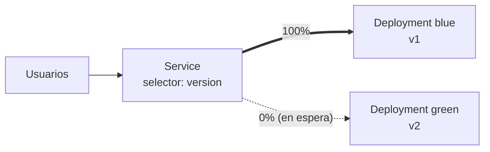

# Canary y blue-green deployments en Kubernetes

En el [capítulo de deployments](./108.Deployments.md) vimos las estrategias nativas: `RollingUpdate` y `Recreate`. Funcionan, pero comparten una limitación: la nueva versión se va liberando a **todos** los usuarios a la vez, sin fase de prueba con tráfico real. En este capítulo veremos las dos estrategias que resuelven eso, y cómo implementarlas con los recursos que ya conoces.

## Recapitulando: el problema
Un rolling update sustituye pods viejos por nuevos progresivamente. Si la versión nueva tiene un bug que solo aparece con tráfico real, lo descubrirás cuando ya esté sirviendo a buena parte de tus usuarios. Las estrategias avanzadas atacan ese hueco:

| Estrategia | Idea | Coste | Rollback |
|------------|------|-------|----------|
| Rolling update | Sustitución progresiva | Bajo | Minutos (`rollout undo`) |
| Blue-green | Dos entornos completos, cambio instantáneo | Doble de recursos | Instantáneo |
| Canary | Una fracción del tráfico prueba la versión nueva | Bajo | Instantáneo (para la mayoría) |

## Blue-green deployment
Mantenemos **dos entornos completos**: el azul (versión actual, recibiendo el tráfico) y el verde (versión nueva, desplegada y verificada pero sin tráfico). Cuando el verde está validado, **movemos todo el tráfico de golpe** cambiando el selector del Service.



La implementación con recursos nativos es sorprendentemente simple. Dos deployments que solo difieren en un label:

```yaml
apiVersion: apps/v1
kind: Deployment
metadata:
  name: app-blue
spec:
  replicas: 3
  selector:
    matchLabels:
      app: myapp
      version: blue
  template:
    metadata:
      labels:
        app: myapp
        version: blue
    spec:
      containers:
      - name: app
        image: myapp:1.0
---
apiVersion: apps/v1
kind: Deployment
metadata:
  name: app-green
spec:
  replicas: 3
  selector:
    matchLabels:
      app: myapp
      version: green
  template:
    metadata:
      labels:
        app: myapp
        version: green
    spec:
      containers:
      - name: app
        image: myapp:2.0
```

Y un Service cuyo selector incluye la versión:

```yaml
apiVersion: v1
kind: Service
metadata:
  name: myapp
spec:
  selector:
    app: myapp
    version: blue   # <- el interruptor
  ports:
  - port: 80
    targetPort: 8080
```

El cambio de entorno (y el rollback) es editar una línea:
```bash
kubectl patch service myapp -p '{"spec":{"selector":{"app":"myapp","version":"green"}}}'
```

**Ventajas**: cambio y rollback instantáneos, la versión nueva se puede probar en el cluster real antes de recibir tráfico.
**Inconvenientes**: duplicas recursos durante la transición, y cuidado con las migraciones de base de datos (ambas versiones conviven apuntando al mismo dato).

## Canary deployment
En lugar de cambiar todo de golpe, liberamos la versión nueva a un **porcentaje pequeño** de usuarios (el "canario en la mina"). Si las métricas aguantan, vamos subiendo el porcentaje hasta el 100%.

### Canary básico con deployments y un Service
Truco nativo: un Service balancea entre **todos los pods que cumplen su selector**, repartiendo el tráfico proporcionalmente al número de réplicas. Si el selector no incluye la versión:

```yaml
spec:
  selector:
    app: myapp   # Sin label de versión: selecciona estable + canary
```

Con 9 réplicas de `app-stable` (v1) y 1 de `app-canary` (v2), aproximadamente el 10% del tráfico irá a la versión nueva. Para promover, escalas:
```bash
kubectl scale deployment app-canary --replicas=5   # ~36%
kubectl scale deployment app-stable --replicas=0   # 100% canary
```

Es la implementación que pide el examen CKAD: dos deployments + un service, controlando el reparto con las réplicas. Su limitación obvia: el porcentaje va atado al número de pods (para un 1% necesitas 99+1 réplicas).

### Canary con pesos: Gateway API
Como vimos en el [capítulo de Gateway API](./113.Gateway.md), el reparto por pesos es parte del estándar y desacopla el tráfico del número de réplicas:

```yaml
  rules:
  - backendRefs:
    - name: myapp-stable
      port: 80
      weight: 95
    - name: myapp-canary
      port: 80
      weight: 5
```

Y combinándolo con matching por headers, puedes mandar a la versión nueva solo a tu equipo de QA antes de abrir el grifo. Si usas ingress-nginx, existe el equivalente con anotaciones (`nginx.ingress.kubernetes.io/canary: "true"` y `canary-weight`), aunque ya sabes lo que opinamos de las anotaciones propietarias.

### Canary automatizado: progressive delivery
En producción seria, el ciclo "subir peso → mirar métricas → subir más o abortar" no se hace a mano. Herramientas como **Argo Rollouts** o **Flagger** lo automatizan: defines los pasos (5% → 20% → 50% → 100%), las métricas de éxito (tasa de errores, latencia desde Prometheus) y el sistema promueve o revierte solo. Es lo que se conoce como *progressive delivery*, y aunque queda fuera del examen, es el estándar de facto en la industria.

## ¿Qué estrategia elegir?
- **Rolling update**: tu opción por defecto. Simple, nativa, suficiente para la mayoría de servicios.
- **Blue-green**: cuando necesitas validación completa antes del cambio y rollback instantáneo (releases de riesgo, ventanas de mantenimiento cortas).
- **Canary**: cuando quieres validar con tráfico real limitando el radio de impacto. Imprescindible en servicios de alto tráfico.
- **Recreate**: solo cuando dos versiones no pueden convivir.

## Resumen
- Blue-green = dos entornos completos + un Service como interruptor (`kubectl patch` del selector).
- Canary nativo = dos deployments bajo el mismo selector de Service; el reparto lo marcan las réplicas.
- Gateway API hace el canary por pesos de forma declarativa y precisa; Argo Rollouts/Flagger lo automatizan con métricas.
- Cuidado siempre con el estado compartido (esquema de base de datos) cuando conviven dos versiones.

---
* Lista de vídeos en Youtube: [Curso Kubernetes](https://www.youtube.com/playlist?list=PLQhxXeq1oc2k9MFcKxqXy5GV4yy7wqSma)

[Volver al índice](README.md#índice)
