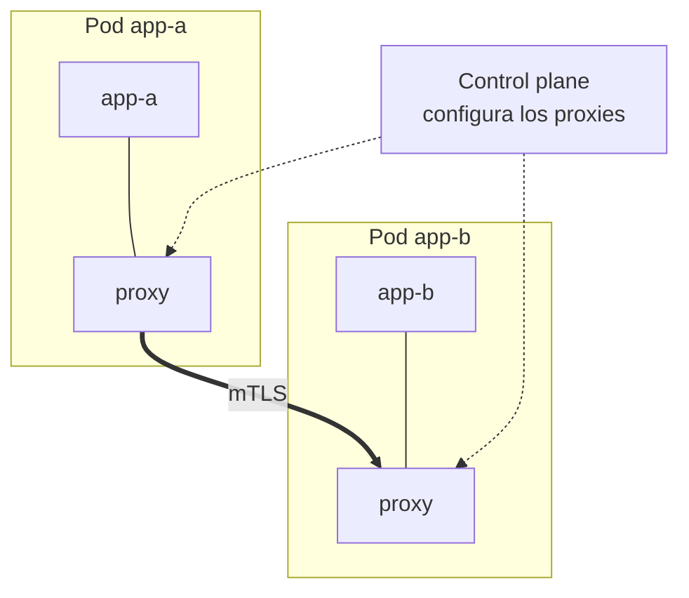

# Service mesh en Kubernetes

A medida que una arquitectura de microservicios crece, aparecen necesidades que se repiten en **cada** servicio: cifrar el tráfico entre pods, reintentar peticiones fallidas, medir latencias, hacer canary releases... Puedes implementarlo en el código de cada aplicación (cincuenta veces), o puedes delegarlo en la plataforma. Esa segunda opción es el **service mesh**.

## ¿Qué es un service mesh?
Un service mesh es una capa de infraestructura que gestiona la **comunicación entre servicios**: interceptar todo el tráfico este-oeste (pod a pod) y aplicarle seguridad, fiabilidad y observabilidad de forma transparente, sin tocar el código de las aplicaciones.

Se compone de dos planos:
- **Data plane**: los proxies que interceptan el tráfico de cada pod (clásicamente, sidecars como Envoy).
- **Control plane**: el cerebro que configura todos esos proxies (Istiod en Istio, el controlador de Linkerd).



¿Te suena el patrón? Es el [sidecar](./302.Multicontainer_sidecars.md) llevado al extremo: el mesh **inyecta automáticamente** un proxy en cada pod (normalmente con un mutating admission webhook al etiquetar el namespace), y la app habla con el mundo sin saber que todo pasa por él.

## Qué te da un service mesh
- **mTLS automático**: todo el tráfico entre pods se cifra y autentica mutuamente, con certificados rotados por el mesh. Es la implementación práctica del *zero trust* dentro del cluster (y complementa a las [NetworkPolicies](./119.Seguridad.md): estas deciden *quién puede hablar con quién*, el mesh asegura *cómo* hablan).
- **Gestión de tráfico**: reintentos, timeouts, circuit breaking y repartos por porcentaje mucho más finos que los de un Service. Los [canary](./303.Canary_bluegreen.md) con métricas automáticas suelen apoyarse en un mesh.
- **Observabilidad**: métricas uniformes (latencia, tasa de error, throughput) y trazas distribuidas de **todos** los servicios sin instrumentar el código.
- **Políticas de autorización**: reglas del tipo "solo `frontend` puede llamar al `POST /pagos` de `backend`", a nivel de identidad de servicio, no de IP.

## Los actores: Istio y Linkerd
- **[Istio](https://istio.io/)**: el más completo y extendido. Usa Envoy como proxy y se configura con CRDs propias (`VirtualService`, `DestinationRule`, `Gateway`, `AuthorizationPolicy`). Su potencia tiene precio: complejidad operativa.
- **[Linkerd](https://linkerd.io/)**: la alternativa ligera, proyecto graduado de la CNCF. Filosofía minimalista: mTLS, métricas y reintentos con configuración casi nula y un proxy propio ultraligero en Rust.

> **Tendencia actual**: el modelo de un sidecar por pod está evolucionando. **Istio ambient mesh** elimina los sidecars (proxies a nivel de nodo) y **Cilium Service Mesh** usa eBPF en el kernel. El concepto que aprendes aquí no cambia: solo la pieza que intercepta el tráfico.

## Ejemplo: probando Linkerd
Para que veas lo tangible que es, el ciclo completo con Linkerd en un cluster de pruebas:

```bash
# Instalar la CLI y el mesh
curl -sL https://run.linkerd.io/install | sh
linkerd install --crds | kubectl apply -f -
linkerd install | kubectl apply -f -
linkerd check

# "Meshear" un namespace: la anotación hace que se inyecte el proxy
kubectl annotate namespace default linkerd.io/inject=enabled

# Reiniciar los deployments para que los pods renazcan con su sidecar
kubectl rollout restart deployment

# Ver el tráfico en vivo (con la extensión viz instalada)
linkerd viz stat deployments
```

A partir de ahí, todo el tráfico entre tus pods va cifrado con mTLS y tienes métricas doradas de cada servicio. Sin tocar una línea de código.

En Istio, el equivalente sería `istioctl install`, etiquetar el namespace con `istio-injection=enabled` y configurar el tráfico con sus CRDs. Por ejemplo, un reparto canary 90/10 con `VirtualService`:

```yaml
apiVersion: networking.istio.io/v1
kind: VirtualService
metadata:
  name: myapp
spec:
  hosts:
  - myapp
  http:
  - route:
    - destination:
        host: myapp
        subset: v1
      weight: 90
    - destination:
        host: myapp
        subset: v2
      weight: 10
```

## ¿Necesitas un service mesh?
La pregunta incómoda. Un mesh añade proxies en cada pod (latencia y consumo), CRDs nuevas y una pieza más que operar y actualizar. La regla práctica:

- **Probablemente no**, si tienes pocos servicios, un solo equipo, y tus necesidades se cubren con Services, Ingress/Gateway API y NetworkPolicies.
- **Probablemente sí**, si tienes decenas de microservicios y varios equipos, necesitas mTLS y políticas de autorización entre servicios por cumplimiento, u observabilidad uniforme sin reinstrumentar todo.

Para el examen CKAD basta con el concepto: qué es, qué aporta (mTLS, tráfico, observabilidad), y que se implementa con proxies inyectados como sidecars configurados por un control plane.

## Resumen
- Un service mesh saca del código la seguridad, fiabilidad y observabilidad de la comunicación entre servicios.
- Data plane (proxies junto a cada pod) + control plane (que los configura). El patrón sidecar, automatizado.
- mTLS automático, gestión fina de tráfico, métricas y trazas uniformes, políticas de autorización por identidad.
- Istio = potencia y complejidad; Linkerd = simplicidad CNCF. Las arquitecturas sin sidecar (ambient, eBPF) son la evolución.
- No es obligatorio: adóptalo cuando el número de servicios y los requisitos lo justifiquen.

---
* Lista de vídeos en Youtube: [Curso Kubernetes](https://www.youtube.com/playlist?list=PLQhxXeq1oc2k9MFcKxqXy5GV4yy7wqSma)

[Volver al índice](README.md#índice)
