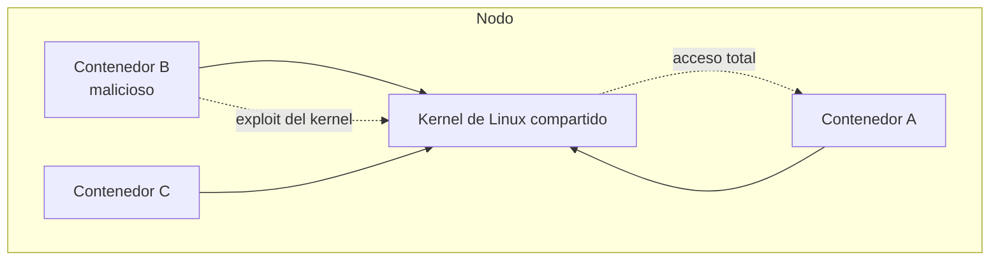

# RuntimeClass: sandboxing de contenedores

Un contenedor no es una máquina virtual: todos los contenedores de un nodo **comparten el mismo kernel de Linux**. Eso significa que una vulnerabilidad del kernel explotable desde un contenedor puede comprometer el nodo entero y, con él, todos los demás pods. Para cargas que no son de confianza (código de terceros, ejecución de código de usuarios), Kubernetes ofrece un mecanismo para ejecutar pods en runtimes más aislados: **RuntimeClass**.

## El problema: el kernel compartido


Las syscalls son la puerta: un contenedor habla directamente con el kernel del host. [Seccomp y AppArmor](./405.Apparmor_seccomp.md) reducen qué puede pedirle, pero la superficie sigue siendo el kernel real. Los **runtimes sandboxed** van un paso más allá: ponen una barrera entre el contenedor y ese kernel.

## Los runtimes sandboxed
### gVisor (runsc)
[gVisor](https://gvisor.dev/), de Google, es un **kernel de aplicación en espacio de usuario**: intercepta las syscalls del contenedor y las atiende él mismo, reimplementadas en Go, tocando el kernel real lo mínimo. El contenedor cree hablar con Linux, pero habla con gVisor.

- **Pros**: arranque rápido, overhead moderado, muy probado (App Engine, Cloud Run, GKE Sandbox).
- **Contras**: no implementa el 100% de las syscalls (algunas apps no funcionan) y penaliza cargas intensivas en I/O.
- Su runtime para containerd se llama **runsc**.

### Kata Containers
[Kata Containers](https://katacontainers.io/) ejecuta cada pod dentro de una **microVM ligera** con su propio kernel, usando virtualización por hardware (KVM). Aislamiento de máquina virtual con experiencia de contenedor.

- **Pros**: el aislamiento más fuerte (kernel propio por pod).
- **Contras**: requiere virtualización en el nodo (problemático en algunas nubes), arranque y memoria algo mayores.

| | runc (estándar) | gVisor | Kata |
|---|---|---|---|
| Aislamiento | Namespaces + cgroups | Kernel en userspace | MicroVM con kernel propio |
| Overhead | Mínimo | Moderado | Mayor |
| Compatibilidad | Total | Alta (no completa) | Muy alta |
| Caso de uso | Cargas confiables | Código no confiable | Multi-tenant duro |

## Configurar un RuntimeClass
La cadena completa tiene tres eslabones: el runtime instalado en el nodo → el handler registrado en containerd → el objeto RuntimeClass en Kubernetes.

1. **Instalar el runtime en los nodos** (gVisor en este ejemplo) y registrarlo en containerd (`/etc/containerd/config.toml`):
```toml
[plugins."io.containerd.grpc.v1.cri".containerd.runtimes.runsc]
  runtime_type = "io.containerd.runsc.v1"
```
```bash
sudo systemctl restart containerd
```

2. **Crear el objeto RuntimeClass**, que mapea un nombre de Kubernetes al handler de containerd:
```yaml
apiVersion: node.k8s.io/v1
kind: RuntimeClass
metadata:
  name: gvisor
handler: runsc   # Debe coincidir con el nombre registrado en containerd
```

3. **Usarlo en los pods** con `runtimeClassName`:
```yaml
apiVersion: v1
kind: Pod
metadata:
  name: pod-sandboxed
spec:
  runtimeClassName: gvisor
  containers:
  - name: app
    image: nginx
```

Este flujo (crear el RuntimeClass y asignarlo a un pod) es exactamente el ejercicio que pide el examen CKS.

### Verificar que funciona
La comprobación clásica es mirar el kernel desde dentro del pod:
```bash
kubectl exec pod-sandboxed -- uname -a
# Con gVisor verás algo como: Linux ... 4.4.0 ... gVisor
# Un kernel "falso", distinto al del nodo: estás en el sandbox
```

```bash
kubectl exec pod-sandboxed -- dmesg | head -2
# [    0.000000] Starting gVisor...
```

Si el RuntimeClass apunta a un handler que no existe en el nodo, el pod se quedará en `ContainerCreating` con un evento `FailedCreatePodSandBox`: directo a tu [metodología de troubleshooting](./306.Troubleshooting_aplicaciones.md).

## Detalles operativos
- **Scheduling**: si solo algunos nodos tienen el runtime instalado, el RuntimeClass admite un campo `scheduling.nodeSelector` para que los pods caigan donde toca (combinado con labels en los nodos, como vimos en [scheduling](./122.Scheduling_labels.md)).
- **Overhead**: el campo `overhead` permite declarar el coste extra de recursos del sandbox, que el scheduler suma a los requests del pod:
```yaml
overhead:
  podFixed:
    memory: "120Mi"
    cpu: "250m"
```
- **¿Cuándo usarlo?** No en todo: el runtime estándar (runc) bien configurado es suficiente para cargas propias y confiables. Reserva los sandboxes para código de terceros, pipelines que ejecutan código arbitrario o multi-tenancy con desconfianza mutua. La defensa en profundidad sigue aplicando: sandbox **además de** security context, seccomp y network policies, no en su lugar.

## Resumen
- Todos los contenedores de un nodo comparten kernel: un escape de contenedor compromete el nodo entero.
- gVisor (kernel en userspace) y Kata (microVMs) añaden una barrera entre contenedor y kernel real.
- La cadena: runtime en el nodo → handler en containerd → objeto `RuntimeClass` → `runtimeClassName` en el pod.
- Verificación rápida: `uname -a` dentro del pod delata el kernel del sandbox.
- Son para cargas no confiables; no sustituyen al resto de capas de seguridad.

---
* Lista de vídeos en Youtube: [Curso Kubernetes](https://www.youtube.com/playlist?list=PLQhxXeq1oc2k9MFcKxqXy5GV4yy7wqSma)

[Volver al índice](README.md#índice)
