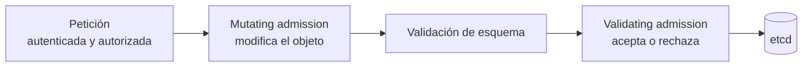

# Admission controllers: validación y mutación de recursos

Ya conoces el viaje de toda petición a la API: autenticación → autorización → **control de admisión** ([capítulo 119](./119.Seguridad.md)). Esta tercera fase es donde un cluster bien asegurado impone sus reglas de juego: "aquí no entra ningún pod privilegiado", "todas las imágenes vienen de mi registry", "todo namespace lleva sus labels". En este capítulo desmontamos la maquinaria.

## Las dos familias: mutar y validar
Los admission controllers procesan la petición **después de autorizarla y antes de persistirla en etcd**, en dos oleadas:



- **Mutating**: pueden **modificar** el objeto. Ya has visto varios sin saberlo: el que inyecta la service account `default`, el que aplica los valores de un [LimitRange](./117.Rangos_quotas.md) o el que inyecta el sidecar de [Istio](./305.Service_mesh.md).
- **Validating**: solo pueden **aceptar o rechazar**. Como los [Pod Security Standards](./119.Seguridad.md) o las [ResourceQuotas](./117.Rangos_quotas.md).

El orden importa y es un detalle de examen: primero **todas** las mutaciones, después **todas** las validaciones. Así nadie valida un objeto que luego otro va a cambiar.

## Controladores integrados
El API server trae decenas compilados. Se gestionan con flags en `/etc/kubernetes/manifests/kube-apiserver.yaml`:

```yaml
- --enable-admission-plugins=NodeRestriction,EventRateLimit
- --disable-admission-plugins=...
- --admission-control-config-file=/etc/kubernetes/admission/config.yaml  # Para los que requieren configuración
```

Los que debes conocer para el CKS:
- **NodeRestriction**: limita cada kubelet a modificar solo su nodo y sus pods. Evita que un nodo comprometido sabotee a los demás. Debe estar siempre activo.
- **PodSecurity**: aplica los Pod Security Standards por namespace (ya lo vimos en la [119](./119.Seguridad.md)).
- **AlwaysPullImages**: fuerza `imagePullPolicy: Always`; en clusters multi-tenant evita que un pod use la imagen privada cacheada de otro.
- **EventRateLimit** e **LimitRanger**, **ResourceQuota**: protección frente a abusos de recursos.
- **ImagePolicyWebhook**: delega la decisión sobre imágenes en un servicio externo (lo vemos ahora).

```bash
# Consultar qué hay habilitado
kubectl -n kube-system exec kube-apiserver-<nodo> -- kube-apiserver -h | grep enable-admission
sudo grep admission /etc/kubernetes/manifests/kube-apiserver.yaml
```

## Webhooks dinámicos: extender la admisión
Para lógica propia sin recompilar el API server existen los **admission webhooks**: el API server envía cada petición (un `AdmissionReview` en JSON) a un servicio HTTPS tuyo, que responde "permitido", "denegado" o "permitido con estos parches".

Se registran con dos recursos:
```yaml
apiVersion: admissionregistration.k8s.io/v1
kind: ValidatingWebhookConfiguration   # O MutatingWebhookConfiguration
metadata:
  name: validador-imagenes
webhooks:
- name: imagenes.empresa.local
  rules:
  - apiGroups: [""]
    apiVersions: ["v1"]
    operations: ["CREATE", "UPDATE"]
    resources: ["pods"]
  clientConfig:
    service:
      name: mi-webhook
      namespace: seguridad
      path: /validate
    caBundle: <CA en base64>
  admissionReviewVersions: ["v1"]
  sideEffects: None
  failurePolicy: Fail
```

El campo más delicado es **`failurePolicy`**:
- `Fail`: si el webhook no responde, la petición **se rechaza**. Máxima seguridad... y un webhook caído puede dejar el cluster sin poder crear pods.
- `Ignore`: si no responde, la petición pasa. Disponibilidad a cambio de una vía de escape para un atacante (tumbar el webhook para saltarse el control).

Es el trade-off clásico de seguridad vs disponibilidad, y pregunta habitual de examen. Sobre esta maquinaria de webhooks se construyen [OPA Gatekeeper y Kyverno](./407.OPA.md), que veremos en su propio capítulo.

## ImagePolicyWebhook: el ejercicio estrella del CKS
Controlador integrado que consulta a un servicio externo si las imágenes de un pod están permitidas. El ejercicio típico del examen es **configurarlo**, y tiene su miga porque encadena tres ficheros:

1. El flag en el API server:
```yaml
- --enable-admission-plugins=NodeRestriction,ImagePolicyWebhook
- --admission-control-config-file=/etc/kubernetes/admission/admission-config.yaml
```

2. El fichero de configuración de admisión:
```yaml
apiVersion: apiserver.config.k8s.io/v1
kind: AdmissionConfiguration
plugins:
- name: ImagePolicyWebhook
  configuration:
    imagePolicy:
      kubeConfigFile: /etc/kubernetes/admission/imagepolicy-kubeconfig.yaml
      allowTTL: 50
      denyTTL: 50
      retryBackoff: 500
      defaultAllow: false   # <- el detalle de seguridad: si el backend no responde, DENEGAR
```

3. Un kubeconfig que apunta al backend (el "servidor" es el webhook externo, el "usuario" son los certificados con los que el API server se presenta).

> No olvides que, si el API server corre como static pod, los ficheros referenciados deben estar montados en su pod (volúmenes `hostPath` en el manifiesto). Es el fallo silencioso más común del ejercicio.

`defaultAllow: false` es el equivalente al `failurePolicy: Fail`: con el backend caído, mejor un cluster que no despliega que un cluster que despliega cualquier cosa.

## ValidatingAdmissionPolicy: validación sin webhooks
Desde Kubernetes 1.30 (GA) existe una tercera vía: políticas de validación **declarativas**, evaluadas dentro del propio API server con el lenguaje de expresiones **CEL**. Sin servicio externo, sin TLS, sin failurePolicy que sufrir:

```yaml
apiVersion: admissionregistration.k8s.io/v1
kind: ValidatingAdmissionPolicy
metadata:
  name: replicas-minimas
spec:
  matchConstraints:
    resourceRules:
    - apiGroups: ["apps"]
      apiVersions: ["v1"]
      operations: ["CREATE", "UPDATE"]
      resources: ["deployments"]
  validations:
  - expression: "object.spec.replicas >= 2"
    message: "Los deployments deben tener al menos 2 réplicas"
---
apiVersion: admissionregistration.k8s.io/v1
kind: ValidatingAdmissionPolicyBinding
metadata:
  name: replicas-minimas-binding
spec:
  policyName: replicas-minimas
  validationActions: ["Deny"]
  matchResources:
    namespaceSelector:
      matchLabels:
        entorno: produccion
```

Para validaciones sencillas es la opción moderna y recomendada; los webhooks quedan para lógica compleja o mutaciones.

## Resumen
- Admisión = última aduana antes de etcd: primero mutan, luego validan.
- Integrados imprescindibles: NodeRestriction, PodSecurity, LimitRanger/ResourceQuota; se configuran con flags del API server.
- Los webhooks dinámicos extienden la admisión; `failurePolicy`/`defaultAllow` deciden qué pasa cuando el control falla (seguridad vs disponibilidad).
- ImagePolicyWebhook: flag + AdmissionConfiguration + kubeconfig al backend, con `defaultAllow: false`.
- ValidatingAdmissionPolicy (CEL) valida de forma declarativa sin infraestructura externa.

---
* Lista de vídeos en Youtube: [Curso Kubernetes](https://www.youtube.com/playlist?list=PLQhxXeq1oc2k9MFcKxqXy5GV4yy7wqSma)

[Volver al índice](README.md#índice)
