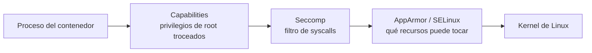

# AppArmor y Seccomp: perfiles de seguridad del kernel

En el [capítulo de RuntimeClass](./402.Runtime_class.md) vimos que el riesgo de fondo de los contenedores es el kernel compartido. Antes de llegar al extremo de los sandboxes, Linux trae de serie dos mecanismos para **reducir lo que un contenedor puede pedirle al kernel**: seccomp (filtra syscalls) y AppArmor (control de acceso obligatorio). Kubernetes los integra en el `securityContext`, y el CKS los pregunta sí o sí.

La foto completa de capas, de dentro hacia fuera:



## Capabilities: el repaso necesario
Las capabilities trocean los privilegios de root en piezas (CAP_NET_ADMIN, CAP_SYS_TIME, CAP_CHOWN...). Ya las vimos en el [securityContext](./119.Seguridad.md); la doctrina es simple y cae en todos los exámenes:

```yaml
    securityContext:
      capabilities:
        drop: ["ALL"]
        add: ["NET_BIND_SERVICE"]   # Solo si de verdad la necesita
```

Suelta todas, añade la imprescindible. Con eso claro, vamos a las dos piezas nuevas.

## Seccomp: filtrar syscalls
**Seccomp** (secure computing mode) filtra qué **llamadas al sistema** puede hacer un proceso. Linux tiene más de 300 syscalls y un contenedor típico usa unas decenas: todo lo demás es superficie de ataque gratuita.

### RuntimeDefault: el 80% del valor con una línea
Los runtimes traen un perfil por defecto sensato (bloquea unas 60 syscalls peligrosas: `mount`, `reboot`, `init_module`...). Kubernetes **no lo aplica salvo que se lo pidas**:

```yaml
apiVersion: v1
kind: Pod
metadata:
  name: pod-seccomp
spec:
  securityContext:
    seccompProfile:
      type: RuntimeDefault
  containers:
  - name: app
    image: nginx
```

Esto debería ser el mínimo de **todos** tus pods (el nivel `restricted` de los [Pod Security Standards](./119.Seguridad.md) lo exige). Los tres tipos posibles:
- `RuntimeDefault`: el perfil del runtime. Tu valor por defecto.
- `Unconfined`: sin filtro (el comportamiento histórico, evitar).
- `Localhost`: un perfil personalizado cargado desde el nodo.

### Perfiles personalizados
Para cargas críticas se puede afinar más con un perfil propio en JSON, ubicado en el nodo bajo `/var/lib/kubelet/seccomp/`:

```json
{
  "defaultAction": "SCMP_ACT_ERRNO",
  "architectures": ["SCMP_ARCH_X86_64"],
  "syscalls": [
    {
      "names": ["read", "write", "exit", "exit_group", "futex", "nanosleep"],
      "action": "SCMP_ACT_ALLOW"
    }
  ]
}
```

`defaultAction: SCMP_ACT_ERRNO` = denegar por defecto y permitir solo la lista. Se referencia con ruta **relativa** a ese directorio:

```yaml
  securityContext:
    seccompProfile:
      type: Localhost
      localhostProfile: profiles/mi-perfil.json   # /var/lib/kubelet/seccomp/profiles/mi-perfil.json
```

Dos gotchas de examen: el fichero debe existir **en el nodo donde se programa el pod** (en todos, en la práctica), y si el perfil bloquea una syscall que la app necesita, el contenedor morirá al instante o ni arrancará: los logs y `dmesg` del nodo lo delatan.

## AppArmor: qué recursos puede tocar el proceso
**AppArmor** es un sistema MAC (Mandatory Access Control): perfiles que definen qué puede hacer un programa con ficheros, red y capabilities, independientemente de los permisos clásicos. Donde seccomp dice "qué syscalls", AppArmor dice "sobre qué recursos".

Los perfiles viven en el nodo (`/etc/apparmor.d/`) y se gestionan con sus herramientas:
```bash
# Estado y perfiles cargados en el nodo
sudo aa-status

# Cargar un perfil
sudo apparmor_parser -r /etc/apparmor.d/mi-perfil
```

Un perfil de ejemplo que impide toda escritura en disco:
```text
#include <tunables/global>

profile deny-write flags=(attach_disconnected) {
  #include <abstractions/base>
  file,
  # Denegar escritura en todo el sistema de ficheros
  deny /** w,
}
```

### Aplicarlo a un pod
Desde Kubernetes 1.30, AppArmor es un campo de primera clase del `securityContext` (antes era una annotation, que aún verás en material antiguo):

```yaml
apiVersion: v1
kind: Pod
metadata:
  name: pod-apparmor
spec:
  containers:
  - name: app
    image: busybox:1.36
    command: ["sh", "-c", "sleep 3600"]
    securityContext:
      appArmorProfile:
        type: Localhost
        localhostProfile: deny-write   # Nombre del perfil cargado en el nodo
```

Los tipos son análogos a seccomp: `RuntimeDefault`, `Localhost` y `Unconfined`.

```bash
# Verificarlo desde dentro
kubectl exec pod-apparmor -- cat /proc/1/attr/current
# deny-write (enforce)

kubectl exec pod-apparmor -- touch /tmp/test
# touch: /tmp/test: Permission denied   <- el perfil funcionando
```

Mismo gotcha que seccomp: si el perfil no está cargado en el nodo, el pod se queda en estado `Blocked`/error con un evento que lo explica.

> **¿Y SELinux?** Es el equivalente en el mundo Red Hat (campo `seLinuxOptions`). Para el CKS basta con saber ubicarlo; los ejercicios usan AppArmor porque los nodos del examen son Ubuntu.

## Estrategia práctica
1. **Base universal**: `seccompProfile: RuntimeDefault` + `capabilities: drop ALL` + `runAsNonRoot` + `allowPrivilegeEscalation: false`. Esto es el nivel `restricted` de PSS y no rompe el 95% de las aplicaciones.
2. **Cargas sensibles**: perfiles seccomp/AppArmor personalizados, generados a partir de observar la app (herramientas como `inspektor-gadget` o el propio [Falco](./406.Falco.md) ayudan a ver qué syscalls usa realmente).
3. **Hazlo obligatorio**: con Pod Security Admission o las [políticas de admisión](./404.Admission_controllers.md), para que nadie despliegue sin perfil.

## Resumen
- Capas complementarias: capabilities (privilegios) → seccomp (syscalls) → AppArmor (recursos). Defensa en profundidad, no alternativas.
- `seccompProfile: RuntimeDefault` debería ser el mínimo universal; `Localhost` para perfiles JSON propios en `/var/lib/kubelet/seccomp/`.
- AppArmor se configura ya en `securityContext.appArmorProfile`; el perfil debe estar **cargado en el nodo** (`apparmor_parser`, `aa-status`).
- Verificación: `/proc/1/attr/current` (AppArmor) y probar operaciones prohibidas; los fallos de perfil aparecen en eventos del pod.

---
* Lista de vídeos en Youtube: [Curso Kubernetes](https://www.youtube.com/playlist?list=PLQhxXeq1oc2k9MFcKxqXy5GV4yy7wqSma)

[Volver al índice](README.md#índice)
