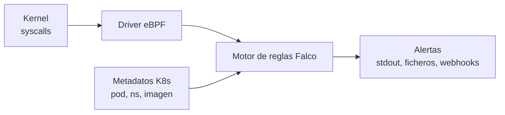

# Falco: detección de amenazas en runtime

Todo lo que hemos visto en la especialización hasta ahora es **prevención**: políticas, perfiles, admission controllers. Pero ningún muro es perfecto, y la pregunta del defensor maduro es: cuando algo se cuele, ¿me enteraré? **[Falco](https://falco.org/)**, proyecto graduado de la CNCF creado por Sysdig, es la respuesta estándar: el sistema de detección de intrusiones (IDS) del mundo cloud native.

## Cómo funciona
Falco observa el flujo de **syscalls** de todos los procesos del nodo (mediante un driver de kernel o, en versiones modernas, sondas **eBPF**), lo enriquece con metadatos de contenedores y Kubernetes (pod, namespace, imagen) y lo evalúa contra un conjunto de **reglas**. Cuando una regla casa, emite una alerta.



La diferencia clave con seccomp/AppArmor: estos **bloquean**, Falco **observa y alerta**. No modifica el comportamiento de nada, por eso se puede desplegar sin miedo a romper aplicaciones.

Se instala como DaemonSet (un Falco por nodo, claro):
```bash
helm repo add falcosecurity https://falcosecurity.github.io/charts
helm install falco falcosecurity/falco -n falco --create-namespace

# Las alertas, de serie, salen por los logs del pod
kubectl -n falco logs -l app.kubernetes.io/name=falco -f
```

## Anatomía de una regla
Las reglas se escriben en YAML con tres tipos de elementos:

```yaml
# Una lista: valores reutilizables
- list: shell_binaries
  items: [bash, sh, zsh, dash]

# Una macro: condición reutilizable
- macro: spawned_process
  condition: evt.type in (execve, execveat) and evt.dir=<

# La regla: condición + salida + prioridad
- rule: Terminal shell in container
  desc: Una shell se ha ejecutado dentro de un contenedor
  condition: >
    spawned_process and container
    and proc.name in (shell_binaries)
  output: >
    Shell en contenedor (user=%user.name container=%container.name
    image=%container.image.repository pod=%k8s.pod.name ns=%k8s.ns.name
    cmdline=%proc.cmdline)
  priority: WARNING
  tags: [container, shell, mitre_execution]
```

- **condition**: expresión sobre campos del evento (`evt.*`, `proc.*`, `fd.*`, `container.*`, `k8s.*`).
- **output**: el mensaje de alerta, interpolando los campos que quieras registrar.
- **priority**: de `DEBUG` a `EMERGENCY`.

Falco trae de serie decenas de reglas que cubren los clásicos del post-explotación: shells interactivas en contenedores, escrituras bajo `/etc` o en directorios de binarios, lectura de ficheros sensibles (`/etc/shadow`), conexiones salientes inesperadas, montaje de paths peligrosos del host...

## Operar Falco: ficheros y personalización
La distribución del CKS espera que sepas moverte por su configuración en el nodo o en el pod:

```text
/etc/falco/falco.yaml          # Configuración general (salidas, formato, etc.)
/etc/falco/falco_rules.yaml    # Reglas oficiales (NO editar: se machacan al actualizar)
/etc/falco/falco_rules.local.yaml  # Tus reglas y overrides
/etc/falco/rules.d/            # Ficheros de reglas adicionales
```

Para **modificar una regla existente** (por ejemplo, cambiar su output o añadir excepciones), se redefine en `falco_rules.local.yaml` con `append` o copiándola entera: la última definición gana. Tras cambiar reglas, recargar:

```bash
# Si corre como servicio en el nodo
sudo systemctl restart falco
# O enviarle SIGHUP / reiniciar los pods del DaemonSet
kubectl -n falco rollout restart daemonset falco
```

### El ejercicio típico del examen
"Usa Falco para identificar qué pods ejecutan X comportamiento y ajusta el formato de salida". El flujo:

1. Localizar la regla que dispara (en los logs aparece su nombre).
2. Buscarla en `/etc/falco/falco_rules.yaml`.
3. Copiarla a `falco_rules.local.yaml` y ajustar el `output` con los campos pedidos (`%k8s.pod.name`, `%container.id`, `%evt.time`...).
4. Reiniciar Falco y capturar las alertas de los logs.

La [referencia de campos](https://falco.org/docs/reference/rules/supported-fields/) es tu documentación de cabecera; apréndete de memoria los habituales: `evt.time`, `user.name`, `proc.cmdline`, `container.id`, `container.image.repository`, `k8s.pod.name`, `k8s.ns.name`.

## De la alerta a la respuesta
Falco alerta; responder es cosa tuya (o de tu automatización):
- **falcosidekick**: el compañero estándar para enrutar alertas a Slack, PagerDuty, SIEM, etc., con su propia UI.
- **Talon / respuesta automática**: motores que reaccionan a alertas (matar el pod, aislarlo con una NetworkPolicy, etiquetar el nodo). Potente, pero diseña con cuidado: una respuesta automática agresiva es un DoS autoinfligido esperando a suceder.
- **Proceso humano**: ante una alerta real, el manual de respuesta clásico aplica: aislar el pod (NetworkPolicy default-deny o `cordon` del nodo), preservar evidencia (`kubectl logs`, `kubectl get pod -o yaml`, snapshot del nodo) y solo después eliminar.

## Resumen
- Falco = detección en runtime: observa syscalls vía eBPF, las cruza con metadatos de Kubernetes y alerta según reglas. Complementa (no sustituye) a seccomp/AppArmor.
- Reglas = listas + macros + reglas (condition/output/priority); las personalizaciones van en `falco_rules.local.yaml`.
- Para el examen: leer alertas en los logs del DaemonSet, identificar la regla, ajustar su output con los campos `%...` y reiniciar Falco.
- La detección sin plan de respuesta es solo ruido: enruta las alertas (falcosidekick) y ten un manual de aislamiento y evidencia.

---
* Lista de vídeos en Youtube: [Curso Kubernetes](https://www.youtube.com/playlist?list=PLQhxXeq1oc2k9MFcKxqXy5GV4yy7wqSma)

[Volver al índice](README.md#índice)
