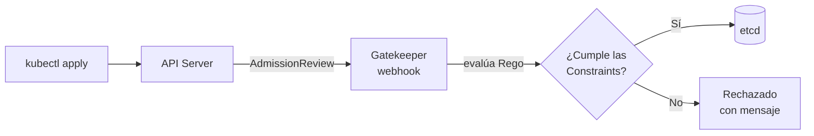

# OPA Gatekeeper: políticas como código

Los [Pod Security Standards](./119.Seguridad.md) cubren la seguridad de pods con tres niveles fijos. Pero, ¿y las reglas propias de tu organización? "Toda imagen viene de nuestro registry", "todo recurso lleva el label del equipo propietario", "prohibido el tag latest"... Para eso necesitas un **motor de políticas**, y el de referencia en el ecosistema (y en el examen CKS) es **OPA Gatekeeper**.

## OPA y Gatekeeper: quién es quién
- **OPA (Open Policy Agent)** es un motor de políticas de propósito general, graduado en la CNCF. Evalúa decisiones ("¿se permite esto?") escritas en su lenguaje **Rego**, y se usa mucho más allá de Kubernetes (APIs, CI/CD, Terraform).
- **Gatekeeper** es la integración nativa de OPA con Kubernetes: un [validating admission webhook](./404.Admission_controllers.md) que evalúa cada petición contra tus políticas, definidas como recursos de Kubernetes (CRDs).



Instalación rápida:
```bash
kubectl apply -f https://raw.githubusercontent.com/open-policy-agent/gatekeeper/master/deploy/gatekeeper.yaml
```

## Las dos piezas: ConstraintTemplate y Constraint
Gatekeeper separa la **lógica** de la política de su **aplicación**, en dos recursos:

### 1. ConstraintTemplate: la lógica (Rego)
Define *qué comprueba* la política y *qué parámetros* acepta. Aquí vive el Rego:

```yaml
apiVersion: templates.gatekeeper.sh/v1
kind: ConstraintTemplate
metadata:
  name: k8srequiredlabels
spec:
  crd:
    spec:
      names:
        kind: K8sRequiredLabels   # Crea este nuevo tipo de recurso
      validation:
        openAPIV3Schema:
          type: object
          properties:
            labels:
              type: array
              items:
                type: string
  targets:
  - target: admission.k8s.gatekeeper.sh
    rego: |
      package k8srequiredlabels

      violation[{"msg": msg}] {
        required := input.parameters.labels
        provided := {label | input.review.object.metadata.labels[label]}
        missing := required[_]
        not provided[missing]
        msg := sprintf("Falta el label obligatorio: %v", [missing])
      }
```

La estructura del Rego de Gatekeeper es siempre la misma: una o varias reglas `violation` que, si se cumplen, generan el mensaje de rechazo. `input.review.object` es el recurso que se está creando; `input.parameters` son los parámetros de la Constraint.

### 2. Constraint: la aplicación
Al aplicar la template, Gatekeeper crea la CRD `K8sRequiredLabels`. Cada objeto de ese tipo es una **Constraint**: dónde aplica y con qué parámetros:

```yaml
apiVersion: constraints.gatekeeper.sh/v1beta1
kind: K8sRequiredLabels
metadata:
  name: ns-deben-tener-equipo
spec:
  match:
    kinds:
    - apiGroups: [""]
      kinds: ["Namespace"]
  parameters:
    labels: ["equipo"]
```

Desde ese momento:
```bash
kubectl create namespace prueba
# Error from server (Forbidden): ... [ns-deben-tener-equipo] Falta el label obligatorio: equipo
```

El `match` admite kinds, namespaces, selectores de labels y exclusiones. Una misma template puede tener muchas constraints con distintos ámbitos y parámetros: por eso se separan.

## Modo auditoría y enforcement
Imponer una política nueva en un cluster vivo rompe cosas. Gatekeeper lo resuelve con el campo `enforcementAction`:

```yaml
spec:
  enforcementAction: dryrun   # deny (por defecto) | dryrun | warn
```

- `dryrun`: no bloquea, pero registra las violaciones.
- `warn`: permite la operación avisando al usuario.
- `deny`: rechaza.

Además, Gatekeeper **audita periódicamente los recursos ya existentes** contra las constraints, y publica las violaciones en su `status`:

```bash
kubectl get k8srequiredlabels ns-deben-tener-equipo -o jsonpath='{.status.violations}' | jq
```

El flujo de adopción sano: `dryrun` → revisar violaciones → corregir → `deny`. Idéntica filosofía a los modos `audit`/`warn`/`enforce` de Pod Security Admission.

## Recetario de políticas habituales
La [librería oficial de Gatekeeper](https://open-policy-agent.github.io/gatekeeper-library/) trae templates listas para los casos comunes; conviene conocerlos porque son los ejercicios típicos:
- **Registries permitidos**: rechazar imágenes que no empiecen por `registry.empresa.com/`.
- **Prohibir tag latest** o exigir digest.
- **Labels/annotations obligatorios** (el ejemplo de arriba).
- **Prohibir privilegiados, hostPath, hostNetwork** (solapa con PSS, pero con mensajes y excepciones a medida).
- **Límites de recursos obligatorios** en todos los contenedores.

## ¿Y Kyverno?
La alternativa más popular a Gatekeeper es **[Kyverno](https://kyverno.io/)**, también de la CNCF. La diferencia fundamental: las políticas se escriben **en YAML puro**, sin aprender Rego, y además de validar puede **mutar** recursos y **generar** otros nuevos (por ejemplo, crear una NetworkPolicy default-deny en cada namespace nuevo).

```yaml
apiVersion: kyverno.io/v1
kind: ClusterPolicy
metadata:
  name: require-labels
spec:
  validationFailureAction: Enforce
  rules:
  - name: check-equipo
    match:
      any:
      - resources:
          kinds: ["Namespace"]
    validate:
      message: "El label 'equipo' es obligatorio"
      pattern:
        metadata:
          labels:
            equipo: "?*"
```

Regla práctica: Gatekeeper si necesitas la expresividad de Rego o ya usas OPA en otros sitios; Kyverno si prefieres simplicidad YAML y las capacidades de mutación/generación. Para el CKS, el protagonista es Gatekeeper (entender template + constraint + Rego básico); y recuerda del [capítulo de admission](./404.Admission_controllers.md) que para validaciones simples el propio Kubernetes ya ofrece ValidatingAdmissionPolicy con CEL.

## Resumen
- Gatekeeper = OPA como admission webhook, con políticas definidas en CRDs.
- **ConstraintTemplate** (lógica en Rego, parametrizable) + **Constraint** (ámbito y parámetros): la separación que permite reutilizar.
- El Rego de Gatekeeper gira en torno a reglas `violation` sobre `input.review.object`.
- `enforcementAction: dryrun` y la auditoría continua permiten adoptar políticas sin romper el cluster.
- Kyverno es la alternativa YAML con mutación y generación; ValidatingAdmissionPolicy cubre los casos simples sin instalar nada.

---
* Lista de vídeos en Youtube: [Curso Kubernetes](https://www.youtube.com/playlist?list=PLQhxXeq1oc2k9MFcKxqXy5GV4yy7wqSma)

[Volver al índice](README.md#índice)
