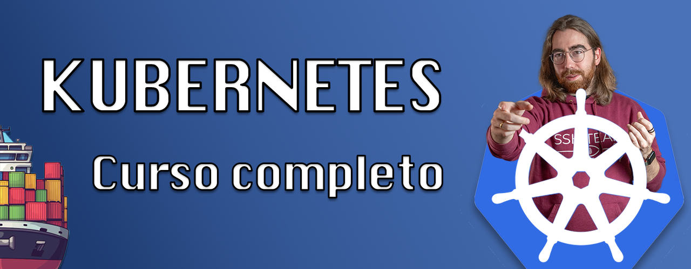

# Curso Kubernetes - De grumete a almirante

**¡Este curso está en desarrollo activo! Sígueme aquí o en Youtube para recibir actualizaciones semanales del curso.**

## 🚀 ¿Qué aprenderás en este curso?

Bienvenido, este curso esta diseñado para llevarte desde cero hasta un nivel profesional. Teniendo en cuenta los principales supuestos:

- **Principiantes absolutos** que nunca han trabajado con Kubernetes
- **Desarrolladores** que quieren aprender orquestación de contenedores
- **Administradores de sistemas** buscando modernizar su infraestructura
- **Profesionales DevOps** que necesitan certificarse en Kubernetes

### 🎓 Preparación para Certificaciones Oficiales

Este curso te prepara completamente para las **tres certificaciones oficiales de Kubernetes**:
- **CKA (Certified Kubernetes Administrator)** - Para administradores
- **CKAD (Certified Kubernetes Application Developer)** - Para desarrolladores  
- **CKS (Certified Kubernetes Security Specialist)** - Para especialistas en seguridad

> Todo el curso está disponible en mi [**CANAL DE YOUTUBE**](https://www.youtube.com/playlist?list=PLQhxXeq1oc2k9MFcKxqXy5GV4yy7wqSma), con más de **5 horas de contenido práctico**.

**⭐ Apoya este contenido gratuito dejando una estrella a este repositorio y suscribiéndote a mi canal de Youtube.**

# 📚 Índice del Curso

### 🟢 Nivel Básico - Fundamentos de Kubernetes
*Aprende los conceptos esenciales de Kubernetes desde cero*

* [📖 Introducción a Kubernetes](./101.Introduccion.md) - ¿Qué es y por qué usarlo?
* [🏗️ Arquitectura de Kubernetes](./102.Arquitectura.md) - Control Plane y Workers
* [⚙️ Instalación con kubeadm](./103.Instalacion.md) - Cluster productivo
* [🎮 Instalación sencilla, minikube y k3s](./104.Playgrounds.md) - Entornos de prueba
* [📄 Manifiestos de Kubernetes](./105.Conceptos.md) - YAML y kubectl básico
* [🐳 Pods y contenedores](./106.Pods.md) - Unidad básica de Kubernetes
* [🏷️ Namespaces y recursos](./107.Namespaces.md) - Organización y aislamiento
* [🚀 Deployment y ReplicaSet](./108.Deployments.md) - Gestión de aplicaciones
* [⚡ DaemonSet y StatefulSet](./109.DSySS.md) - Aplicaciones especializadas
* [⏰ Jobs y cronjobs](./110.Jobs.md) - Tareas programadas
* [🌐 Servicios](./111.Services.md) - Comunicación entre pods
* [🚪 Ingress](./112.Ingress_controller.md) - Exposición de servicios
* [🎯 Gateway](./113.Gateway.md) - Gateway API moderna
* [❤️ Probes y healthchecks](./114.Probes_live_readiness.md) - Monitoreo de salud
* [📊 Rangos y cuotas](./115.Rangos_quotas.md) - Límites de recursos
* [📈 Autoescalado](./116.Autoscaling.md) - Escalado automático
* [🔐 Secrets y configmaps](./117.Secrets_configmaps.md) - Gestión de configuración
* [💾 Almacenamiento](./118.Almacenamiento.md) - Persistent Volumes
* [🔒 Seguridad](./119.Seguridad.md) - Fundamentos de seguridad
* [👤 Usuarios y RBAC](./120.Usuarios.md) - Control de acceso
* [🎭 Roles y ClusterRoles](./121.Roles.md) - Permisos granulares
* [🎯 Scheduling y labels](./122.Scheduling_labels.md) - Programación de pods
* [⚖️ Taints y tolerations](./123.Taints_tolerations.md) - Restricciones de nodos
* [📝 Logging](./124.Logging.md) - Gestión de logs
* [📦 Helm](./125.Helm.md) - Gestor de paquetes
* [🖥️ Perfiles y herramientas visuales](./126.Perfiles_software_dashboard.md) - Dashboards

### 🔵 Kubernetes para Administradores (Especialización CKA)
*Administración avanzada de clusters y preparación para certificación CKA*

* 🔧 Mantenimiento, backup y restauración de un clúster
* 🔍 Troubleshooting del cluster
* 🔐 APIs, TLS y seguridad avanzada
* 📜 Certificados y autenticación
* 💾 Volúmenes y almacenamiento custom
* ⚙️ CRDs y Operators
* 🏢 High Availability y Disaster Recovery
* 📋 Preparación examen CKA

### 🟡 Kubernetes para Desarrolladores (Especialización CKAD)
*Desarrollo de aplicaciones en Kubernetes y preparación para certificación CKAD*

* 🏗️ Pods e initContainers
* 🤝 Multi-container pods, sidecars, ambassador y adapter
* 🔄 Canary y blue-green deployments
* 🌐 CoreDNS, servicios y DNS
* 🕸️ Service mesh
* 🐛 Troubleshooting de aplicaciones
* 📋 Preparación examen CKAD

### 🔴 Seguridad en Kubernetes (Especialización CKS)
*Seguridad avanzada en Kubernetes y preparación para certificación CKS*

* 📊 CIS Benchmarks
* 🏃 Runtime class
* 🛡️ Network policies avanzadas
* ⚡ Admission controllers
* 🔒 Apparmor y Seccomp
* 🦅 Falco
* 📋 OPA
* 📋 Preparación examen CKS

## 🚀 ¡Comienza Ahora!

1. **⭐ Dale estrella a este repositorio para apoyar el proyecto**
2. **🔔 Suscríbete al [canal de YouTube](https://www.youtube.com/@Pabpereza?sub_confirmation=1)**
3. **📖 Comienza con la [Introducción a Kubernetes](./101.Introduccion.md)**
4. **💬 Únete a la comunidadde [telegram](https://t.me/+mti-dcXs7c1lYjdk)**

---

## 🤝 Contribuir
Si quieres contribuir a este repositorio, puedes hacerlo de varias formas:
* Reportando errores
* Proponiendo mejoras
* Añadiendo contenido 
* Compartiendo y difundiendo el contenido
* Dejando una estrella para apoyar el contenido
  
Siéntete libre de abrir una issue o un pull request con tus propuestas. **Apoya mi contenido siguiéndome en Youtube y Github, dando likes en los vídeos y dando una estrella a este repositorio.**
